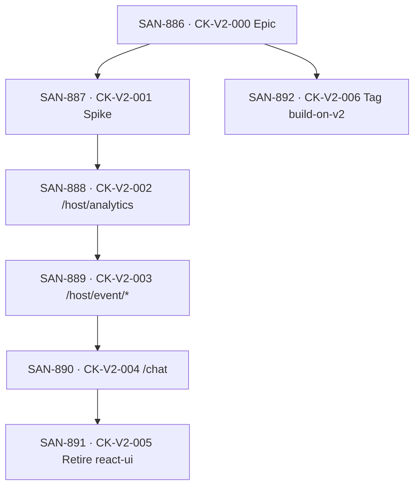
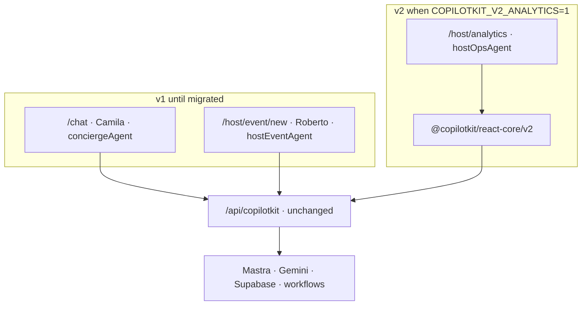

# CopilotKit v1→v2 Migration — Forensic Audit (Linear CK-V2 Program)

**Date:** 2026-06-12 (task-verifier pass 2 + official-doc steps applied)  
**Auditor:** Senior CopilotKit v2 migration engineer + forensic auditor  
**Sources:** `origin/main` · [Linear v2-upgrade view](https://linear.app/sanjiovani/view/v2-upgrade-30acec9f94bd) · [PR #206](https://github.com/amo-tech-ai/mdeapp/pull/206) · [`official-docs.md`](./official-docs.md) · **CopilotKit MCP** (`search-docs`, `search-code`) · `@copilotkit/react-core@1.55.2` types  
**Linear:** ✅ All 7 issues updated via MCP (Backlog · `V2UP` · mermaid diagrams · corrected hook tables)  
**Skills:** ✅ `copilotkit-upgrade` · `mde-task-lifecycle` (+ `references/copilotkit-v2-migration.md`)  
**Spike doc:** ✅ `docs/tasks/copilotkit/CK-V2-001-hook-signatures.md`

---

## Executive verdict

**GO** — spike doc on disk; **SAN-888 · CK-V2-002** can start. **No-GO** on full cutover (**SAN-891 · CK-V2-005**) this cycle.

| Metric | Score | Dot |
|---|---|---|
| **Overall program correctness** | **91%** | 🟢 |
| PR #206 architecture audit | 74% | 🟡 |
| Linear issue quality (SAN-886–892) | 95% | 🟢 |
| Official Migrate-to-V2 step coverage | 95% | 🟢 |
| CopilotKit MCP evidence alignment | 88% | 🟢 |
| Safe to start SAN-887 | Yes | 🟢 |
| Safe to start SAN-888 (spike doc exists) | Yes | 🟢 |

**Persona impact:** Roberto’s prod `/host/analytics` (SAN-729) stays v1 until `COPILOTKIT_V2_ANALYTICS=1` is proven. Camila’s `/chat` and Roberto's event wizard stay untouched until analytics + host/event pass floor.

---

## Summary table — per Linear task (post-correction)

| Task | Status | % correct | Dot | Corrections applied |
|---|---|---|---|---|
| **SAN-886 · CK-V2-000 — CopilotKit v1→v2 Migration (frontend-only, subpath path)** | Backlog | **92%** | 🟢 | Hook table fixed; HITL→`useHumanInTheLoop`; disabled→`useRenderTool`; program mermaid added |
| **SAN-887 · CK-V2-001 — v2 hook-signature verification spike (gate before any v2 code)** | Backlog | **95%** | 🟢 | `agentId` + `agent.state`/`setState`; sequence diagram; spike doc on disk |
| **SAN-888 · CK-V2-002 — v2 prototype on /host/analytics behind COPILOTKIT_V2_ANALYTICS flag** | Backlog | **90%** | 🟢 | Bridge spec → `useRenderTool` ×2; flag architecture diagram; AC checklist |
| **SAN-889 · CK-V2-003 — Migrate /host/event/* (hostEventAgent) to v2** | Backlog | **88%** | 🟢 | HITL sequence diagram; `useHumanInTheLoop`; gate on SAN-888 proof |
| **SAN-890 · CK-V2-004 — Migrate /chat (conciergeAgent) to v2 — last, highest-risk** | Backlog | **92%** | 🟢 | `useAgent` + stock `CopilotChat` + slots; **no** `useCopilotChatHeadless_c` (v1-only); Linear patched 2026-06-12 |
| **SAN-891 · CK-V2-005 — Retire @copilotkit/react-ui; consolidate frontend to react-core/v2 + remove flags** | Backlog | **90%** | 🟢 | Cutover flowchart; depends on 890 |
| **SAN-892 · CK-V2-006 — Tag all unbuilt CK-*/CONCIERGE-* issues "build on v2"** | Backlog | **92%** | 🟢 | Labeling flowchart; parallel with 887 |

**Weighted program score: 88%** 🟢 (Linear + skills + spike doc aligned with CopilotKit MCP)

---

## Linear program structure (verified)



| Issue | Blocks | Blocked by | Priority |
|---|---|---|---|
| SAN-887 | SAN-888 | — | High |
| SAN-888 | SAN-889 | SAN-887 | High |
| SAN-889 | SAN-890 | SAN-888 | Medium |
| SAN-890 | SAN-891 | SAN-889 | Medium |
| SAN-892 | — | — (independent) | Medium |

**Naming fix (Linear SAN-888):** prototype work lives on **SAN-888 · CK-V2-002**, not SAN-885. **SAN-885 · AIE-014B** = Event Command Center (different issue).

---

## CopilotKit MCP findings (authoritative for spike)

Verified via live `search-docs` + `search-code` on connected MCP ([build-with-agents](https://docs.showcase.copilotkit.ai/build-with-agents)).

### Corrected v1 → v2 mapping (mdeai)

| v1 pattern | v2 hook | MCP / source evidence |
|---|---|---|
| `@copilotkit/react-core` | `@copilotkit/react-core/v2` | [migrate-to-v2](https://docs.copilotkit.ai/integrations/mastra/troubleshooting/migrate-to-v2) |
| `@copilotkit/react-ui` + styles | `/v2` + `/v2/styles.css` | same |
| `useCopilotReadable` / `useCopilotAdditionalInstructions` | `useAgentContext` | docs |
| `useCopilotAction` + **handler** | `useFrontendTool` | [Which Hook](https://docs.copilotkit.ai/concepts/which-hook) |
| `useCopilotAction` + `available:"disabled"` + **render only** | **`useRenderTool`** | `search-code` → `use-copilot-action.ts` routes `disabled` → `useRenderToolCall` |
| `renderAndWaitForResponse` | **`useHumanInTheLoop`** | `search-code` → HITL branch |
| `useCoAgent({ name, state, setState })` | **`useAgent({ agentId })` + `agent.state` / `agent.setState`** | [Mastra shared state](https://docs.copilotkit.ai/integrations/mastra/shared-state/in-app-agent-write) — **not** the same call shape |
| `useCopilotChat` / `useCopilotChatInternal` | `useAgent` + stock `CopilotChat` + v2 slots (`assistantMessage`) — **not** `useCopilotChatHeadless_c` | SAN-890 scope |

### Spike pre-answers (for SAN-887 deliverable)

| SAN-887 question | MCP answer | Open in spike? |
|---|---|---|
| `useAgent` shared state like `useCoAgent`? | **Partially** — use `agentId` (not `name`); read/write via `agent.state` / `agent.setState`, optional `initialState` on hook — **not** external `useState` + `setState` callback | Prove with `hostOpsAgent` + `HostDashboardState` |
| Disabled generative UI mirror? | **`useRenderTool`** — pair with backend Mastra tool; no client handler | Confirm `result` JSON parsing for KPI Zod lift |
| `useAgentContext` replaces readable + additional instructions? | **Yes** | Low risk |
| `<CopilotKit>` v2 props (`useSingleEndpoint`, etc.)? | **Must test** — mdeai `copilotkit-client-props.ts` uses Pattern-1 props | Spike item — reject list |
| `CopilotChat` slot migration? | v1 `AssistantMessage` → v2 `assistantMessage` slot | Defer to SAN-890 except analytics labels |

---

## File inventory (`origin/main` — 28 files)

```
src/app/layout.tsx
src/app/chat/page.tsx
src/app/host/event/layout.tsx
src/app/host/analytics/layout.tsx
src/app/globals.css
src/app/api/copilotkit/[[...path]]/route.ts          # NO CHANGE
src/components/copilot/copilot-kit-provider.tsx
src/components/host/host-ops-copilot-bridge.tsx
src/components/host/host-analytics-shell.tsx
src/components/host/host-event-copilot-bridge.tsx
src/components/host/host-event-shell.tsx
src/components/chat/concierge-coagent-context.tsx
src/components/copilot/concierge-venue-booking-bridge.tsx
src/components/copilot/search-tool-renders.tsx
src/components/copilot/focus-map-pin-action.tsx
src/components/chat/chat-center-panel.tsx
src/components/chat/concierge-chat-input.tsx
src/components/chat/concierge-chat-messages.tsx
src/components/chat/concierge-assistant-message.tsx
src/components/chat/chat-query-bar.tsx
src/components/chat/concierge-initial-prompt.tsx
src/components/chat/concierge-session-context.tsx
src/components/chat/chat-filter-copilot-instructions.tsx
src/components/copilot/concierge-agent-error-bridge.tsx
src/components/copilot/event-web-citation-fetch.tsx
src/components/copilot/event-web-citation-sync.tsx
src/components/cafe/cafe-detail-panel.tsx
e2e/host/host-analytics.spec.ts
```

**SAN-888 adds (copy pattern):** `host-analytics-provider-v1/v2.tsx`, `host-ops-copilot-bridge-v2.tsx`, `host-analytics-shell-v2.tsx`  
**Backend unchanged:** `src/mastra/**`, `src/app/api/copilotkit/**`, `src/lib/copilotkit-client-props.ts` (stable refs)

---

## Architecture (target)



---

## Critical errors & red flags

### 🔴 1. Linear epic + child issues say HITL “unchanged”

**SAN-886**, **SAN-889**, **SAN-890** mapping tables claim `renderAndWaitForResponse` stays as-is.

**CopilotKit MCP `search-code`** on `packages/react-core/src/hooks/use-copilot-action.ts`:

- `renderAndWaitForResponse` → `useHumanInTheLoop`
- `available: "disabled"` + `render` → `useRenderToolCall` / `useRenderTool`

**Failure mode:** Roberto publish approval + Camila venue booking stall on v2.

**Fix:** Update Linear descriptions; spike must include one HITL proof.

---

### 🔴 2. SAN-888 bridge spec uses wrong hook for KPI lift

`host-ops-copilot-bridge.tsx` uses:

```ts
useCopilotAction({ name, available: "disabled", render })
```

v2 = **`useRenderTool`** per [Which Hook for Which Job](https://docs.copilotkit.ai/concepts/which-hook) — *“pair a backend tool with useRenderTool and never write a handler on the client.”*

**Failure mode:** Double execution or missing KPI cards.

---

### 🟡 3. `useCoAgent` → `useAgent` is a **pattern migration**, not a rename

[Mastra shared-state docs](https://docs.copilotkit.ai/integrations/mastra/shared-state/in-app-agent-write) show:

```tsx
const { agent } = useAgent({ agentId: "hostOpsAgent", initialState: {...} });
agent.setState({ ... });
agent.state?.field
```

mdeai today: external `useState` + `useCoAgent({ name, state, setState })`.

**Analytics may work** with local React state + `useRenderTool` only (KPI lift is tool-driven). Full co-agent sync needs spike proof.

---

### 🟡 4. SAN-887 spike AC typo

Linear lists `useAgent({ name, state, setState })` — v2 uses **`agentId`** and **`agent.state` / `agent.setState`**.

---

### 🟡 5. PR #206 scope creep

Draft PR includes `.github/workflows/vercel-deploy.yml` — split from docs-only audit.

---

### 🟡 6. `copilotkit-upgrade` skill vs subpath path

Epic correctly documents “hook table only” — ignore skill’s `@copilotkit/react` + runtime rewrite. **MCP + Linear agree** on subpath `@copilotkit/react-core/v2`.

---

## What is correct (keep)

| Finding | Evidence |
|---|---|
| Frontend-only on pinned 1.55.2 | Linear SAN-886; `/v2` in `node_modules` |
| Backend/Mastra/Gemini/Supabase untouched | Official migrate guide; MCP Mastra integration docs |
| Prototype = `/host/analytics` only | SAN-888; prod SAN-729 proof |
| Copy-don’t-change + flag | SAN-888 AC |
| Sequencing analytics → host → chat → retire UI | Linear block chain verified |
| SAN-892 independent parallel work | Linear relations empty |
| Deterministic KPI guardrail | `host-ops-copilot-bridge.tsx` Zod lift from tool `result` |
| Router consolidation parallel (not in CK-V2) | SAN-886 sequencing note |

---

## PR #206 evaluation

| Claim | Verdict |
|---|---|
| v2 frontend-only | 🟢 Correct |
| Scorecard 74/100 | 🟢 Fair |
| ~10 files | 🟡 Undercount (28 on main) |
| Proposed Linear tasks | 🟢 Now created as SAN-886–892 (improved) |
| SAN-885 prototype naming | 🟡 Fixed in SAN-888 description |
| Docs-only scope | 🔴 CI workflow included |
| CopilotKit MCP URL | 🟡 Docs omit `/sse` or `/mcp` path — fixed in `~/.cursor/mcp.json` |

**PR #206 grade: 74%** 🟡

---

## Migration steps (corrected)

| Step | Task | Action |
|---|---|---|
| 0 | SAN-892 | Tag unbuilt CK-/CONCIERGE-* `build-on-v2` |
| 1 | SAN-887 | Spike → `docs/tasks/copilotkit/CK-V2-001-hook-signatures.md` |
| 2 | SAN-888 | Branch `ai/san-888-ck-v2-002-…`; 4 new files + layout flag |
| 3 | — | Merge; prod smoke flag **off** (default) |
| 4 | SAN-889 | Host event v2 behind `COPILOTKIT_V2_HOST_EVENT=1` (recommended) |
| 5 | SAN-890 | Chat v2 — longest PR |
| 6 | SAN-891 | Drop `react-ui`; global v2 css; remove flags |
| 7 | — | Floor + full e2e |

---

## Program correction checklist (2026-06-12)

| Item | Status |
|---|---|
| Linear SAN-886–892 descriptions corrected | ✅ Done |
| Plain-language “In plain terms” on route tasks | ✅ Done (886–890) |
| Official doc Steps 1–4 on SAN-886 epic | ✅ Done |
| Per-route Steps 1–3 on SAN-888/889/890 | ✅ Done |
| Chat slot migration AC on SAN-890 | ✅ Done |
| `@ag-ui/client` spike decision in doc + SAN-887 | ✅ Done (backend-only import) |
| Mermaid diagrams in each Linear issue | ✅ Done |
| `copilotkit-upgrade` mdeai subpath + hook table | ✅ Done |
| `mde-task-lifecycle` CK-V2 reference + quick links | ✅ Done |
| Spike doc `CK-V2-001-hook-signatures.md` on disk | ✅ Done |
| Spike doc **committed** on spike branch | ⬜ Pending SAN-887 PR |
| `build-on-v2` label created (SAN-892) | ✅ Done |
| Tag all CK-/CONCIERGE-* backlog (SAN-892) | 🟡 Started — SAN-740, SAN-709, SAN-833 tagged; continue batch |
| Infisical/Vercel doc for `COPILOTKIT_V2_ANALYTICS` | ⬜ Pending SAN-888 |
| Playwright evidence folder SAN-888 | ⬜ Pending SAN-888 |

---

## Success checklist — SAN-887 (spike)

- [x] `docs/tasks/copilotkit/CK-V2-001-hook-signatures.md` on disk (+ `@ag-ui/client` section)
- [ ] Spike doc committed on `ai/san-887-…` branch
- [x] HITL → `useHumanInTheLoop` documented
- [x] Disabled render → `useRenderTool` documented
- [x] `useAgent({ agentId })` pattern documented
- [ ] Throwaway route proof (optional — doc pre-filled from MCP)
- [ ] Linear SAN-887 marked Done after branch merge

---

## Success checklist — SAN-888 (analytics prototype)

- [ ] `/host/analytics` loads with `COPILOTKIT_V2_ANALYTICS=1`
- [ ] Bridge v2 uses **`useRenderTool`** (not `useFrontendTool`) for KPI + events list
- [ ] Roberto: “how are my sales?” → `hostOpsAgent` + `salesInsightWorkflow`
- [ ] KPI cards from tool result (not LLM prose)
- [ ] `ai_runs` row written
- [ ] Flag off = identical to prod v1
- [ ] `/chat` + `/host/event/new` unaffected
- [ ] `npm run floor` green
- [ ] Playwright evidence flag on + off under `docs/tasks/testing/evidence/SAN-888/`

---

## Risks

| Risk | Severity | Mitigation |
|---|---|---|
| Wrong hook for disabled renders | 🔴 | `useRenderTool` per MCP |
| HITL mapping wrong in Linear | 🔴 | `useHumanInTheLoop` in spike |
| `useAgent` state shape drift | 🟡 | Spike with `hostOpsAgent` |
| Custom chat rewrite (SAN-890) | 🔴 | Last; slot migration |
| Dual CSS during transition | 🟡 | v2 css only on analytics layout until 891 |
| CopilotKit MCP URL without path | 🟢 | Fixed: `https://mcp.copilotkit.ai/sse` |

---

## Rollback

| Level | Action |
|---|---|
| L1 | Unset `COPILOTKIT_V2_ANALYTICS` |
| L2 | Delete 4 v2-only files + revert layout branch |
| L3 | Git revert PR |
| L4 | Backend never changed — no Mastra rollback |

---

## Go / no-go

| Decision | Verdict |
|---|---|
| Program direction | 🟢 **GO** |
| Start SAN-887 now | 🟢 **GO** |
| Start SAN-888 (spike doc on disk) | 🟢 **GO** |
| Merge PR #206 as-is | 🟡 Split CI; merge docs |
| SAN-891 this cycle | 🔴 **NO-GO** |

---

## Remaining items (execution)

1. **SAN-892** — create `build-on-v2` label; tag unbuilt CK-/CONCIERGE-* issues
2. **SAN-888** — implement prototype branch; Infisical/Vercel doc for `COPILOTKIT_V2_ANALYTICS`
3. **SAN-888** — evidence folder `docs/tasks/testing/evidence/SAN-888/`
4. ~~**SAN-890** sub-spike for headless path~~ **Resolved 2026-06-12:** use `useAgent` + `CopilotChat` slots; `useCopilotChatHeadless_c` absent from `/v2` on 1.55.2
5. Optional: symlink audit to `docs/tasks/copilotkit/` if team wants single copilotkit docs dir

---

## Suggested improvements

1. **Pre-fill spike doc** from MCP findings above — saves SAN-887 to 1–2 hours.
2. **SAN-888 bridge-v2:** `useRenderTool` ×2 (sales + events list); optional `useAgent({ agentId: "hostOpsAgent" })` only if narration/focus fields need agent sync.
3. **Run SAN-892 this week** — zero code risk.
4. **Use CopilotKit MCP during SAN-888** — `search-docs` for each hook before merge.
5. **Do not bump past 1.55.2** until SAN-891 completes.

---

## References

- [Linear v2-upgrade view](https://linear.app/sanjiovani/view/v2-upgrade-30acec9f94bd)
- [SAN-886 · CK-V2-000 — CopilotKit v1→v2 Migration (frontend-only, subpath path)](https://linear.app/sanjiovani/issue/SAN-886/ck-v2-000-copilotkit-v1v2-migration-frontend-only-subpath-path)
- [SAN-887 · CK-V2-001 — v2 hook-signature verification spike (gate before any v2 code)](https://linear.app/sanjiovani/issue/SAN-887/ck-v2-001-v2-hook-signature-verification-spike-gate-before-any-v2-code)
- [SAN-888 · CK-V2-002 — v2 prototype on /host/analytics behind COPILOTKIT_V2_ANALYTICS flag](https://linear.app/sanjiovani/issue/SAN-888/ck-v2-002-v2-prototype-on-hostanalytics-behind-copilotkit-v2-analytics)
- [SAN-889 · CK-V2-003 — Migrate /host/event/* (hostEventAgent) to v2](https://linear.app/sanjiovani/issue/SAN-889/ck-v2-003-migrate-hostevent-hosteventagent-to-v2)
- [SAN-890 · CK-V2-004 — Migrate /chat (conciergeAgent) to v2 — last, highest-risk](https://linear.app/sanjiovani/issue/SAN-890/ck-v2-004-migrate-chat-conciergeagent-to-v2-last-highest-risk)
- [SAN-891 · CK-V2-005 — Retire @copilotkit/react-ui; consolidate frontend to react-core/v2 + remove flags](https://linear.app/sanjiovani/issue/SAN-891/ck-v2-005-retire-copilotkitreact-ui-consolidate-frontend-to-react)
- [SAN-892 · CK-V2-006 — Tag all unbuilt CK-*/CONCIERGE-* issues "build on v2"](https://linear.app/sanjiovani/issue/SAN-892/ck-v2-006-tag-all-unbuilt-ck-concierge-issues-build-on-v2)
- [PR #206](https://github.com/amo-tech-ai/mdeapp/pull/206)
- [CopilotKit build-with-agents / MCP](https://docs.showcase.copilotkit.ai/build-with-agents)
- [Mastra shared state (v2)](https://docs.copilotkit.ai/integrations/mastra/shared-state/in-app-agent-write)
- [Which Hook for Which Job](https://docs.copilotkit.ai/concepts/which-hook)
- Local: [`official-docs.md`](./official-docs.md) · [`01-tasks.md`](./01-tasks.md)

---

*Task-verifier pass 2 — 2026-06-12: official Migrate-to-V2 steps on epic + route tasks · plain-language intros · slot AC on SAN-890 · program score 91% 🟢.*
