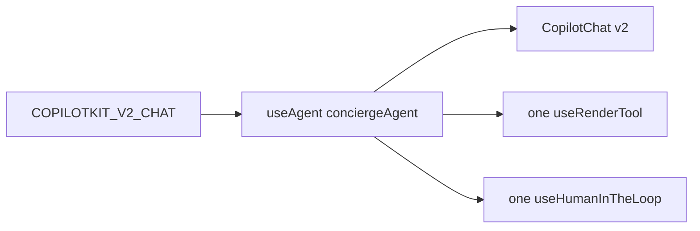
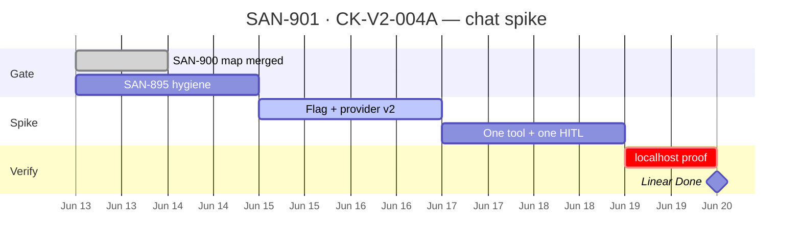

## CK-V2-004A — Chat vertical slice spike (useAgent + 1 tool + 1 HITL)

**In plain terms:** Before migrating all of Camila's `/chat` (20+ files), prove v2 works on a **tiny slice** — one message, one tool card, one HITL flow — behind `COPILOTKIT_V2_CHAT=1`. If the spike fails, fix architecture before SAN-890.

**Blocked by:** — (gates cleared: [SAN-900 · CK-V2-011 — Migration dependency map + audit-copilotkit-v2-map script](https://linear.app/sanjiovani/issue/SAN-900/ck-v2-011-migration-dependency-map-audit-copilotkit-v2-map-script) · [SAN-895 · CK-V2-007 — Fix hostEventAgent Gemini thought_signature console errors](https://linear.app/sanjiovani/issue/SAN-895/ck-v2-007-fix-hosteventagent-gemini-thought-signature-console-errors) · [SAN-905 · CK-V2-007d — Console clean on hostEventAgent stream](https://linear.app/sanjiovani/issue/SAN-905/ck-v2-007d-console-clean-on-hosteventagent-stream) merged [#216](https://github.com/amo-tech-ai/mdeapp/pull/216) @ `34d6831`)

**Unblocks:** [SAN-890 · CK-V2-004 — Migrate /chat (conciergeAgent) to v2 — last, highest-risk](https://linear.app/sanjiovani/issue/SAN-890/ck-v2-004-migrate-chat-conciergeagent-to-v2-last-highest-risk) full `/chat` migration directly ([SAN-911 · CK-V2-013 — Extract CopilotKit v2 migration factory before full /chat migration](https://linear.app/sanjiovani/issue/SAN-911/ck-v2-013-extract-copilotkit-v2-migration-factory-before-full-chat) parked)

**Skills:** `copilotkitV1` · `copilotkit-upgrade` · `mde-task-lifecycle` · `task-verifier` · `testing`

**Audit:** [`05-890audit.md`](https://github.com/amo-tech-ai/mdeapp/blob/main/docs/upgradeV2/05-890audit.md) · [`official-docs.md`](https://github.com/amo-tech-ai/mdeapp/blob/main/docs/upgradeV2/official-docs.md)

**Plan:** [`efficient-plan.md` Task D](https://github.com/amo-tech-ai/mdeapp/blob/main/docs/upgradeV2/efficient-plan.md)

---

### Purpose

De-risk [SAN-890 · CK-V2-004 — Migrate /chat (conciergeAgent) to v2 — last, highest-risk](https://linear.app/sanjiovani/issue/SAN-890/ck-v2-004-migrate-chat-conciergeagent-to-v2-last-highest-risk) by proving the v2 subpath pattern on `/chat` with **minimal surface area**: `useAgent(conciergeAgent)` + one `useRenderTool` + one `useHumanInTheLoop` — zero console errors on flag-on localhost.

### User stories

| Persona | Story | Done when |
|---|---|---|
| **Camila** | I send one chat message on v2 flag-on and get a normal reply. | Message streams without error |
| **Camila** | I see one rental/event card from a tool call. | One `useRenderTool` renders |
| **Camila** | I complete one venue-booking approve/reject on v2. | One HITL flow passes |
| **Sofía** | Spike failure blocks full migration — no [SAN-890 · CK-V2-004 — Migrate /chat (conciergeAgent) to v2 — last, highest-risk](https://linear.app/sanjiovani/issue/SAN-890/ck-v2-004-migrate-chat-conciergeagent-to-v2-last-highest-risk) until PASS. | Evidence JSON green |
| **Lucía** | Console sweep on spike path = 0 errors. | Playwright or manual proof |

---

### Scope boundary

**In scope:**
```text
/chat → COPILOTKIT_V2_CHAT=1
  → provider-v2 twin (minimal)
  → useAgent(conciergeAgent)
  → CopilotChat from /v2
  → 1 useRenderTool (pick one search tool)
  → 1 useHumanInTheLoop (venue booking OR publish-style stub)
```

**Out of scope:** map pins · full ×12 tool renders · fast-path regex · topic switch · VEB workflow · `useCopilotChatInternal` cliff (document only)



---

### Completion steps

#### A. Gate
- [x] **A1** [SAN-900 · CK-V2-011 — Migration dependency map + audit-copilotkit-v2-map script](https://linear.app/sanjiovani/issue/SAN-900/ck-v2-011-migration-dependency-map-audit-copilotkit-v2-map-script) `09-file-map.md` merged — touch order sourced from map
- [x] **A2** [SAN-895 · CK-V2-007 — Fix hostEventAgent Gemini thought_signature console errors](https://linear.app/sanjiovani/issue/SAN-895/ck-v2-007-fix-hosteventagent-gemini-thought-signature-console-errors) + [SAN-905 · CK-V2-007d — Console clean on hostEventAgent stream](https://linear.app/sanjiovani/issue/SAN-905/ck-v2-007d-console-clean-on-hosteventagent-stream) landed — host console hygiene gate passed ([#216](https://github.com/amo-tech-ai/mdeapp/pull/216) @ `34d6831`)
- [ ] **A3** Read [`05-890audit.md`](https://github.com/amo-tech-ai/mdeapp/blob/main/docs/upgradeV2/05-890audit.md) hook map

#### B. Scaffold spike
- [ ] **B1** Add `COPILOTKIT_V2_CHAT` flag in `src/platform/copilot/` (mirror host-event pattern)
- [ ] **B2** `copilot-kit-provider.tsx` — v2 branch for `/chat` only
- [ ] **B3** Spike shell: minimal v2 `chat-center-panel` twin OR flag branch in existing panel

#### C. Wire minimal hooks
- [ ] **C1** `useAgent({ agentId: "conciergeAgent" })` — name matches Mastra key
- [ ] **C2** One `useRenderTool` — e.g. `searchRentalsTool` only
- [ ] **C3** One `useHumanInTheLoop` — venue booking or stub HITL
- [ ] **C4** Import `@copilotkit/react-core/v2/styles.css` on spike path only

#### D. Verify
- [ ] **D1** `COPILOTKIT_V2_CHAT=1` + `npm run dev` — send message, see tool card
- [ ] **D2** HITL approve/reject completes on spike flow
- [ ] **D3** Zero console errors on spike path
- [ ] **D4** Flag OFF — `/chat` unchanged (grep v1 path still default)
- [ ] **D5** `npm test -- --run copilotkit-v2` + targeted unit tests green

#### E. Ship
- [ ] **E1** Evidence: `docs/tasks/testing/evidence/SAN-901/`
- [ ] **E2** PR `Closes SAN-901` · one worktree
- [ ] **E3** If FAIL: document blocker in [SAN-890 · CK-V2-004 — Migrate /chat (conciergeAgent) to v2 — last, highest-risk](https://linear.app/sanjiovani/issue/SAN-890/ck-v2-004-migrate-chat-conciergeagent-to-v2-last-highest-risk) — do not start full migration

---

### Proof commands

```bash
COPILOTKIT_V2_CHAT=1 infisical run --silent --env=dev --path=/ -- npm run dev
# Camila path: http://localhost:3001/chat
npm test -- --run copilotkit-v2
npm run build
```

| Gate | Pass |
|---|---|
| v2 flag-on chat | message + 1 tool + 1 HITL |
| Console | 0 errors on spike |
| v1 default | unchanged |

---

### Gantt — SAN-901 · CK-V2-004A — Chat vertical slice spike



---

### Out of scope

- Full ×12 `search-tool-renders` migration
- `concierge-chat-messages` cliff (`useCopilotChatInternal`)
- [SAN-911 · CK-V2-013 — Extract CopilotKit v2 migration factory before full /chat migration](https://linear.app/sanjiovani/issue/SAN-911/ck-v2-013-extract-copilotkit-v2-migration-factory-before-full-chat) factory extraction
- Prod flag flip
