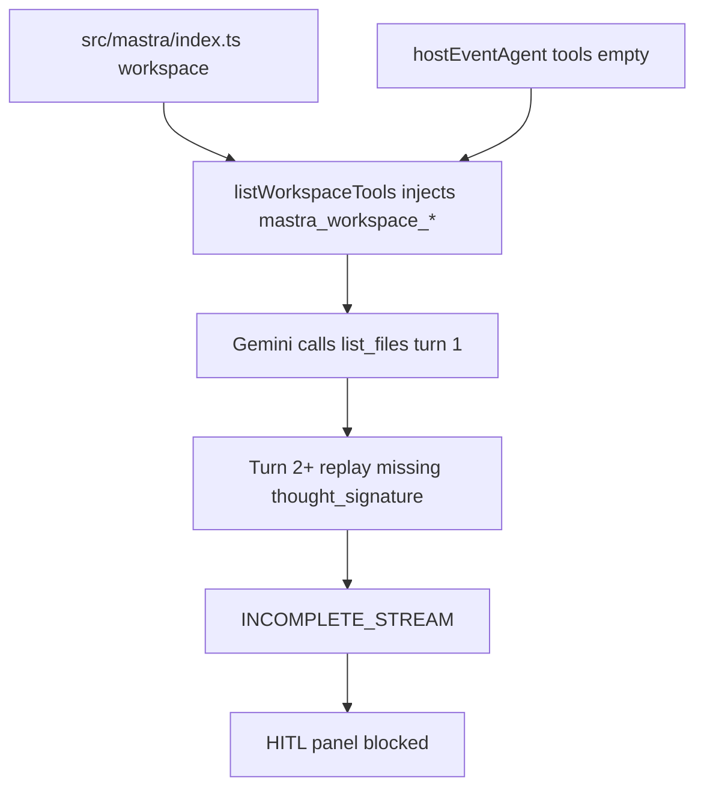
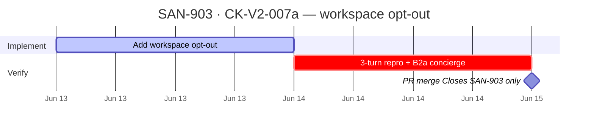

## CK-V2-007a — P0 workspace opt-out on hostEventAgent

**In plain terms:** Roberto types his event details on `/host/event/new` and the AI should fill the form and show the publish-approval panel — today Gemini often crashes on turn 2 with `thought_signature` errors that correlate with `mastra_workspace_list_files` on turn 1. This one-line agent config **tests** whether opting out of the global workspace fixes the stream.

**Parent:** [SAN-895 · CK-V2-007](<https://linear.app/sanjiovani/issue/SAN-895>) · Fix hostEventAgent Gemini thought_signature

**Blocked by:** — (first executable step in [SAN-895](https://linear.app/sanjiovani/issue/SAN-895/ck-v2-007-fix-hosteventagent-gemini-thought-signature-console-errors) chain)

**Unblocks:** [SAN-902](https://linear.app/sanjiovani/issue/SAN-902/ck-v2-007b-minimal-repro-mastra-multi-turn-signature) repro · [SAN-904](https://linear.app/sanjiovani/issue/SAN-904/ck-v2-007c-hitl-approvereject-proofs-green) HITL proofs · [SAN-905](https://linear.app/sanjiovani/issue/SAN-905/ck-v2-007d-console-clean-on-hosteventagent-stream) console clean · host flag flip · [SAN-901](https://linear.app/sanjiovani/issue/SAN-901/ck-v2-004a-chat-vertical-slice-spike-useagent-1-tool-1-hitl) hygiene gate

**Does NOT close:** [SAN-895](https://linear.app/sanjiovani/issue/SAN-895) — landing SAN-903 is a **hypothesis test**; parent Done requires SAN-902 → SAN-904 → SAN-905.

**Skills (.claude/skills — load ≤5):** `mastra` · `gemini` · `mde-task-lifecycle` · `task-verifier` · `copilotkitV1`

**Audit:** [`08-local-hostaudit.md` §7](<https://github.com/amo-tech-ai/mdeapp/blob/main/docs/upgradeV2/08-local-hostaudit.md>) · [`11-tasks-audit.md`](<https://github.com/amo-tech-ai/mdeapp/blob/main/docs/upgradeV2/11-tasks-audit.md>) §SAN-903

**Spec score:** **94/100** — proceed as planned; confirm root cause in SAN-895 subtasks.

---

### Purpose

Opt `hostEventAgent` out of the **global Mastra workspace** so Gemini never sees `mastra_workspace_list_files` during Roberto's event wizard. This is the **leading mitigation hypothesis** for `thought_signature` / `INCOMPLETE_STREAM` — not a CopilotKit v2 defect; hits v1 and v2 equally.

**[SAN-895](https://linear.app/sanjiovani/issue/SAN-895) confirms** whether this resolves the stream failure via SAN-902 (repro doc) · SAN-904 (HITL) · SAN-905 (console gate).

### User stories

| Persona | Story | Acceptance |
| -- | -- | -- |
| **Roberto** (event host) | As Roberto on `/host/event/new`, I describe my event so the agent fills the form without console errors blocking publish. | Turn 1 tool surface has **no** `mastra_workspace_*` names |
| **Roberto** | I want the publish-approval panel after the agent drafts my event. | Stream survives to `preview_and_publish` (verified in [SAN-904](https://linear.app/sanjiovani/issue/SAN-904/ck-v2-007c-hitl-approvereject-proofs-green)) |
| **Sofía** (dev) | As Sofía, I need a minimal diff that does not change `conciergeAgent` workspace behavior. | Only `host-event.ts` agent config changes · **B2a** concierge still has workspace tools |
| **Lucía** (QA) | As Lucía, I can re-run HITL proofs and see zero `thought_signature` errors. | [SAN-905](https://linear.app/sanjiovani/issue/SAN-905/ck-v2-007d-console-clean-on-hosteventagent-stream) console gate passes |

---

### Primary hypothesis (not proven until SAN-895 closes)

Global `workspace` on `Mastra({ … })` injects filesystem tools into every agent unless opted out; `hostEventAgent` declares `tools: {}` but still inherits workspace tools; Gemini 3.5 replays multi-turn history and may throw `missing a thought_signature` when workspace tool calls appear in turn 1.

**Evidence today:** `thought_signature` and `mastra_workspace_list_files` **co-occur** in localhost traces.  
**Not yet proven:** removing workspace tools **eliminates** the error — that confirmation belongs to SAN-902/905.



---

### Completion steps (check in order)

#### A. Implement

- [ ] **A1** Add `workspace: () => undefined` to `hostEventAgent` in `src/mastra/agents/host-event.ts` — matches Mastra agent-level opt-out pattern
- [ ] **A2** Confirm `src/mastra/index.ts` global `workspace` unchanged — concierge skills path unaffected

#### B. Verify locally

- [ ] **B1** Restart `npm run dev` — both `[ui]` and `[agent]` prefixes healthy
- [ ] **B2** Minimal repro (no browser) from audit §7:
  - Turn 1: `toolCalls` must **not** include `mastra_workspace_*`
  - Turns 2–3: run **3 conversational turns** on same `threadId` — **no** `missing a thought_signature` / `INCOMPLETE_STREAM`
- [ ] **B2a** Collateral check: `hostEventAgent.getWorkspace()` → `undefined`; `conciergeAgent.getWorkspace()` + `mastra.getWorkspace()` still defined — covered by `host-event-agent` Vitest (faster than live `listTools`)
- [ ] **B3** `npm test -- --run host-event` — 16/16 green
- [ ] **B4** `npm run build` — exit 0

#### C. Hand off to parent proofs

- [ ] **C1** Comment on [SAN-895](https://linear.app/sanjiovani/issue/SAN-895/ck-v2-007-fix-hosteventagent-gemini-thought-signature-console-errors) with repro output — **do not** mark SAN-895 Done
- [ ] **C2** Unblock [SAN-902](https://linear.app/sanjiovani/issue/SAN-902/ck-v2-007b-minimal-repro-mastra-multi-turn-signature) / [SAN-904](https://linear.app/sanjiovani/issue/SAN-904/ck-v2-007c-hitl-approvereject-proofs-green) / [SAN-905](https://linear.app/sanjiovani/issue/SAN-905/ck-v2-007d-console-clean-on-hosteventagent-stream)
- [ ] **C3** Do **not** flip `COPILOTKIT_V2_HOST_EVENT` on prod — hygiene proofs still open on [SAN-898](https://linear.app/sanjiovani/issue/SAN-898/ck-v2-010-fix-v2-host-event-hydration-mismatch-caret-color-transparent)

#### D. Ship

- [ ] **D1** One PR · branch `ai/san-903-ck-v2-007a-p0-workspace-opt-out-on-hosteventagent` · `Closes SAN-903` (not SAN-895)
- [ ] **D2** Evidence snippet in PR body: before/after toolCalls + 3-turn repro + B2a concierge check

---

### Code change (exact)

```ts
// src/mastra/agents/host-event.ts
export const hostEventAgent = new Agent({
  id: "host-event-agent",
  name: "Host Event Agent",
  tools: {},
  workspace: () => undefined, // SAN-903 · opt out of global filesystem tools (hypothesis test)
  model: FLASH_MODEL,
  instructions: HOST_EVENT_INSTRUCTIONS,
  memory: createThreadMemory(EventDraftStateSchema),
});
```

---

### Proof commands

```bash
# Unit gates (fast — no Gemini)
npm test -- --run host-event-agent

# Live 3-turn (Infisical + tsx — SAN-902 may promote to committed script)
infisical run --silent --env=dev --path=/ -- npx tsx --input-type=module -e "
import { mastra } from './src/mastra/index.ts';
const agent = mastra.getAgent('hostEventAgent');
const threadId = 'san-903-' + Date.now();
const r1 = await agent.generate('Startup mixer March 15 Provenza 200 cap', { threadId, resourceId: 'repro' });
console.log('turn1 tools', r1.toolCalls?.map(t => t.toolName));
const r2 = await agent.generate('Set venue Rooftop Provenza', { threadId, resourceId: 'repro' });
console.log('turn2 ok', !!r2.text);
const r3 = await agent.generate('Add GA tier 50000 COP', { threadId, resourceId: 'repro' });
console.log('turn3 ok', !!r3.text);
"

npm run build
```

| Gate | Pass |
| -- | -- |
| Unit: hostEvent `getWorkspace()` | `undefined` |
| Unit: concierge `getWorkspace()` | defined (B2a) |
| Turn 1 (hostEvent live) | No `mastra_workspace_*` |
| Turns 2–3 (hostEvent live) | No `thought_signature` throw |
| Build | exit 0 |

---

### Gantt — [SAN-903](https://linear.app/sanjiovani/issue/SAN-903/ck-v2-007a-p0-workspace-opt-out-on-hosteventagent) step sequence



---

### Out of scope

* Marking [SAN-895](https://linear.app/sanjiovani/issue/SAN-895) Done (parent needs 902–905)
* Mastra memory `providerMetadata` round-trip ([SAN-899](https://linear.app/sanjiovani/issue/SAN-899/ck-ai-002-mastra-thread-memory-thought-signature-round-trip-gemini-35) fallback)
* Hydration `caret-color` ([SAN-898](https://linear.app/sanjiovani/issue/SAN-898/ck-v2-010-fix-v2-host-event-hydration-mismatch-caret-color-transparent))
* Disabling workspace globally in `workspaces.ts` (blast radius on concierge)
* CopilotKit v2 hook migration (already Done on [SAN-889](https://linear.app/sanjiovani/issue/SAN-889/ck-v2-003-migrate-hostevent-hosteventagent-to-v2) structural)
