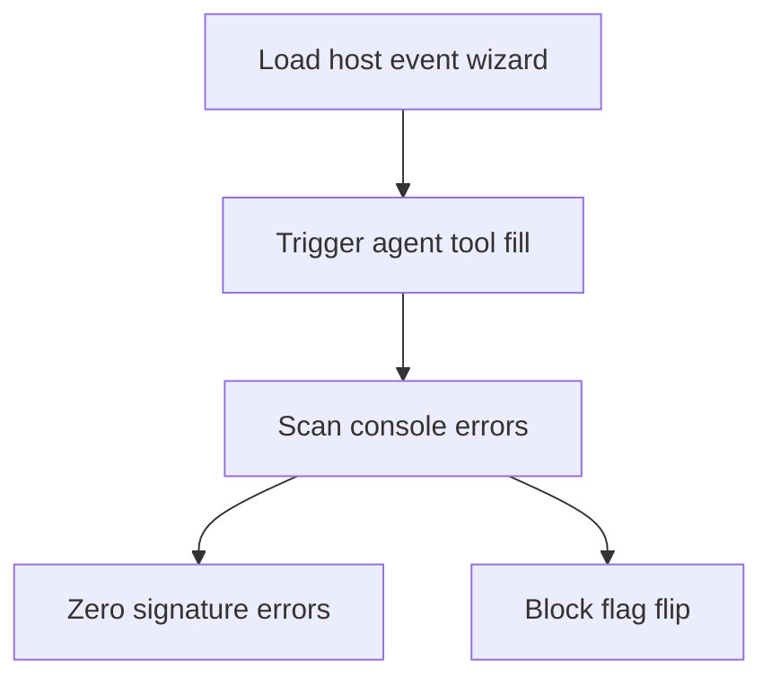

## CK-V2-007d — Console clean on hostEventAgent stream

**Parent:** [SAN-895 · CK-V2-007 — Fix hostEventAgent Gemini thought_signature console errors](https://linear.app/sanjiovani/issue/SAN-895/ck-v2-007-fix-hosteventagent-gemini-thought-signature-console-errors)

**In plain terms:** Roberto (and Lucía's console sweep) must see **zero** `thought_signature` / `INCOMPLETE_STREAM` errors on `/host/event/new` for both v1 and v2 flag states after the P0 fix.

**Purpose:** Final hygiene gate before any `COPILOTKIT_V2_HOST_EVENT` preview flip.

### User stories

| Persona | Story | Done when |
|---|---|---|
| **Roberto** | My browser console stays clean while using the wizard. | 0 signature errors |
| **Lucía** | Automated proofs capture console allowlist. | Scripts pass console gate |
| **Sofía** | SAN-895 can flip to Done. | This subtask checked |

### Steps

- [ ] **A1** Flag OFF — load wizard, trigger agent fill, capture console 30s
- [ ] **A2** Flag ON — same flow, zero `thought_signature` errors
- [ ] **A3** Note: v1 max-depth errors may remain (SAN-893) — do not conflate
- [ ] **A4** `npm test -- --run host-event` + `copilotkit-v2`

### Proof

Filter DevTools console for: `thought_signature`, `INCOMPLETE_STREAM`, `mastra_workspace`

**Blocked by:** [SAN-904 · CK-V2-007c — HITL approve/reject proofs green](https://linear.app/sanjiovani/issue/SAN-904/ck-v2-007c-hitl-approvereject-proofs-green)
