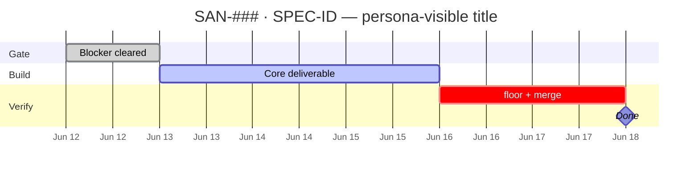

> ⚠️ **DEPRECATED (2026-06-20) — superseded by the canonical `linear` skill.**
> All content from `mde-linear` was merged into `.agents/skills/linear/` (SKILL.md +
> references/). Use the `linear` skill instead. Kept temporarily for review; scheduled for
> removal once the migration is approved. Do not extend this file.

# mde-linear — mdeai Linear operations

**BLUF:** Load [linear.md](../../../linear.md) first, then this skill for mdeai-specific rules. For API/CLI mechanics, delegate to the generic `linear` skill.

**Issue descriptions are execution contracts** — not title-only stubs. Every executable SAN-### gets completion steps + Gantt (and sequence diagram when HITL/routing).

---

## When to invoke

| Trigger | Action |
|---------|--------|
| "Create Linear issue for …" | Follow creation workflow + **full description skeleton** below |
| "Update SAN-###" / "Mark SAN-### Done" | Pair ID with title; verify gates; sync checkboxes |
| "Add steps / Gantt to SAN-###" | Load [linear-issue-steps.md](../mde-task-lifecycle/references/linear-issue-steps.md) |
| Cycle / milestone / initiative update | Follow linear.md §Cycles |
| "Sync tasks to Linear" | Bulk script or MCP per linear.md |
| CK-V2 / VEB / program tasks | Add skills table + link to program tracker |

---

## mdeai rules (always)

1. **Never bare `SAN-NNN`** — always `SAN-NNN · <full Linear title>` in chat, commits, PRs, docs.
2. **Branch naming:** `ai/san-NNN-spec-id-slug` (see linear.md).
3. **PR magic words:** `Closes SAN-NNN` in PR body.
4. **Deprecated prefixes:** Do not create new `SCREEN-*`, `EVP-*`, `IMP-*` issues.
5. **Phase labels:** `phase:launch` (Cycle 1 P0), `phase:mvp` (post-launch).
6. **One worktree, one PR** per SAN issue (app code).

---

## Executable issue description (required skeleton)

Paste into `save_issue` `description` when creating or refreshing an issue:

```markdown
## <SPEC-ID> — <short title>

**In plain terms:** <Who notices what on which surface — one sentence>

**Blocked by:** SAN-### · <full title> (or "—")

**Skills (.claude/skills — load ≤5):**
| Skill | Why (persona-visible) |
|---|---|
| `mde-task-lifecycle` | Five-phase gates + ship bookkeeping |
| … | … |

Map: `<path to program skills map if exists>`

---

### Completion steps (check in order)

#### A. <Gate / scope>
- [ ] **A1** <action> — proof: <file, grep, URL, or behavior>

#### B. <Build>
- [ ] **B1** …

#### E. Verify + ship
- [ ] **E1** Vitest / unit tests
- [ ] **E2** Playwright or localhost proof
- [ ] **E3** `npm run floor` green
- [ ] **E4** Evidence `docs/tasks/testing/evidence/SAN-###/`
- [ ] **E5** PR merged · `Closes SAN-###` · Linear Done

---

### Gantt — SAN-### step sequence



**Unblocks:** SAN-### · <next task>
```

**Canonical reference:** [mde-task-lifecycle/references/linear-issue-steps.md](../mde-task-lifecycle/references/linear-issue-steps.md)

---

## Plain-language descriptions (persona-first)

Write so a busy non-engineer knows what changes in the product.

| Bad (jargon) | Good (mdeai) |
|---|---|
| "Migrate `useCoAgent` → `useAgent`" | "**Roberto**'s event wizard keeps draft state when the agent fills fields" |
| "Flag-gated v2 provider" | "Prod stays v1 until env flag on — **Camila**'s `/chat` untouched this PR" |
| "Wire `useRenderTool`" | "Sales KPI cards still read tool **result**, not LLM prose" |

**Personas:** Roberto `/host/*` · Camila `/chat` `/rentals` · Andrés checkout · Patricia `/admin` · Sofía CI · Lucía Playwright.

Each checklist step's proof should name who breaks if the step is skipped.

---

## Mermaid diagrams in Linear

Load **`mermaid-diagrams`** before authoring. Validate against `references/gantt.md` and `references/best-practices.md`.

| Diagram | When | Rules |
|---|---|---|
| **Gantt** | Every executable issue | `dateFormat YYYY-MM-DD` · sections = checklist phases · `:crit` = merge/floor · `:milestone` = Done |
| **flowchart** | Program deps (epic) | `accTitle` + `accDescr` for a11y |
| **sequenceDiagram** | HITL, routing, webhooks | Agent ↔ UI ↔ user; e.g. Roberto publish approval |

**Program Gantt** (second diagram on cutover/epic issues): chain SAN-888 → 889 → 890 → 891 with parallel SAN-892.

**CK-V2 examples:** Linear SAN-888–892 (verified 2026-06-12).

### Gantt status tokens

| Token | Meaning |
|---|---|
| `:done` | Shipped / merged |
| `:active` | Current branch / PR |
| `:crit` | Blocks Done (floor, HITL, highest risk) |
| `:milestone` | Linear Done (0d) |
| `after <id>` | Sequential dependency within issue |

---

## Progress tracker sync (programs)

When a program has repo trackers, keep **Linear + docs** aligned:

| Artifact | Typical path | Update when |
|---|---|---|
| Linear checkboxes | Issue description | Step completes |
| Progress tracker | `docs/<program>/todo.md` | 🟢🟡🔴⚫ + % per task |
| Changelog | `docs/<program>/changelog.md` | Merge, proof, blocker |

**CK-V2:** [docs/upgradeV2/todo.md](../../../docs/upgradeV2/todo.md) · [changelog.md](../../../docs/upgradeV2/changelog.md)

Run **`task-verifier`** before marking steps `[x]` and setting state **Done**.

---

## Issue creation workflow

1. Read [linear.md](../../../linear.md) for project, labels, cycle.
2. Resolve full title (grep existing issues — no duplicate spec IDs).
3. Draft description with skeleton above (steps + Gantt + skills).
4. Set `team`, `project`, labels (`phase:launch` if P0), estimate if known.
5. Create via MCP `save_issue` or `linear issue create`.
6. Reply with linked title: `[SAN-NNN · Title](https://linear.app/sanjiovani/issue/SAN-NNN/...)`.
7. If program task: add row to `docs/<program>/todo.md`.

---

## Issue update / Done workflow

```
[ ] All completion steps E1–E5 checked (or N/A documented)
[ ] task-verifier pass on disk claims
[ ] Localhost proof (gate 9) unless pure-doc task
[ ] PR merged with Closes SAN-NNN
[ ] todo.md dot 🟢 + changelog dated entry
[ ] Linear state → Done
[ ] Gantt: mark :done / :milestone on final items (optional comment)
```

**Do not** flip Done on floor fail, missing evidence, or open blocker — use 🟡/🔴 in tracker instead.

---

## CK-V2 program quick map

| SAN | SPEC | Persona / surface | Flag |
|---|---|---|---|
| 886 | CK-V2-000 | Epic — no code | — |
| 887 | CK-V2-001 | Sofía — spike doc | — |
| 888 | CK-V2-002 | Roberto `/host/analytics` | `COPILOTKIT_V2_ANALYTICS` |
| 889 | CK-V2-003 | Roberto `/host/event/new` | `COPILOTKIT_V2_HOST_EVENT` |
| 890 | CK-V2-004 | Camila `/chat` | `COPILOTKIT_V2_CHAT` |
| 891 | CK-V2-005 | All — retire react-ui | remove flags |
| 892 | CK-V2-006 | Patricia — tag build-on-v2 | — |
| 893 | CK-V1-001 | Roberto `/host/event/new` (investigate) | — |
| 894 | CK-V1-002 | Roberto `/host/event/new` (fix max-depth) | — |
| 895 | CK-V2-007 / CK-AI-001 | Roberto — `thought_signature` hygiene | — |
| 896 | CK-V2-008 | Sofía — evidence refresh | — |
| 897 | CK-V2-009 | Roberto preview `/host/analytics` | `COPILOTKIT_V2_ANALYTICS` preview only |
| 898 | CK-V2-010 | Roberto — v2 hydration fix | `COPILOTKIT_V2_HOST_EVENT` |
| 899 | CK-AI-002 | All agents — memory signature round-trip | — |

Skills map: [docs/upgradeV2/CK-V2-skills-map.md](../../../docs/upgradeV2/CK-V2-skills-map.md)  
Lifecycle: [copilotkit-v2-migration.md](../mde-task-lifecycle/references/copilotkit-v2-migration.md)

---

## MCP / CLI delegation

For raw API operations, load the generic **`linear`** skill:

- `mcp__plugin_linear_linear__save_issue` — create/update (description supports Markdown + Mermaid fences)
- `mcp__plugin_linear_linear__list_issues` — search by team/project
- CLI: `linear issue view SAN-NNN`, `linear issue update SAN-NNN --description-file …`

**Mermaid in MCP:** pass description as real newlines in markdown (not escaped `\n`).

---

## Views & links

| Resource | URL |
|---|---|
| CK-V2 view | https://linear.app/sanjiovani/view/v2-upgrade-30acec9f94bd |
| Team | sanjiovani |
| Conventions | [linear.md](../../../linear.md) |

---

## Don't use

- `linear-automation` / `linear-claude-skill` — archived under `.agents/skills/_archive/2026-06-11/`
- Bare issue numbers in user-facing text
- Title-only descriptions for code tasks
