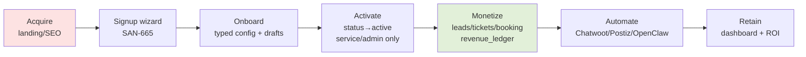
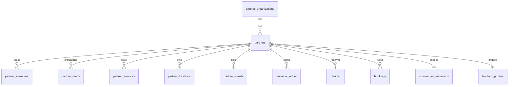
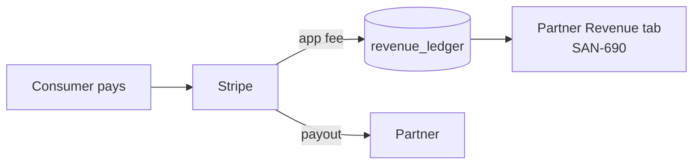

# Partners Project — Forensic Audit & Improvement Plan

> Forensic review of the Linear **Partners** project ([032df556f9f9](https://linear.app/sanjiovani/project/partners-032df556f9f9)) + the partner schema (PR #105/#106) against the live codebase and existing backlog.
> **Method:** grounded in the real 44 issues / 5 milestones, the `ptr001–014` migrations, and the existing global catalogs (REV-C\*, CW-\*, OCL/AUT, INT, Venues/Events/RE/Trips). Brutally honest; solutions included.
> **Date:** 2026-06-06 · **Scope:** Partners only (consumer side audited separately in `docs/dashboard.md`).

---

## 1. Executive summary

The Partners project is **well-conceived and mostly follows "build once, configure many"** — one shared `partners` schema, one shared dashboard (SAN-690), and per-type onboarding *cycles* rather than per-type platforms. The milestone spine (Acquire → Deliver → Monetize → Augment → Expand) is sound, and hotels/coworking are correctly guard-railed as future types.

**But it is early and has real gaps.** Honest headline issues:

1. **IA is inconsistent** — partner routes are scattered across `/`, `/partners/*`, `/business/*`, `/venues/*` with no single namespace.
2. **Acquisition gap for your strongest verticals** — Nightlife (70% built) and Restaurants (55%) have **e2e onboarding cycles but no marketing landing page**. You can't acquire the partners for the verticals you've actually shipped.
3. **Duplication risk with existing catalogs** — partner Chatwoot (689), Postiz (687), OpenClaw (688), and revenue (668) overlap with already-ticketed `CW-1/CW-3`, `AUT-027`, `OCL-*`, and `REV-C*`. Reuse, don't fork.
4. **The 11 per-type "e2e cycle" issues read like 11 builds** — they must be *configurations + verification* of ONE wizard (665) + ONE dashboard (690), or scope explodes.
5. **Schema is strong but ships with 2 privilege gaps** (F1 self-activation, F2 open storage insert) — fixed in PR #106 (`ptr014`), not yet merged.
6. **Almost everything is P3/P4 backlog** — only the schema is moving. Revenue proof (M3) has no in-flight work.

**Overall: 🟡 71/100** — good architecture, thin execution, fixable. The single highest-leverage move: **prove ONE vertical end-to-end (event host) with revenue, reusing existing rails, before fanning out to 11 types.**

---

## 2. Current system map

| Area | Exists? | Source | Notes |
|---|---|---|---|
| Partner DB schema | 🟡 In progress | SAN-683 / PR #105 (ptr001–013) | Strong; privilege fixes in #106 (ptr014) pending |
| `partner_type` enum | ✅ | ptr001 | host·venue·broker·sponsor·agency·vendor·tour·creator (8) — nightclub/restaurant/café = `venue`+category ✅ |
| Revenue ledger | ✅ schema | ptr013 | Table exists; wiring (SAN-668) backlog |
| Leads/bookings partner cols | ✅ | ptr010/011 | Extends live tables (no dup) ✅ |
| Partner hub `/partners` | ❌ planned | SAN-692 (Todo) | Not built |
| Signup wizard `/partners/signup` | ❌ planned | SAN-665 (Todo) | Foundation for all onboarding |
| Partner dashboard `/dashboard` | ❌ planned | SAN-690 (Backlog); SAN-666 canceled dup ✅ | Route should be `/partners/dashboard` (IA) |
| Marketing landings | ❌ planned | /host(660) /venues(661) /sponsors(664) /business/ai(663) /partners/rentals(691) | **Missing: nightlife, restaurants, cafés, brokers(named), hotels** |
| Per-type e2e cycles | ❌ planned | 675–682, 698–700 (11 issues) | Should be configs+tests of 665/690, not 11 builds |
| AI copilot | ❌ planned | SAN-685 | Depends on Mastra (✅) + create_checkout (SAN-551, not built) |
| Booking system | ❌ planned | SAN-686 | Depends on ptr011 (✅) + create_checkout |
| Lead-gen engine | ❌ planned | SAN-684 | Depends on schema |
| Chatwoot/WhatsApp | ❌ planned | SAN-689 | **Overlaps SAN-553/555 (CW-1/CW-3)** |
| Postiz/social/assets | ❌ planned | SAN-687/697 | **Overlaps SAN-213 (AUT-027), Postiz catalog** |
| OpenClaw enrichment | ❌ planned | SAN-688 | **Overlaps OCL-* catalog (AUT-015/019/020…)** |
| UX pack (wireframes+30 SVG) | ❌ planned | SAN-674 (Todo) | Over-scoped single task |
| Master plan epic | 🟡 | SAN-667 (Backlog) | Epic not yet authored |
| Existing reusable verticals | ✅ | Venues/Events/RE/Trips/Commerce/AI projects | The supply side to reuse |

**Partner types (enum vs cycles):** enum = 8; e2e cycles = 11 (nightclub/restaurant/café are `venue` sub-categories). Correct "configure many" — keep it.

---

## 3. Website page audit

> Grading the *planned* pages (none built yet). Score = design completeness of the plan, not live quality.

| Page | Issue | Purpose | CTA | Content | Forms | AI/Bot | Rev fit | Score |
|---|---|---|---|---|---|---|---|---|
| `/partners` hub | 692 | Entry for all types | route picker → signup | thin (planned) | — | — | indirect | 🟡 70 |
| `/host` | 660 | Event host landing | "List your event" | planned | → signup | concierge later | tickets | 🟡 74 |
| `/venues` | 661 | Venue landing | "Get listed" | planned | → signup | — | featured/booking | 🟡 72 |
| `/partners/rentals` (brokers) | 691 | Broker landing | "Get leads" | planned | → signup | lead bot | lead fees | 🟡 72 |
| `/sponsors` | 664 | Sponsorship | "Become a sponsor" | planned | contact | — | sponsorship | 🟡 68 |
| `/business/ai` | 663 | AI services (agency) | "Book a demo" | planned | contact | — | AI retainers | 🟡 67 |
| `/partners/signup` | 665 | Typed onboarding wizard | submit | wizard | ✅ core | wizard copilot | all | 🟡 75 |
| `/dashboard` | 690 | Role-aware dashboard | manage | planned | — | copilot | all | 🟡 70 |
| `/contact` | 693 | Demo/contact | submit | planned | ✅ | — | indirect | 🟡 66 |
| `/pricing` | 695 | Partner pricing | "Start" | planned | — | — | subs | 🟡 64 |
| `/contests` | 694 | Growth loop | enter | planned | ✅ | — | engagement | 🟢/🟡 60 |
| `/partners/creator` | 696 | Creator program | "Join" | planned | → signup | — | creator comm | 🟡 62 |
| `/business/social` (Postiz) | 697 | Social services | "Get started" | planned | contact | — | social retainer | 🟡 60 |
| `/business/event-marketing` | 701 | Event marketing svc | demo | planned | contact | — | retainer | 🟡 60 |
| `/venues/features` | 703 | Venue deep-dive | "Get listed" | planned | — | — | featured | 🟡 62 |
| `/partners/vendor` | 702 | Marketplace vendor | "Sell" | planned | → signup | — | marketplace % | 🟡 58 |
| `/about` | 662 | Trust | — | planned | — | — | indirect | 🟡 60 |

**Missing pages (conversion gaps):**
- 🔴 **`/nightlife` partner landing** — Nightlife is your **most-built** consumer vertical (70%) but has **no partner acquisition page**.
- 🔴 **`/restaurants` partner landing** — Restaurants 55% built, no acquisition page.
- 🟡 **`/cafes` partner landing** — café cycle exists (679), no landing.
- 🟡 **`/brokers`** named route — only `/partners/rentals` exists; "brokers" SEO term unclaimed.
- 🟢 **`/hotels`** — correctly deferred (guard-railed).

**IA finding (🔴):** routes live under 4 different namespaces (`/host`, `/venues`, `/partners/*`, `/business/*`). Pick one partner namespace (recommend `/partners/<type>` for landings + `/partners/dashboard`, keep `/business/*` only for AI-agency services). Inconsistent IA hurts SEO, nav, and analytics.

---

## 4. Partner journey audit

> Acquire → Signup → Onboard → Activate → Monetize → Automate → Retain.

| Partner | Journey score | Drop-offs | Missing features | Revenue opportunity |
|---|---|---|---|---|
| Event Host | 🟡 72 | no landing→signup proof; publish→revenue not wired | e2e (675), revenue tab (668) | tickets 5%+fee · promo |
| Nightclub | 🔴 55 | **no landing page**; VIP deposit not built | landing, VIP booking (SAN-559/C10) | 10–15% table |
| Restaurant | 🔴 55 | **no landing**; reservation loop thin | landing, reservation mgmt | retainer · featured |
| Café | 🔴 50 | **no landing**; `/cafes` is a stub | landing, café cycle (679) | featured · loyalty |
| Venue | 🟡 65 | landing exists, booking not wired | booking (686) | featured · booking |
| Broker | 🟡 68 | lead billing not built | lead-gen (684), lead billing (C4) | qualified lead $30–75 |
| Property Mgr | 🔴 50 | folded into broker? unclear | clarify vs broker | rentals |
| Hotel | ⚪ defer | n/a (guard-railed) | — | later |
| Sponsor | 🟡 62 | reuses `sponsor.*` but cycle thin | 681 | sponsorship |
| Agency | 🟡 60 | AI-services delivery undefined | 682, AI catalog (669) | AI retainers |
| Vendor | 🔴 48 | marketplace not built | 698, marketplace (672) | marketplace % |
| Tour Operator | 🟡 58 | no booking/commission | 699 | 15–20% comm |
| Influencer/Creator | 🔴 48 | creator program undefined | 696/700 | creator comm |

**Weakest links (🔴):** *Acquire* (missing landings for nightlife/restaurant/café) and *Monetize* (revenue wiring SAN-668 not started). Strongest: *Onboard* (schema + drafts done/near).

---

## 5. Forms, chatbots & copilots audit

| Form/Bot | Issue | Purpose | Missing fields | AI opportunity | Risk | Fix |
|---|---|---|---|---|---|---|
| Signup wizard | 665 | typed onboarding | per-type schema, autosave resume | wizard copilot drafts (partner_drafts ✅) | abandonment | autosave (have `partner_drafts`), resume link |
| Lead form | 684 | inbound capture | partner_id attribution, consent | lead-qual agent (C8) | spam, no consent | hCaptcha + Ley-1581 consent + `lead_billing` |
| Booking form | 686 | availability→pay | availability model, deposit | booking agent + create_checkout | double-book | idempotent (VEN-026 pattern) + webhook truth |
| Contact/demo | 693 | sales | qualification fields | router to right team | unrouted leads | Chatwoot routing |
| Partner copilot | 685 | dashboard assistant | capability sets per type, HITL | Mastra agent | unsafe writes | HITL approvals; reuse one agent + tools |
| Lead assistant | 684/685 | qualify/route | scoring | C8 Lead Agent | over-automation | human-in-loop on routing |
| Booking assistant | 686 | confirm | — | booking workflow | irreversible pay | deterministic workflow + HITL (AGT-11 SAN-601) |
| Marketing assistant | 670/687 | content/campaigns | brand voice | Marketing Agent + Postiz | brand-unsafe posts | approval gate (AUT-027 sandbox) |

**Key fix:** there is no per-type *form schema* source yet. Define it as JSON config consumed by ONE wizard — not N hard-coded forms.

---

## 6. AI architecture audit

| Agent/Workflow | Needed? | Tier | Problem | Fix | Score |
|---|---|---|---|---|---|
| Partner copilot (685) | ✅ | MVP | risks becoming a new mega-agent | ONE concierge + capability **tools** scoped by `partner_type` | 🟡 68 |
| Lead agent | ✅ | MVP | duplicates C8 (canonical) | reuse C8/C4 (SAN-562 pointer) | 🟡 70 |
| Booking workflow | ✅ | MVP | duplicates AGT-11 (SAN-601) + create_checkout (SAN-551) | reuse; deterministic + HITL | 🟡 70 |
| Marketing agent (670) | ✅ | Growth | duplicates Marketing/Postiz catalog | reuse AUT-027/REV-C7 | 🟡 66 |
| Concierge wiring (673) | ✅ | Core | unclear contract | `useCopilotReadable` partner context, no split layout | 🟡 67 |
| ADK grounding | ✅ | Core | not partner-specific | reuse existing sidecar | 🟢 80 |

**Findings:** ⚠️ **agent-sprawl risk** — 685/684/686/670 each imply a new agent. Collapse to **one partner copilot + a tool registry** (create_checkout, qualify_lead, gen_content, build_proposal) gated by capability sets. ⚠️ **missing approval gates** on marketing send + booking pay — both need HITL. ✅ ADK/Gemini reuse is correct (no new model stack).

---

## 7. Data architecture audit

| Data area | Current state | Missing | RLS risk | Fix |
|---|---|---|---|---|
| Partner core | ✅ partners, organizations, members | — | 🔴 **F1: member self-activate** | ptr014 column-grants (#106) |
| Drafts | ✅ partner_drafts | — | 🟢 owner-scoped | — |
| Services | ✅ partner_services | entitlement enforcement | 🟡 **F4: tier self-set** | ptr014 |
| Locations | ✅ partner_locations | — | 🟢 | — |
| Assets | ✅ partner_assets + bucket | — | 🔴 **F2/F3 storage scope** | ptr014 path-scoping |
| Leads | ✅ extended | — | 🟢 ptr012 | — |
| Bookings | ✅ extended | availability table | 🟢 | add `partner_availability` (M2) |
| Revenue | ✅ revenue_ledger | wiring + payouts | 🟡 F5 immutability | append-only + Stripe wiring (668) |
| Campaigns | ❌ | `campaigns/audiences` | n/a | add (M4, reuse `wa_outbox`) |
| Conversations | ❌ (Chatwoot owns) | mirror table | n/a | mirror only (689) |
| pgvector | ❌ for partners | embeddings for partner search | n/a | reuse INT-016/VEC (defer) |

**Verdict:** 🟢 **strong, additive, bridged (no duplication)** — the best part of the project. Blockers are the 4 privilege fixes (in #106) + availability + campaign tables.

---

## 8. Revenue audit

| Partner | Revenue streams | Readiness | Missing work | Score |
|---|---|---|---|---|
| Event host | ticket comm + promo | 🟡 schema ready, unwired | 668 + create_checkout | 65 |
| Nightclub | VIP table fee, guest list | 🔴 | landing + C10 deposit | 45 |
| Restaurant | retainer, featured, reservation | 🔴 | landing + retainer product | 45 |
| Café | featured, loyalty | 🔴 | landing | 40 |
| Venue | featured, booking | 🟡 | booking (686) | 55 |
| Broker | qualified lead fee, agent sub | 🟡 | C4 lead billing | 60 |
| Sponsor | sponsorship | 🟢 `sponsor.*` exists | activate (681) | 68 |
| Agency | AI retainers | 🟡 | AI catalog (669) | 58 |
| Tour | 15–20% comm | 🔴 | booking | 45 |
| Vendor | marketplace % | 🔴 | marketplace (672) | 40 |
| Creator | creator comm | 🔴 | program (700) | 38 |

**Finding (🔴):** M3 (Monetize) is the whole point of a partner platform and has **zero in-flight work**. `revenue_ledger` exists but nothing writes to it. **Wire event-host ticket fees first** (reuse existing `ticket-payment-webhook`) — smallest path to "first GMV in partner dashboard."

---

## 9. Marketing & automation audit

| Automation | Tool | Tier | Risk | Fix | Score |
|---|---|---|---|---|---|
| Lead capture | forms + Chatwoot | MVP | consent | Ley-1581 consent + suppression (VEN-030 exists) | 🟡 68 |
| Nurture | WhatsApp | Core | 24h window/ban | reuse CW-3 bridge window check | 🟡 65 |
| Approval | Postiz sandbox | Core | brand-unsafe | reuse AUT-027 (SAN-213) approval | 🟡 64 |
| Send | Postiz/WhatsApp | Growth | spam | single sender; reuse `wa_outbox` | 🟡 62 |
| Track | analytics | Growth | none | reuse `outbound_clicks`/`roi_daily` | 🟡 66 |
| Retain | dashboard ROI | Growth | — | SAN-690 Revenue tab | 🟡 65 |

**Finding (🔴 dup):** SAN-689 (Chatwoot), 687 (Postiz), 688 (OpenClaw) **re-spec work already ticketed** as CW-1/CW-3 (553/555), AUT-027 (213), OCL-\* (201/205/206/218/219). Convert these into **"reuse + partner-config" tasks**, not net-new builds.

---

## 10. Maps & intelligence audit

| Feature | Current state | Risk | Missing | Fix |
|---|---|---|---|---|
| Places enrichment | ✅ live (places_cache, field-mask) | 🟢 | partner→place link | use `partner_locations.google_place_id` (✅ in ptr008) |
| Nearby/geo | ✅ maps live | 🟢 | partner pins on map | reuse single-pin-writer |
| Grounding | ✅ ADK sidecar | 🟡 prod maturity | partner facts grounding | reuse |
| Location recs | 🟡 | — | partner ranking | defer to INT/VEC |
| Enrichment (OpenClaw) | ❌ planned 688 | 🔴 ToS/Ley-1581 | compliant discovery only | reuse OCL guardrails (official APIs + opt-in) |

**Verdict:** 🟢 Maps foundation is strong and `partner_locations` already carries `lat/lng/google_place_id` — wire it, don't rebuild.

---

## 11. Official docs / best-practices verification

| Technology | Alignment | Risk | Best-practice fix |
|---|---|---|---|
| Supabase RLS | 🟢 90 | F1/F2 column gaps | column grants / guard trigger (ptr014) |
| PostgreSQL | 🟢 88 | enum hard to alter | acceptable; document |
| pgvector | ⚪ n/a yet | — | reuse VEC-002 schema when needed |
| CopilotKit | 🟢 85 | agent sprawl | one agent + tools; pinned 1.55.2 |
| Mastra | 🟡 78 | duplicate agents | tool registry, not N agents; HITL workflows |
| Google ADK | 🟡 75 | prod maturity | reuse sidecar |
| Google Maps/Places | 🟢 90 | cost | field-mask (already enforced) |
| Stripe | 🟡 80 | Connect not built | destination charges for payouts (REV/Commerce) |
| Chatwoot | 🟡 (planned) | 24h window | official Cloud API + window check (CW-3) |
| Postiz | 🟡 (planned) | brand safety | approval sandbox (AUT-027) |

**Flags:** ⚠️ overengineering risk = per-type agents/forms/pages; ⚠️ underengineering risk = no availability table for bookings, no campaign tables. Both fixable.

---

## 12. Linear audit

| Linear item | Problem | Fix | Priority |
|---|---|---|---|
| SAN-666 | canceled dup of 690 | ✅ already handled | — |
| SAN-689 / 687 / 688 | duplicate CW/Postiz/OCL catalogs | relate→canonical (553/555/213/OCL); rescope to "partner config" | P1 |
| SAN-668 (revenue) | M3 has no in-flight work; relate to REV-C\* | add blockers: create_checkout (551), webhook | P1 |
| SAN-675–682, 698–700 | 11 "e2e" issues read as 11 builds | re-label "verification of 665+690+config"; depend on 665/690/668 | P1 |
| SAN-674 | one giant task (wireframes+30 SVG+decisions) | split into 674a wireframes / 674b diagrams / 674c decisions | P2 |
| SAN-667 | epic empty | author master-plan epic body; link milestones | P2 |
| SAN-690 dashboard route | `/dashboard` generic | rename `/partners/dashboard` | P2 |
| Missing landings | nightlife/restaurant/café/brokers | **add 3–4 MKT tasks** | P1 |
| Labels/deps | many issues lack `prefix:PTR`/blockers | add `prefix:PTR` + dependency links | P2 |
| Priorities | most P3/P4; M3 revenue not prioritized | bump 668/684 to P2 | P1 |

**Missing tasks to add:** `/nightlife` landing, `/restaurants` landing, `/cafes` landing, `partner_availability` table, partner copilot **tool registry** (not agent-per-type), revenue-ledger **writer** (event-host ticket fee).

**Wrong execution order:** revenue (M3) is gated behind too much; pull *event-host ticket-fee writer* forward into M2 to prove GMV early.

---

## 13. Core / MVP / Growth / Marketplace / Intelligence / Automation

| Feature | Core | MVP | Growth | Marketplace | Intelligence | Automation | Defer |
|---|---|---|---|---|---|---|---|
| partner schema (683) | ✅ | | | | | | |
| ptr014 hardening (#106) | ✅ | | | | | | |
| signup wizard (665) | | ✅ | | | | | |
| dashboard (690) | | ✅ | | | | | |
| event-host e2e (675) | | ✅ | | | | | |
| revenue wiring (668) | | ✅ | | | | | |
| lead-gen (684) | | ✅ | | | | | |
| `/partners` hub (692) | | ✅ | | | | | |
| host/venue/nightlife/rest landings | | ✅ | | | | | |
| booking (686) | | | ✅ | | | | |
| AI copilot (685) | | | ✅ | | | | |
| pricing/contests (695/694/671) | | | ✅ | | | | |
| marketplace/vendor (672/698/702) | | | | ✅ | | | |
| creator program (696/700) | | | | ✅ | | | |
| data intel (688) | | | | | ✅ | | |
| Chatwoot/Postiz/OpenClaw (689/687) | | | | | | ✅ | |
| hotels/coworking | | | | | | | ✅ |

---

## 14. Red flags & blockers (top items)

**Top red flags**
| Finding | Severity | Impact | Root cause | Fix |
|---|---|---|---|---|
| No landing for nightlife/restaurant/café | 🔴 | can't acquire shipped verticals | pages not specced | add 3 MKT tasks |
| M3 revenue zero in-flight | 🔴 | platform can't prove $ | sequencing | pull ticket-fee writer into M2 |
| Schema privilege gaps F1/F2 | 🔴 | self-activation / open storage | RLS column limits | merge #106 |
| Dup CW/Postiz/OpenClaw/revenue tasks | 🟠 | wasted build, drift | parallel catalogs | reuse canonical |
| 11 e2e issues as 11 builds | 🟠 | scope explosion | per-type framing | configs+tests of 665/690 |
| IA scatter (4 namespaces) | 🟠 | SEO/nav/analytics | no IA decision | one `/partners/*` namespace |
| Agent sprawl (685/684/686/670) | 🟠 | cost, maintenance | agent-per-job | one copilot + tools |
| create_checkout (551) not built | 🟠 | booking/tickets blocked | dependency | build C2 first |
| No availability model | 🟡 | booking double-book | missing table | `partner_availability` |
| No consent on lead forms | 🟡 | Ley-1581 risk | not specced | consent + suppression |

**Top blockers (ordered):** (1) #106 schema hardening, (2) create_checkout SAN-551, (3) signup wizard 665, (4) dashboard 690, (5) revenue writer 668.

**Top failure points:** self-activation bypass, WhatsApp 24h-window ban, double-booking, brand-unsafe auto-posts, scraped-data Ley-1581 breach, two-writers on WhatsApp, duplicate-task drift.

---

## 15. Improvements & corrections

| Issue | Severity | Correction | Effort | Priority | Rev impact |
|---|---|---|---|---|---|
| Missing vertical landings | 🔴 | add `/partners/nightlife,/restaurants,/cafes` MKT tasks | M | P1 | high (acquire) |
| Revenue not wired | 🔴 | event-host ticket-fee → `revenue_ledger` writer (reuse webhook) | M | P1 | direct |
| F1/F2/F4 privilege | 🔴 | merge #106 ptr014 | S (done) | P0 | trust |
| Dup automation tasks | 🟠 | rescope 687/688/689 → reuse 213/553/555/OCL | S | P1 | — |
| e2e as builds | 🟠 | re-label 675–682/698–700 as config+verify of 665/690 | S | P1 | — |
| IA scatter | 🟠 | adopt `/partners/<type>` + `/partners/dashboard` | S | P1 | SEO |
| Agent sprawl | 🟠 | one partner copilot + tool registry (HITL) | M | P2 | cost |
| create_checkout dep | 🟠 | build SAN-551 (C2) before 686 | M | P1 | unlocks $ |
| Availability | 🟡 | add `partner_availability` table | M | P2 | booking |
| Lead consent | 🟡 | consent + suppression on lead form | S | P2 | compliance |
| UX pack giant task | 🟡 | split 674 into a/b/c | S | P2 | velocity |
| Empty epic | 🟡 | author 667 body + milestone links | S | P3 | clarity |

---

## 16. Final scorecard

| Area | Score | Status |
|---|---|---|
| Architecture | 82 | 🟡 |
| UX | 64 | 🟡 |
| Revenue | 55 | 🔴/🟡 |
| AI | 70 | 🟡 |
| Data | 86 | 🟢 |
| Maps | 84 | 🟡 |
| Automation | 62 | 🟡 |
| Marketing | 60 | 🟡 |
| Linear | 70 | 🟡 |
| Production readiness | 48 | 🔴 |
| **Overall** | **71** | 🟡 |

**Strongest:** Data architecture (additive, bridged, RLS-tight). **Weakest:** Production readiness + Revenue (nothing monetizes yet).

---

## 17. Final execution plan

**Immediate — this week (top-10 ROI)** — see §18.

**Next 30 days (MVP + revenue)**
| Task | Why | Dependency | Rev impact | Priority |
|---|---|---|---|---|
| Merge #106 ptr014 | close privilege gaps | #105 | trust | P0 |
| Build create_checkout (551) | unlocks booking/tickets | #106 | direct | P1 |
| Signup wizard 665 | onboarding for all types | schema | activation | P1 |
| Dashboard 690 | partners see value | schema | retention | P1 |
| Event-host e2e 675 + revenue writer 668 | first GMV in dashboard | 551, 690 | **direct** | P1 |
| `/partners` hub + host/nightlife/restaurant landings | acquire shipped verticals | — | high | P1 |

**Next 90 days (growth/marketplace/intelligence)**
| Task | Why | Dependency | Priority |
|---|---|---|---|
| Booking 686 (+availability) | venue/tour monetization | 551 | P2 |
| Lead-gen 684 + C4 billing | broker revenue | wizard | P2 |
| Partner copilot 685 (one agent+tools) | dashboard assist | Mastra | P2 |
| Pricing/contests 695/694/671 | retention/growth | dashboard | P3 |
| Marketplace/creator 672/696/700 | expansion | proven core | P3 |

**Later (advanced automation)**
| Task | Why | Priority |
|---|---|---|
| Chatwoot/Postiz/OpenClaw (reuse 553/555/213/OCL, partner-config) | scaled comms | P3 |
| Data intel 688 (compliant) | data moat | P4 |
| Hotels/coworking | new types after P0/P1 proven | defer |

---

## 18. Top 10 immediate actions

1. **Merge PR #106 (ptr014)** — close F1 self-activation + F2 open-storage before anyone builds on the schema.
2. **Build `create_checkout` (SAN-551 / C2)** — the dependency that unblocks tickets *and* partner bookings; nothing monetizes without it.
3. **Wire the event-host ticket fee into `revenue_ledger`** (reuse `ticket-payment-webhook`) — smallest path to "first GMV visible in the partner dashboard," the entire point of M3.
4. **Add the 3 missing landings** — `/partners/nightlife`, `/partners/restaurants`, `/partners/cafes` — you can't acquire partners for the verticals you've already shipped.
5. **Lock one IA namespace** — `/partners/<type>` for landings + `/partners/dashboard`; migrate `/host`, `/venues` under it.
6. **Rescope 687/688/689 to "reuse + configure"** — point them at CW-1/CW-3 (553/555), AUT-027 (213), OCL-\*; stop re-building automation.
7. **Re-frame the 11 e2e issues (675–682, 698–700)** as *configuration + verification* of ONE wizard (665) + ONE dashboard (690) — not 11 platforms.
8. **Collapse agent plans into one partner copilot + tool registry** (create_checkout, qualify_lead, gen_content) gated by `partner_type` capability sets; add HITL on pay/send.
9. **Author the master-plan epic (667)** with milestone links + the "build once, configure many" invariant, and bump 668/684 to P2.
10. **Add `partner_availability` + lead-form consent** — the two missing primitives that make booking safe and lead capture Ley-1581-compliant.

---

### Top 10 actions I would take immediately if I owned this platform

1. **Stop fanning out. Prove ONE vertical (event host) end-to-end with real money** before touching the other 10 types.
2. Merge the schema hardening (#106) today — never build on a self-activation bug.
3. Ship `create_checkout` — it's the keystone for every revenue stream.
4. Make "first GMV in the partner dashboard" the only M2/M3 success metric and drive everything to it.
5. Build the partner experience as **one wizard + one dashboard + config**, and delete the mental model of "a platform per partner type."
6. Claim the acquisition pages for the verticals already live (nightlife, restaurants) — demand is being wasted.
7. Reuse the existing CW/Postiz/OpenClaw/REV catalogs ruthlessly; rescope the duplicate partner tasks to config.
8. One partner copilot, a tool registry, HITL on anything that spends money or posts publicly.
9. Fix the IA to a single `/partners/*` namespace before SEO debt compounds.
10. Keep hotels/coworking guard-railed; resist scope until P0/P1 partners are paying.

> _Partners forensic audit v1 — pairs with `docs/dashboard.md`, `docs/strategic-audit.md`, and the partner schema (PR #105/#106). Re-audit after M2._
