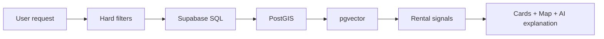

# MDE Rentals Documentation — Design

## Task 1 · Goal

Create a simple, canonical Real Estate / Rentals documentation package for MDE.

The docs must answer these questions quickly:

1. What does MDE Rentals do today?
2. What should we keep from the current MDE implementation?
3. Which external repos/examples are we using as references?
4. Exactly what are we adapting from each repo?
5. Where does that pattern go in MDE?
6. What would a real MDE user experience look like?
7. What must be fixed before Rentals is production-ready?

The rule for every reference is:

> **Repo → what it proves → what MDE adapts → where it goes → real-world example → what we do not copy.**

Do not write vague instructions such as “adapt PropertyShop” or “use CopilotKit canvas.”

---

## Task 2 · Canonical Files

Use the existing MDE docs structure:

```text
docs/04-domains/rentals/
├── README.md
├── RENTALS.md
├── REUSE-MATRIX.md
└── REFERENCES.md
```

### `README.md`

A small index that explains what each file is for.

### `RENTALS.md`

The main Real Estate product and architecture document.

It explains:

- renter and broker journeys;
- screens/routes;
- search and Maps behavior;
- rental agent responsibilities;
- Supabase, pgvector and PostGIS;
- ownership/RLS;
- viewing/lead transactions;
- current gaps;
- target architecture;
- implementation order;
- tests and production proof.

### `REUSE-MATRIX.md`

The decision table.

It answers:

> Do we KEEP, COPY, ADAPT, MODEL, REFERENCE or SKIP this pattern?

### `REFERENCES.md`

The searchable index of repos, templates, examples and official docs used by MDE Rentals.

---

## Task 3 · Source of Truth

When sources disagree, use this order:

1. Merged MDE `main`.
2. Current Supabase schema, RLS, RPCs and live read-only evidence.
3. Current Linear tasks and canonical MDE planning docs.
4. Installed package source/types.
5. Official CopilotKit, Mastra, Supabase and Google Maps documentation.
6. Official GitHub examples/templates.
7. External real-estate repositories.
8. Custom implementation only when the above do not solve the requirement.

Important:

- **GitHub `main`** tells us what is implemented.
- **Supabase** tells us what data/security actually exists.
- **Linear** tells us current task status and execution order.
- **These docs** explain durable product and architecture decisions.

Do not copy live Linear status into GitHub docs.

---

## Task 4 · Core MDE Rental Journeys

### J-RE-01 · Find a rental

Real-world example:

> “I need a furnished 2-bedroom apartment under COP 5M in Laureles, available October 1.”

Correct flow:

```text
User request
→ extract hard filters
→ Supabase SQL filters eligible listings
→ PostGIS/location ranking
→ pgvector/lifestyle ranking
→ cards + map
→ AI explains the best matches
```

The AI cannot put an apartment back into the result if it fails the budget, bedroom or availability rules.

### J-RE-02 · Inspect a listing

```text
Select card or map pin
→ load canonical listing
→ show location / price / availability / amenities
→ save or request viewing
```

Real-world example:

> User selects an apartment on the map and sees the exact same apartment selected in the list and chat context.

### J-RE-03 · Request a viewing

```text
Listing
→ choose future time
→ show exact action to user
→ user approves
→ server re-authorizes
→ atomic database write
→ confirmation only after commit
```

Real-world example:

> “Book a viewing Friday at 3 PM.” MDE shows the apartment and time, the user confirms, and only then creates the lead/showing.

### J-RE-04 · Broker follow-up

```text
Broker signs in
→ sees only owned listings
→ opens lead/showing
→ contacts renter
→ updates status
```

A broker must never see another broker's private lead simply because they know the record ID.

### J-RE-05 · Save and resume

```text
Save apartment/preferences
→ refresh or return later
→ same authorized user
→ context resumes
```

### J-RE-06 · Failure and recovery

The docs must explain what happens when:

- Supabase is unavailable;
- model call fails;
- embedding search fails;
- rate limiter fails;
- user submits twice;
- listing becomes inactive;
- broker ownership changes;
- workflow is interrupted.

---

## Task 5 · Most Important Search Rule

> **SQL decides what is eligible. AI decides what is relevant among eligible listings.**

Use SQL/business logic for:

- price;
- bedrooms;
- availability;
- ownership;
- authorization;
- counts;
- aggregates.

Use AI/vector ranking for:

- “quiet”;
- “good for remote work”;
- “walkable”;
- “near cafés”;
- “good lifestyle fit.”

Target:



---

## Task 6 · Reference Adaptation Map

This table must appear near the top of the planning docs.

| Repo / example | What it teaches us | What MDE adapts | Where it goes in MDE | Real-world MDE example | Do not copy |
|---|---|---|---|---|---|
| CopilotKit Mastra Canvas — https://github.com/CopilotKit/CopilotKit/tree/main/examples/canvas/mastra | AI and UI can share the same application state | Shared rental state | filters, selected listing, map pin, map bounds, shortlist | User says “only Laureles under $1,200”; cards, map and agent all use the same filters | Do not replace MDE auth, Supabase or runtime |
| CopilotKit Generative UI — https://github.com/CopilotKit/CopilotKit/tree/main/examples/showcases/generative-ui | AI can return typed UI, not only text | Fixed rental UI components | RentalCard, RentalComparison, ApprovalCard, ErrorRecoveryCard | AI shows 3 apartment cards with price and location instead of a paragraph | Do not let generated UI authorize privileged writes |
| CopilotKit + Mastra Integration — https://github.com/CopilotKit/CopilotKit/tree/main/examples/integrations/mastra | Canonical CopilotKit ↔ Mastra wiring | Runtime parity patterns | existing MDE CopilotKit route + Mastra bridge | Rental tool results stream through the same runtime as chat | Do not rewrite working MDE runtime without a proven gap |
| Dubai Real Estate — https://github.com/nazsats/dubai-real-estate | SQL should answer numeric/filter truth; RAG should answer semantic knowledge | SQL-first rental eligibility | rental search pipeline | “2BR under COP 5M” is filtered before AI ranking | Do not use RAG/vector similarity for hard constraints |
| HomeRecoEngine — https://github.com/yuehong136/HomeRecoEngine | Structured + geo + semantic ranking can work together | Hybrid ranking | Supabase + PostGIS + pgvector + rental_signals | “Quiet near cafés but away from nightlife” | Do not create a second search database |
| PropertyShop — https://github.com/awallathome/property_shop | Property research can be enriched progressively | Neighborhood/market enrichment after valid listings exist | advanced rental research | Compare Laureles vs Envigado for remote work after basic listing eligibility is known | Do not create an agent swarm for simple search |
| PropGenie — https://github.com/neoxu999/real-estate-agent | Clear specialist responsibilities | Router/tool/workflow boundaries | concierge + rental/search/market capabilities | Search request goes to search; viewing request goes to deterministic workflow | Do not create one agent per feature |
| AI Real Estate Assistant — https://github.com/AleksNeStu/ai-real-estate-assistant | Useful real-estate product surfaces | Favorites, saved searches, comparison, broker lead views | `/rentals`, `/saved`, broker workspace | User saves three apartments and compares them later | Do not copy its whole application architecture |
| Real Estate AI Chatbot — https://github.com/JoaoVitorCarvalhoPR/real-estate-ai-chatbot | AI can qualify leads and hand them to humans | Lead qualification + broker handoff | lead/showing flow | AI answers questions, captures renter intent, then hands off to the authorized broker | Do not bypass MDE RLS/HITL or copy vendor/channel assumptions |
| Real Estate RAG — https://github.com/jusnaini/real-estate-rag | RAG is useful when evaluated and used for prose knowledge | Rental/building/neighborhood knowledge | FAQs and policy answers | “Is this building pet friendly?” returns a sourced answer | Do not use RAG for price, availability or ownership |
| HomeMatch — https://github.com/GretaGalliani/HomeMatch | Lifestyle preferences can improve ranking | Preference extraction + semantic matching | user-scoped rental preferences | “Quiet, fast Wi-Fi, walkable, no steep hills” | Do not allow lifestyle score to override budget/date filters |
| Mastra Company Knowledge — https://github.com/mastra-ai/template-company-knowledge | Grounded internal knowledge with source hierarchy | Broker/building/neighborhood knowledge | advanced knowledge layer | Broker asks building policy; MDE checks indexed internal knowledge first | Do not add another datastore if Supabase/pgvector already works |
| Mastra Deep Search — https://github.com/mastra-ai/template-deep-search | Research can repeat until evidence is sufficient | Advanced neighborhood research | research workflow | “Best neighborhood for a one-month remote-work stay?” | Do not put deep research in the fast property-search path |
| Mastra Browsing Agent — https://github.com/mastra-ai/template-browsing-agent | External websites can be checked through governed browser automation | Optional source verification | advanced broker/operator workflow | Verify whether an external property listing is still live | Do not allow unrestricted autonomous writes/browsing |
| Mastra Agent Harness — https://github.com/mastra-ai/template-agent-harness | Approvals, tasks and schedules can be governed | Future broker coworker patterns | broker operations | Prepare tomorrow's follow-ups for broker review | Do not expose shell/filesystem capabilities to public rental chat |

The point of this table is not to adopt everything. It tells us **what each repo is useful for** and where it fits.

---

## Task 7 · Reuse Matrix Rules

`REUSE-MATRIX.md` must use:

```text
KEEP
COPY
ADAPT
MODEL
REFERENCE
SKIP
```

### Meaning

**KEEP**  
MDE already has an equal or better implementation.

**COPY**  
Copy a small implementation only when source, license and version compatibility are verified.

**ADAPT**  
Reuse the pattern/code but change it for MDE's data, auth, runtime or UI.

**MODEL**  
Use the idea/architecture only. Do not copy code.

**REFERENCE**  
Useful documentation/evidence, not implementation authority.

**SKIP**  
Not suitable for MDE. Explain why.

Required columns:

| Field | What to record |
|---|---|
| Capability | What user problem/feature this addresses |
| Current MDE | Existing file/module/table/flow |
| Reference | Repo/example/template |
| Full URL | Exact URL |
| Commit/tag | Exact ref when implementation work begins |
| License | Verified license or UNKNOWN |
| Action | KEEP/COPY/ADAPT/MODEL/REFERENCE/SKIP |
| What to take | Exact pattern/code/idea |
| MDE destination | Exact MDE component/tool/workflow/data area |
| Real example | One clear MDE user example |
| Do not copy | Boundary/anti-pattern |
| Verification | VERIFIED/PARTIAL/UNVERIFIED/HISTORICAL |
| Journey | J-RE-* |

Unknown or incompatible license means **MODEL/REFERENCE only**.

---

## Task 8 · REFERENCES.md Structure

Organize references by usefulness.

### Tier A · MDE current implementation

Always check these first:

- https://github.com/amoai-tech/mdeai
- https://github.com/amoai-tech/mdeai/tree/main/docs/04-domains/rentals
- https://github.com/amoai-tech/mdeai/tree/main/src/mastra
- https://github.com/amoai-tech/mdeai/tree/main/supabase

### Tier B · Official CopilotKit

- https://github.com/CopilotKit/CopilotKit/tree/main/examples/integrations/mastra
- https://github.com/CopilotKit/CopilotKit/tree/main/examples/canvas/mastra
- https://github.com/CopilotKit/CopilotKit/tree/main/examples/canvas/mastra-pm
- https://github.com/CopilotKit/CopilotKit/tree/main/examples/showcases/generative-ui
- https://github.com/CopilotKit/CopilotKit/tree/main/examples/showcases/a2a-travel
- https://github.com/CopilotKit/CopilotKit/tree/main/examples

### Tier C · Official Mastra

- https://github.com/mastra-ai/mastra
- https://github.com/mastra-ai/template-company-knowledge
- https://github.com/mastra-ai/template-deep-search
- https://github.com/mastra-ai/template-browsing-agent
- https://github.com/mastra-ai/template-agent-harness
- https://github.com/mastra-ai/template-text-to-sql

### Tier D · Real Estate references

- https://github.com/nazsats/dubai-real-estate
- https://github.com/awallathome/property_shop
- https://github.com/neoxu999/real-estate-agent
- https://github.com/AleksNeStu/ai-real-estate-assistant
- https://github.com/JoaoVitorCarvalhoPR/real-estate-ai-chatbot
- https://github.com/yuehong136/HomeRecoEngine
- https://github.com/jusnaini/real-estate-rag
- https://github.com/Archit1706/Keya-Agentic-AI-assistant-for-Real-Estate
- https://github.com/GretaGalliani/HomeMatch
- https://github.com/open-estate-ai/real-estate-mcp-server

Each entry must say:

```text
What this repo does
What MDE wants from it
Where that idea goes in MDE
Real-world MDE example
What MDE must not copy
License
Commit/tag when adopted
Verification status
```

---

## Task 9 · RENTALS.md Required Structure

Keep it easy to review:

1. Purpose
2. Current MDE state
3. Users
4. Screens/routes
5. User journeys
6. Current features
7. Search architecture
8. Maps/spatial behavior
9. AI responsibilities
10. Tools/workflows
11. Supabase/data model
12. RLS/ownership/security
13. Viewing/lead transaction
14. What we KEEP
15. What we ADAPT from references
16. Gaps/blockers
17. Target architecture
18. Implementation order
19. Failure/degraded behavior
20. Tests
21. Success criteria
22. References

Clearly label:

```text
CURRENT
PLANNED
REFERENCE
```

Do not present planned behavior as shipped behavior.

---

## Task 10 · Real-World Examples Are Mandatory

Every major recommendation must include a real MDE example.

Bad:

> Adapt HomeRecoEngine.

Good:

> Adapt HomeRecoEngine's hybrid ranking pattern. MDE first applies SQL filters for price, bedrooms and availability, then PostGIS for distance, then pgvector/rental signals for lifestyle relevance. Example: a user asks for “a quiet apartment near cafés but away from nightlife.”

Bad:

> Use shared state.

Good:

> Adapt CopilotKit's Mastra canvas shared-state pattern so the AI, rental cards and map use the same filters and selected listing. Example: when the user says “only show Laureles,” the map pins and cards update together and the agent sees that same neighborhood filter.

---

## Task 11 · Safety Rules

Stop implementation if a reference would:

- create cross-user state;
- expose secrets/tokens to the browser or model;
- bypass Supabase RLS;
- bypass server authorization;
- replace an atomic DB write with AI judgement;
- create a second source of truth for listings/ownership;
- introduce another agent runtime without a proven need;
- require copying code with unknown/incompatible license;
- remove working MDE behavior before replacement is proven.

---

## Task 12 · Evidence Required Before ADAPT/COPY

Before implementation, record:

```text
Verified date:
MDE main SHA:
Reference repo:
Reference SHA/tag:
Reference license:
MDE package versions:
Relevant MDE files:
Relevant Supabase objects:
Tests run:
Verification status:
```

Moving `main` URLs are fine for research.

Implementation work must pin the exact source commit/tag.

---

## Task 13 · Implementation Order

1. Update `README.md` as the rental docs index.
2. Create `REFERENCES.md` first.
3. Create `REUSE-MATRIX.md` from verified references + current MDE.
4. Create `RENTALS.md` from current-state evidence and reuse decisions.
5. Run docs validation.
6. Update Linear only with durable links/summaries; keep live status in Linear.

Verification:

```bash
npm run docs:check
git diff --check
```

Also prove:

- all local links work;
- all external references use full URLs;
- every external repo has an action classification;
- every important adaptation has a real MDE example;
- no unverified repo is classified COPY/ADAPT;
- current vs planned behavior is obvious;
- rental README links to all canonical rental docs.

---

## Task 14 · Non-Goals

This documentation work does not:

- change production code;
- change the production database;
- implement rental features;
- add new agents;
- migrate threads;
- change Linear task status;
- copy third-party code.

It creates the clear evidence and planning structure needed to implement MDE Real Estate safely later.
