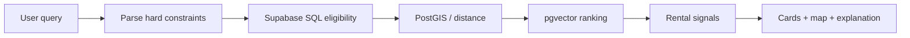

# MDE Rentals Domain Documentation — Design

## Task 1 · Goal

Create the canonical Real Estate / Rentals documentation package inside `docs/04-domains/rentals/` without introducing a second documentation taxonomy.

The package must make it easy to answer five questions:

1. What does MDE Rentals do today?
2. Which current MDE code/data/journeys are canonical and should be kept?
3. Which external repositories/examples/templates are worth reusing, adapting, modeling, referencing, or skipping?
4. Exactly what are we taking from each reference, and where does it fit in MDE?
5. What gaps must be closed before the rental journey is production-ready?

Every planning document must explain references in plain language. A repo name alone is not enough.

For every important reference, state:

> **Reference repo → pattern we adapt → MDE feature/journey → what stays MDE-native → real-world example.**

## Task 2 · Source-of-truth order

Use this order whenever sources disagree:

1. Current MDE implementation on merged `main`.
2. Current Supabase schema/RLS/functions and live read-only evidence.
3. Current Linear tasks and canonical MDE planning documents.
4. Installed package source/types.
5. Official CopilotKit/Mastra/Supabase/Google Maps documentation.
6. Official GitHub examples/templates.
7. Proven external real-estate OSS repositories.
8. Custom design only when the sources above do not satisfy the requirement.

Repository docs describe durable product/architecture truth. Linear owns live status, ownership, priority, and sequencing.

## Task 3 · Canonical file set

```text
docs/04-domains/rentals/
├── README.md
├── RENTALS.md
├── REUSE-MATRIX.md
└── REFERENCES.md
```

### `README.md`

Small router only. It explains what each canonical file owns and links to the relevant Linear planning documents.

### `RENTALS.md`

Canonical domain/product document.

Required sections:

1. Purpose and scope
2. Current verified state
3. Users/personas
4. Routes/screens
5. Core user journeys
6. Current features
7. Search architecture
8. Maps/spatial behavior
9. AI/agent responsibilities
10. Tools/workflows
11. Supabase/data model
12. Ownership/RLS/auth boundaries
13. Viewing/lead transaction model
14. Existing MDE capabilities to KEEP
15. Reference adaptation plan
16. Domain reuse summary
17. Gaps/blockers
18. Target architecture
19. Ordered implementation sequence
20. Failure/degraded states
21. Testing and production proof
22. Success criteria
23. References

The document must distinguish `CURRENT`, `PLANNED`, and `REFERENCE` behavior. It must not duplicate live Linear task status.

## Task 4 · Core journeys

The domain document must cover at least these journeys:

### J-RE-01 · Rental discovery

```text
Describe need
→ parse hard constraints
→ SQL eligible candidate set
→ geo/vector ranking
→ cards + map
→ refine
```

### J-RE-02 · Listing detail

```text
Select card/pin
→ load canonical listing
→ inspect availability/amenities/location
→ save or request viewing
```

### J-RE-03 · Viewing request

```text
Listing
→ choose future time
→ explicit approval
→ server authorization
→ atomic database write
→ truthful confirmation
```

### J-RE-04 · Broker follow-up

```text
Authorized broker
→ owned listing
→ lead/showing
→ contact/follow-up
→ status update
```

### J-RE-05 · Save/resume

```text
Save listing/preferences
→ refresh/restart
→ same authorized user
→ context resumes
```

### J-RE-06 · Failure/recovery

Must cover database/model/embedding/rate-limit failure, duplicate submit, stale ownership, inactive listing, and interrupted workflow.

## Task 5 · Search architecture invariant

The canonical rule is:

> SQL decides what is eligible. AI decides what is relevant among eligible candidates.

Hard constraints such as price, bedrooms, availability, ownership, authorization, counts, and aggregates must not be enforced only by vector similarity or LLM reasoning.

Target flow:



## Task 6 · Reuse matrix standard

`REUSE-MATRIX.md` follows the iPix documentation standard, adapted to MDE.

Required columns:

| Field | Requirement |
|---|---|
| Capability | Concrete rental feature/journey step |
| Current MDE | Existing file/module/table/flow |
| Reference | Repo/example/template |
| Full URL | Exact source URL |
| Version/commit | Exact ref used for verification |
| License | Verified license or `UNKNOWN` |
| Action | `KEEP / COPY / ADAPT / MODEL / REFERENCE / SKIP` |
| Reuse | Exact pattern/code/idea to take |
| MDE adaptation | Exact MDE component/tool/workflow/data contract this changes |
| Real-world example | Short MDE user example showing why the reuse matters |
| Do not copy | Explicit boundary/anti-pattern |
| Verification | `VERIFIED / PARTIAL / UNVERIFIED / HISTORICAL` |
| Journey | J-RE-* affected |

Rules:

- `KEEP` means current MDE is equal or stronger.
- `COPY` requires source inspection, compatible license, and version compatibility.
- `ADAPT` must name what changes for MDE auth/data/runtime.
- `MODEL` means architectural/product inspiration only.
- `REFERENCE` means useful evidence/docs, not implementation authority.
- `SKIP` means not suitable for MDE and must state why.
- Unknown/no license cannot be `COPY` or `ADAPT`; it is `MODEL` or `REFERENCE` only.
- Prefer first-party/native CopilotKit/Mastra/Supabase primitives over duplicate infrastructure.
- Never write only “adapt this repo.” Name the exact behavior/pattern and the exact MDE destination.

## Task 7 · GitHub reference index

`REFERENCES.md` is the indexed search surface for repositories, templates, examples, docs, and source references used by MDE Rentals.

Every entry records:

- name;
- category;
- full URL;
- owner;
- language/framework;
- exact commit/tag when adopted;
- license;
- what the repo actually demonstrates;
- exact MDE feature/pattern to adapt;
- exact MDE destination;
- real-world MDE example;
- action classification;
- verification status;
- related journey/capability.

### Tier A · MDE current implementation

- https://github.com/amoai-tech/mdeai
- https://github.com/amoai-tech/mdeai/tree/main/docs/04-domains/rentals
- https://github.com/amoai-tech/mdeai/tree/main/src/mastra
- https://github.com/amoai-tech/mdeai/tree/main/supabase

These are always checked before external references.

### Tier B · Official CopilotKit examples

- https://github.com/CopilotKit/CopilotKit/tree/main/examples/integrations/mastra — canonical CopilotKit + Mastra integration; `ADAPT/REFERENCE`.
- https://github.com/CopilotKit/CopilotKit/tree/main/examples/canvas/mastra — shared-state cards/map/workspace pattern; `ADAPT/MODEL`.
- https://github.com/CopilotKit/CopilotKit/tree/main/examples/canvas/mastra-pm — complex workspace/state pattern; `MODEL`.
- https://github.com/CopilotKit/CopilotKit/tree/main/examples/showcases/generative-ui — fixed-schema generative UI patterns; `ADAPT/MODEL`.
- https://github.com/CopilotKit/CopilotKit/tree/main/examples/showcases/a2a-travel — multi-agent UX/orchestration reference only; `MODEL`, do not add a second runtime by default.
- https://github.com/CopilotKit/CopilotKit/tree/main/examples — full current example catalog; `REFERENCE`.

### Tier C · Official Mastra templates/repositories

- https://github.com/mastra-ai/mastra — native capability/source reference; `REFERENCE`.
- https://github.com/mastra-ai/template-company-knowledge — grounded internal knowledge/RAG pattern; `MODEL/ADAPT` only if needed.
- https://github.com/mastra-ai/template-deep-search — research/evaluate/gap/repeat pattern; `MODEL` for advanced market/neighborhood research.
- https://github.com/mastra-ai/template-browsing-agent — governed browser automation; `MODEL` for external availability/source verification.
- https://github.com/mastra-ai/template-agent-harness — approvals/tasks/workspace/schedule governance; `MODEL` for advanced operations.
- https://github.com/mastra-ai/template-text-to-sql — structured analytics/query pattern; `MODEL` for broker/admin analytics, never as a direct privileged-write path.

### Tier D · Real-estate domain references

These are domain references, not automatic implementation dependencies. License and current source must be verified before anything stronger than `MODEL/REFERENCE`.

- https://github.com/nazsats/dubai-real-estate — deterministic SQL vs RAG boundary, market analytics; high-value `MODEL`.
- https://github.com/awallathome/property_shop — multi-agent property discovery and progressive results; `MODEL`.
- https://github.com/neoxu999/real-estate-agent — specialist agent/router decomposition; `MODEL`.
- https://github.com/AleksNeStu/ai-real-estate-assistant — product surface/features such as saved search, favorites, leads, valuation; `MODEL`.
- https://github.com/JoaoVitorCarvalhoPR/real-estate-ai-chatbot — lead qualification, human handoff, Supabase/pgvector concepts; `MODEL`.
- https://github.com/yuehong136/HomeRecoEngine — hybrid semantic + structured + geospatial search pattern; `MODEL`.
- https://github.com/jusnaini/real-estate-rag — evaluated real-estate RAG pattern; `MODEL`.
- https://github.com/Archit1706/Keya-Agentic-AI-assistant-for-Real-Estate — conversational filters + contextual place data; `MODEL`.
- https://github.com/GretaGalliani/HomeMatch — preference/lifestyle matching; `MODEL`.
- https://github.com/open-estate-ai/real-estate-mcp-server — MCP concept only; `REFERENCE/MODEL` until implementation depth and license are verified.

## Task 8 · Explicit reference adaptation map

The planning docs must include a concise table like this near the top. This is the human-readable answer to “what are we actually taking from these repos?”

| Reference repo | What we adapt | MDE destination | Real-world MDE example | What we do NOT copy |
|---|---|---|---|---|
| CopilotKit `examples/canvas/mastra` — https://github.com/CopilotKit/CopilotKit/tree/main/examples/canvas/mastra | Bidirectional shared state between AI and UI | Rental filters, selected listing, selected map pin, map bounds, shortlist | User says “only show Laureles under $1,200”; cards and map update together and the agent sees the same state | Do not replace MDE auth, Supabase, routing, or existing runtime |
| CopilotKit `generative-ui` — https://github.com/CopilotKit/CopilotKit/tree/main/examples/showcases/generative-ui | Typed/fixed-schema AI-rendered components | RentalCard, RentalComparison, ApprovalCard, ErrorRecoveryCard | Agent returns three apartments as structured cards instead of a paragraph | Do not allow arbitrary generated UI to authorize writes |
| CopilotKit Mastra integration — https://github.com/CopilotKit/CopilotKit/tree/main/examples/integrations/mastra | Canonical CopilotKit ↔ Mastra runtime wiring | Existing MDE CopilotKit route and Mastra bridge | Rental agent streams tool-backed results through the same runtime used by MDE chat | Do not rebuild MDE runtime if parity audit shows current code is already equivalent |
| Dubai Real Estate — https://github.com/nazsats/dubai-real-estate | Deterministic SQL for numeric/filter truth; RAG only for semantic knowledge | Rental search eligibility and market analytics | “2BR under $1,300 available next month” is filtered in SQL before AI ranking | Do not replace Supabase with its storage stack or use RAG for hard constraints |
| HomeRecoEngine — https://github.com/yuehong136/HomeRecoEngine | Hybrid structured + semantic + geo ranking | Supabase filters + PostGIS + pgvector + `rental_signals` | “Quiet remote-work apartment near cafés but away from nightlife” combines hard filters, distance, and semantic fit | Do not create a second search database or independent truth store |
| PropertyShop — https://github.com/awallathome/property_shop | Progressive specialist property research | Advanced neighborhood/market enrichment around the existing rental agent | User asks whether Envigado or Laureles is better for remote work; MDE enriches valid listings with neighborhood evidence | Do not create an agent swarm for basic search/filtering |
| PropGenie — https://github.com/neoxu999/real-estate-agent | Clear specialist responsibilities and routing boundaries | Concierge/router → rental/search/market/task capabilities | “Find apartments” routes to search; “compare monthly cost” invokes deterministic calculation; “request viewing” uses workflow/tool | Do not create one MDE agent per feature when a tool/workflow is enough |
| AI Real Estate Assistant — https://github.com/AleksNeStu/ai-real-estate-assistant | Product surface ideas: favorites, saved searches, comparison, valuation, lead views | MDE `/rentals`, `/saved`, broker workspace, future comparison surfaces | User saves three apartments and returns later to compare them | Do not copy its full application architecture |
| Real Estate AI Chatbot — https://github.com/JoaoVitorCarvalhoPR/real-estate-ai-chatbot | Lead qualification + human/broker handoff pattern | Rental lead/showing workflow and broker workspace | AI answers listing questions, captures intent, then hands a qualified lead to the authorized broker | Do not copy channel/vendor assumptions or bypass MDE RLS/HITL |
| Real Estate RAG — https://github.com/jusnaini/real-estate-rag | Evaluated RAG for prose knowledge | Building rules, neighborhood guides, rental FAQs | User asks “Is this building pet friendly?” and receives a sourced answer from verified knowledge | Do not use RAG for price, availability, ownership, authorization, counts, or aggregates |
| HomeMatch — https://github.com/GretaGalliani/HomeMatch | Lifestyle/preference extraction and semantic matching | User-scoped rental preferences + ranking | User says “quiet, fast Wi-Fi, walkable, no steep hills”; MDE ranks eligible listings by lifestyle fit | Do not let semantic preferences override hard budget/date constraints |
| Mastra Company Knowledge — https://github.com/mastra-ai/template-company-knowledge | Grounded knowledge hierarchy and source citation | Advanced broker/building/neighborhood knowledge | Broker asks a policy question; MDE uses indexed internal knowledge first, then live sources when freshness is needed | Do not provision a duplicate datastore when Supabase/pgvector already satisfies the need |
| Mastra Deep Search — https://github.com/mastra-ai/template-deep-search | Search → evaluate → identify gaps → repeat | Advanced property/neighborhood research workflow | User asks for the best neighborhoods for a month-long remote-work stay; research continues until key criteria are evidenced | Do not use deep research in the fast property search path |
| Mastra Browsing Agent — https://github.com/mastra-ai/template-browsing-agent | Governed external browsing pattern | Optional verification of external listing/source information | Broker asks MDE to verify an external listing is still published before review | Do not allow autonomous write actions or unrestricted browsing without authorization/audit |
| Mastra Agent Harness — https://github.com/mastra-ai/template-agent-harness | Approval, task, workspace, schedule governance ideas | Future broker coworker/operations workflows | Broker asks MDE to prepare follow-ups for tomorrow; actions remain reviewable and auditable | Do not expose shell/filesystem capabilities in public rental chat |

This table is not a license to implement everything. It is the planning map. `REUSE-MATRIX.md` provides the formal verification/classification before implementation.

## Task 9 · Real-world adaptation examples required in planning docs

Every major architecture recommendation must include a concrete MDE example.

### Example A · SQL-first rental search

Reference:
https://github.com/nazsats/dubai-real-estate

Adapt:
Deterministic filtering before semantic reasoning.

MDE example:

> Camila asks: “I need a furnished 2-bedroom apartment under COP 5M, available October 1, around Laureles.”

MDE must first enforce price, bedrooms, furnishing and availability in Supabase SQL. Only the eligible apartments continue to PostGIS/pgvector/rental-signal ranking. The LLM may explain why apartment A fits better than apartment B, but it cannot reintroduce an apartment over budget.

### Example B · Shared cards + map state

Reference:
https://github.com/CopilotKit/CopilotKit/tree/main/examples/canvas/mastra

Adapt:
One shared state contract between CopilotKit, cards, map and rental agent.

MDE example:

> Camila clicks apartment #3 on the map, then asks: “Compare this one with the quieter option.”

The agent must know which pin/card is selected without the user repeating the listing name. Selecting a card must highlight the same map pin.

### Example C · Qualified broker handoff

Reference:
https://github.com/JoaoVitorCarvalhoPR/real-estate-ai-chatbot

Adapt:
AI qualification followed by controlled human handoff.

MDE example:

> A renter confirms budget, dates and viewing preference. MDE creates the authorized lead/showing transaction once, then the correct broker sees the lead in `/host/rentals`.

The reference provides the handoff concept. MDE keeps Supabase RLS, atomic RPCs, HITL and ownership as the authority.

### Example D · Lifestyle ranking

Reference:
https://github.com/GretaGalliani/HomeMatch

Adapt:
Extract soft preferences and use them only after hard eligibility.

MDE example:

> User asks for “quiet, reliable Wi-Fi, cafés nearby, walkable, but not beside nightlife.”

Budget/date/bedroom constraints are enforced first. MDE then uses semantic preferences, neighborhood profiles, distance and `rental_signals` to rank eligible apartments.

## Task 10 · Reference selection rules

Use external references for proven patterns, not wholesale architecture replacement.

Examples:

- Hard-filter correctness: model the SQL-vs-RAG boundary, but keep Supabase/Postgres as MDE source of truth.
- Shared state: adapt the official CopilotKit Mastra canvas before writing custom synchronization.
- HITL writes: keep MDE's existing `useHumanInTheLoop` pattern and deterministic backend/RPC authorization.
- Memory: do not add observational memory until SAN-547/SAN-548 identity and durability proof exists.
- MCP/browser/schedules: remain gated behind identity, authorization, auditing, and production-proof requirements.
- Real-estate OSS repos: use mainly as product/domain models; never copy unlicensed or stale code.

## Task 11 · Evidence and freshness

Every adopted reference must have an evidence snapshot before implementation:

```text
Verified date:
MDE main SHA:
Reference SHA/tag:
Reference license:
Installed MDE package versions:
Relevant MDE files:
Relevant Supabase objects:
Tests run:
Verification status:
```

Moving `main` URLs are acceptable for research, but `COPY`/`ADAPT` implementation work must pin exact source commits/tags.

## Task 12 · Failure and safety boundaries

Stop implementation if a proposed reference would:

- create cross-user durable state;
- expose privileged credentials to browser/model context;
- bypass RLS/server authorization;
- replace atomic database guarantees with model judgment;
- introduce a second source of truth for listing eligibility/ownership;
- add a second agent runtime without a proven requirement;
- require copying code with unknown/incompatible licensing;
- remove proven MDE behavior before replacement passes equivalent or stronger tests.

## Task 13 · Verification for the documentation package

The implementation PR must prove:

```bash
npm run docs:check
git diff --check
```

Additionally verify:

- all local Markdown links resolve;
- every external implementation recommendation has a full URL;
- every reused source has a classification;
- every major reused source says exactly what MDE adapts;
- every major reused source names the MDE destination/component/journey;
- every major architectural pattern includes a real-world MDE example;
- current vs planned behavior is explicit;
- no live task-status table is duplicated from Linear;
- no unverified repo is labeled `COPY` or `ADAPT`;
- `README.md` routes readers to the three canonical rental documents.

## Task 14 · Implementation order

1. Update `docs/04-domains/rentals/README.md` as a router.
2. Create `REFERENCES.md` first with the explicit repo → adaptation → MDE example mapping.
3. Create `REUSE-MATRIX.md` from verified current MDE + indexed references.
4. Create `RENTALS.md` from current-state evidence and the reuse decisions, using real-world examples for major architecture choices.
5. Run docs validation and link checks.
6. Mirror durable summaries/links into Linear only where useful; keep live execution status in Linear.

## Task 15 · Non-goals

This documentation work does not:

- modify production code;
- modify the production database;
- implement rental features;
- create new agents;
- migrate historical threads;
- change Linear task statuses;
- copy external source code.

It creates the canonical documentation and reuse evidence needed to execute those changes safely later.
