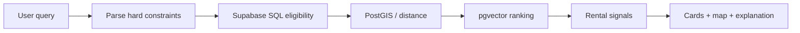

# MDE Rentals Domain Documentation — Design

## Task 1 · Goal

Create the canonical Real Estate / Rentals documentation package inside `docs/04-domains/rentals/` without introducing a second documentation taxonomy.

The package must make it easy to answer four questions:

1. What does MDE Rentals do today?
2. Which current MDE code/data/journeys are canonical and should be kept?
3. Which external repositories/examples/templates are worth reusing, adapting, modeling, referencing, or skipping?
4. What gaps must be closed before the rental journey is production-ready?

## Task 2 · Source-of-truth order

Use this order whenever sources disagree:

1. Current MDE implementation on merged `main`.
2. Current Supabase schema/RLS/functions and live read-only evidence.
3. Current Linear tasks and canonical MDE planning documents.
4. Installed package source/types.
5. Official CopilotKit/Mastra/Supabase/Google Maps documentation.
6. Official GitHub examples/templates.
7. Proven external real-estate OSS repositories.
8. Custom design only when the sources above do not satisfy the requirement.

Repository docs describe durable product/architecture truth. Linear owns live status, ownership, priority, and sequencing.

## Task 3 · Canonical file set

```text
docs/04-domains/rentals/
├── README.md
├── RENTALS.md
├── REUSE-MATRIX.md
└── REFERENCES.md
```

### `README.md`

Small router only. It explains what each canonical file owns and links to the relevant Linear planning documents.

### `RENTALS.md`

Canonical domain/product document.

Required sections:

1. Purpose and scope
2. Current verified state
3. Users/personas
4. Routes/screens
5. Core user journeys
6. Current features
7. Search architecture
8. Maps/spatial behavior
9. AI/agent responsibilities
10. Tools/workflows
11. Supabase/data model
12. Ownership/RLS/auth boundaries
13. Viewing/lead transaction model
14. Existing MDE capabilities to KEEP
15. Domain reuse summary
16. Gaps/blockers
17. Target architecture
18. Ordered implementation sequence
19. Failure/degraded states
20. Testing and production proof
21. Success criteria
22. References

The document must distinguish `CURRENT`, `PLANNED`, and `REFERENCE` behavior. It must not duplicate live Linear task status.

## Task 4 · Core journeys

The domain document must cover at least these journeys:

### J-RE-01 · Rental discovery

```text
Describe need
→ parse hard constraints
→ SQL eligible candidate set
→ geo/vector ranking
→ cards + map
→ refine
```

### J-RE-02 · Listing detail

```text
Select card/pin
→ load canonical listing
→ inspect availability/amenities/location
→ save or request viewing
```

### J-RE-03 · Viewing request

```text
Listing
→ choose future time
→ explicit approval
→ server authorization
→ atomic database write
→ truthful confirmation
```

### J-RE-04 · Broker follow-up

```text
Authorized broker
→ owned listing
→ lead/showing
→ contact/follow-up
→ status update
```

### J-RE-05 · Save/resume

```text
Save listing/preferences
→ refresh/restart
→ same authorized user
→ context resumes
```

### J-RE-06 · Failure/recovery

Must cover database/model/embedding/rate-limit failure, duplicate submit, stale ownership, inactive listing, and interrupted workflow.

## Task 5 · Search architecture invariant

The canonical rule is:

> SQL decides what is eligible. AI decides what is relevant among eligible candidates.

Hard constraints such as price, bedrooms, availability, ownership, authorization, counts, and aggregates must not be enforced only by vector similarity or LLM reasoning.

Target flow:



## Task 6 · Reuse matrix standard

`REUSE-MATRIX.md` follows the iPix documentation standard, adapted to MDE.

Required columns:

| Field | Requirement |
|---|---|
| Capability | Concrete rental feature/journey step |
| Current MDE | Existing file/module/table/flow |
| Reference | Repo/example/template |
| Full URL | Exact source URL |
| Version/commit | Exact ref used for verification |
| License | Verified license or `UNKNOWN` |
| Action | `KEEP / COPY / ADAPT / MODEL / REFERENCE / SKIP` |
| Reuse | Exact pattern/code/idea to take |
| Do not copy | Explicit boundary/anti-pattern |
| Verification | `VERIFIED / PARTIAL / UNVERIFIED / HISTORICAL` |
| Journey | J-RE-* affected |

Rules:

- `KEEP` means current MDE is equal or stronger.
- `COPY` requires source inspection, compatible license, and version compatibility.
- `ADAPT` must name what changes for MDE auth/data/runtime.
- `MODEL` means architectural/product inspiration only.
- `REFERENCE` means useful evidence/docs, not implementation authority.
- `SKIP` means not suitable for MDE and must state why.
- Unknown/no license cannot be `COPY` or `ADAPT`; it is `MODEL` or `REFERENCE` only.
- Prefer first-party/native CopilotKit/Mastra/Supabase primitives over duplicate infrastructure.

## Task 7 · GitHub reference index

`REFERENCES.md` is the indexed search surface for repositories, templates, examples, docs, and source references used by MDE Rentals.

Every entry records:

- name;
- category;
- full URL;
- owner;
- language/framework;
- exact commit/tag when adopted;
- license;
- MDE use;
- action classification;
- verification status;
- related journey/capability.

### Tier A · MDE current implementation

- https://github.com/amoai-tech/mdeai
- https://github.com/amoai-tech/mdeai/tree/main/docs/04-domains/rentals
- https://github.com/amoai-tech/mdeai/tree/main/src/mastra
- https://github.com/amoai-tech/mdeai/tree/main/supabase

These are always checked before external references.

### Tier B · Official CopilotKit examples

- https://github.com/CopilotKit/CopilotKit/tree/main/examples/integrations/mastra — canonical CopilotKit + Mastra integration; `ADAPT/REFERENCE`.
- https://github.com/CopilotKit/CopilotKit/tree/main/examples/canvas/mastra — shared-state cards/map/workspace pattern; `ADAPT/MODEL`.
- https://github.com/CopilotKit/CopilotKit/tree/main/examples/canvas/mastra-pm — complex workspace/state pattern; `MODEL`.
- https://github.com/CopilotKit/CopilotKit/tree/main/examples/showcases/generative-ui — fixed-schema generative UI patterns; `ADAPT/MODEL`.
- https://github.com/CopilotKit/CopilotKit/tree/main/examples/showcases/a2a-travel — multi-agent UX/orchestration reference only; `MODEL`, do not add a second runtime by default.
- https://github.com/CopilotKit/CopilotKit/tree/main/examples — full current example catalog; `REFERENCE`.

### Tier C · Official Mastra templates/repositories

- https://github.com/mastra-ai/mastra — native capability/source reference; `REFERENCE`.
- https://github.com/mastra-ai/template-company-knowledge — grounded internal knowledge/RAG pattern; `MODEL/ADAPT` only if needed.
- https://github.com/mastra-ai/template-deep-search — research/evaluate/gap/repeat pattern; `MODEL` for advanced market/neighborhood research.
- https://github.com/mastra-ai/template-browsing-agent — governed browser automation; `MODEL` for external availability/source verification.
- https://github.com/mastra-ai/template-agent-harness — approvals/tasks/workspace/schedule governance; `MODEL` for advanced operations.
- https://github.com/mastra-ai/template-text-to-sql — structured analytics/query pattern; `MODEL` for broker/admin analytics, never as a direct privileged-write path.

### Tier D · Real-estate domain references

These are domain references, not automatic implementation dependencies. License and current source must be verified before anything stronger than `MODEL/REFERENCE`.

- https://github.com/nazsats/dubai-real-estate — deterministic SQL vs RAG boundary, market analytics; high-value `MODEL`.
- https://github.com/awallathome/property_shop — multi-agent property discovery and progressive results; `MODEL`.
- https://github.com/neoxu999/real-estate-agent — specialist agent/router decomposition; `MODEL`.
- https://github.com/AleksNeStu/ai-real-estate-assistant — product surface/features such as saved search, favorites, leads, valuation; `MODEL`.
- https://github.com/JoaoVitorCarvalhoPR/real-estate-ai-chatbot — lead qualification, human handoff, Supabase/pgvector concepts; `MODEL`.
- https://github.com/yuehong136/HomeRecoEngine — hybrid semantic + structured + geospatial search pattern; `MODEL`.
- https://github.com/jusnaini/real-estate-rag — evaluated real-estate RAG pattern; `MODEL`.
- https://github.com/Archit1706/Keya-Agentic-AI-assistant-for-Real-Estate — conversational filters + contextual place data; `MODEL`.
- https://github.com/GretaGalliani/HomeMatch — preference/lifestyle matching; `MODEL`.
- https://github.com/open-estate-ai/real-estate-mcp-server — MCP concept only; `REFERENCE/MODEL` until implementation depth and license are verified.

## Task 8 · Reference selection rules

Use external references for proven patterns, not wholesale architecture replacement.

Examples:

- Hard-filter correctness: model the SQL-vs-RAG boundary, but keep Supabase/Postgres as MDE source of truth.
- Shared state: adapt the official CopilotKit Mastra canvas before writing custom synchronization.
- HITL writes: keep MDE's existing `useHumanInTheLoop` pattern and deterministic backend/RPC authorization.
- Memory: do not add observational memory until SAN-547/SAN-548 identity and durability proof exists.
- MCP/browser/schedules: remain gated behind identity, authorization, auditing, and production-proof requirements.
- Real-estate OSS repos: use mainly as product/domain models; never copy unlicensed or stale code.

## Task 9 · Evidence and freshness

Every adopted reference must have an evidence snapshot before implementation:

```text
Verified date:
MDE main SHA:
Reference SHA/tag:
Reference license:
Installed MDE package versions:
Relevant MDE files:
Relevant Supabase objects:
Tests run:
Verification status:
```

Moving `main` URLs are acceptable for research, but `COPY`/`ADAPT` implementation work must pin exact source commits/tags.

## Task 10 · Failure and safety boundaries

Stop implementation if a proposed reference would:

- create cross-user durable state;
- expose privileged credentials to browser/model context;
- bypass RLS/server authorization;
- replace atomic database guarantees with model judgment;
- introduce a second source of truth for listing eligibility/ownership;
- add a second agent runtime without a proven requirement;
- require copying code with unknown/incompatible licensing;
- remove proven MDE behavior before replacement passes equivalent or stronger tests.

## Task 11 · Verification for the documentation package

The implementation PR must prove:

```bash
npm run docs:check
git diff --check
```

Additionally verify:

- all local Markdown links resolve;
- every external implementation recommendation has a full URL;
- every reused source has a classification;
- current vs planned behavior is explicit;
- no live task-status table is duplicated from Linear;
- no unverified repo is labeled `COPY` or `ADAPT`;
- `README.md` routes readers to the three canonical rental documents.

## Task 12 · Implementation order

1. Update `docs/04-domains/rentals/README.md` as a router.
2. Create `REFERENCES.md` first so all later claims have a source index.
3. Create `REUSE-MATRIX.md` from verified current MDE + indexed references.
4. Create `RENTALS.md` from current-state evidence and the reuse decisions.
5. Run docs validation and link checks.
6. Mirror durable summaries/links into Linear only where useful; keep live execution status in Linear.

## Task 13 · Non-goals

This documentation work does not:

- modify production code;
- modify the production database;
- implement rental features;
- create new agents;
- migrate historical threads;
- change Linear task statuses;
- copy external source code.

It creates the canonical documentation and reuse evidence needed to execute those changes safely later.
