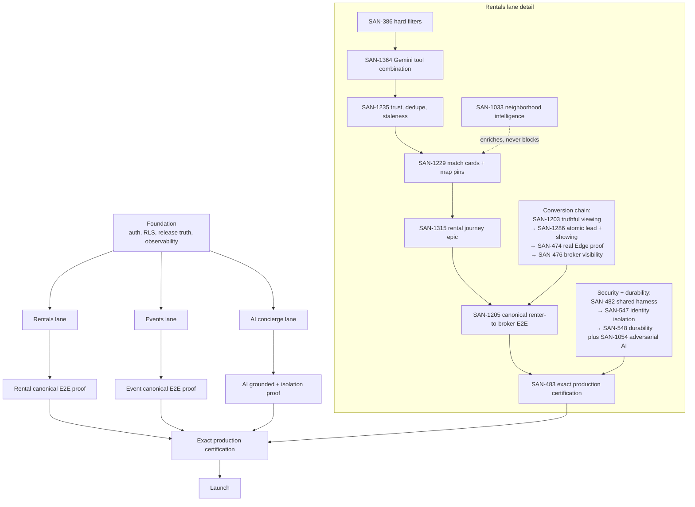

# MDE AI — MVP Definition

**What this document owns:** the launch definition, launch scope, launch gates, and the minimum
user journeys required for MDE AI to be considered ready to launch in Medellín.

**What it does not own:**

| Truth | Owner |
| --- | --- |
| Product requirements | `prd.md` |
| Strategic direction, NOW/NEXT/LATER sequencing | `roadmap.md` |
| Live task status, priority, ownership, progress | Linear |
| Shipped implementation | merged `main` |
| Route surface | `src/app` |
| Physical database schema | `supabase/migrations` |
| Detailed per-task specifications | the Linear issue for that task |

`mvp.md` answers one question: **is MDE ready to launch, and what still blocks it?** It is deliberately
shorter than both `prd.md` and `roadmap.md`, and it links to execution owners instead of copying them.

---

## 1 · Executive MVP definition

MDE AI is an AI-native local concierge and transaction platform for Medellín that carries a person
from **intent → trusted discovery → decision → action → return**. The MVP proves MDE is not a chatbot
wearing a website: a natural-language request is resolved against trusted data, presented as
synchronized cards and map pins, and finished through a real identity-bound transaction — a viewing
request a broker can act on, or a ticket in a wallet after a payment settles. Chat understands and
coordinates; structured screens own data, controls, approvals, and money. The launch succeeds when a
real user can do that end to end in production without being misled, and safely fails when a provider
or model does.

---

## 2 · MVP launch goal

> **A real user can use MDE AI in production to discover trustworthy local options and complete at
> least one meaningful action safely.**

The launch must prove three core loops, because together they exercise every capability the platform
claims and no vertical alone does:

| Loop | What it proves that the others do not |
| --- | --- |
| **1 · Rentals** | Deterministic eligibility over real inventory, map/card synchronization, trust signals, and an **atomic, identity-bound commitment** (lead + showing) with correct operator visibility. The highest-correctness write path. |
| **2 · Events + Ticketing** | A **real money loop**: external payment authority, exactly-once webhook finalization, entitlement delivery, and a wallet that reflects truth. |
| **3 · AI Concierge + Local Discovery** | The layer every other surface depends on: intent routing, grounded facts, structured output, session continuity, and safe authenticated tool actions. |

Rentals prove trustworthy supply and safe commitment. Events prove money and entitlement. The
concierge proves the intelligence layer is grounded and user-scoped. Any two of the three can pass
while the third hides a launch-blocking defect — which is why all three are launch gates rather than
parallel feature tracks.

Real-world shape of the goal: a renter searching **“2BR in Laureles under $80/night, quiet for remote
work”** gets only eligible listings, sees pins that match the cards, and books a viewing the *owning*
broker can see; an attendee buys a ticket for a **Provenza** show, the webhook finalizes once, and the
QR appears in their wallet; a visitor asking **“rooftop with a view for tonight near Parque Lleras”**
gets grounded, sourced options on a synchronized map.

---

## 3 · MVP priority order

Priority is dependency order, not preference. Each loop depends on the ones above it.

### Priority 1 · Rentals MVP

```
renter describes need
  → eligible rentals returned
  → map/cards synchronized
  → renter reviews trustworthy result
  → renter requests viewing
  → lead + showing commit atomically
  → correct broker sees it
```

**External discovery fallback — only when MDE inventory is insufficient:**

```
MDE/Supabase first
  → Gemini Search only for result shortfall
  → URL Context for selected pages
  → Firecrawl only for extraction gaps
  → deterministic eligibility
  → trust/dedupe
  → Maps enrichment for finalists
  → safe result rendering
```

**Canonical external result behaviour — the action contract is not negotiable:**

| Result | Action shown |
| --- | --- |
| MDE rental, requestable | **Schedule Viewing** (authenticated MDE mutation) |
| Any external rental | **View Original Listing** only — never routed into MDE's viewing mutation |

Rental coordination epic: **[SAN-1315 · EPIC · Finish the rental journey from apartment discovery to committed viewing](https://linear.app/amo100/issue/SAN-1315/san-1315-epic-finish-the-rental-journey-from-apartment-discovery-to)**

**Search lane — the critical path (what is shown):**

| Order | Task | Classification |
| --- | --- | --- |
| 1 | SAN-386 · MDE Rentals — Apply Hard Filters Before AI/Vector Ranking | `MVP · Launch Blocker` |
| 2 | SAN-1364 · GEM-004 — Define and Prove Gemini Tool Combination Across MDE | `MVP · Launch Blocker` |
| 3 | SAN-1235 · RE-TRUST-001 — Listing Trust, Duplicate & Staleness Signals | `MVP · Launch Blocker` |
| 4 | SAN-1229 · RE-REQ-006 — Match-Score Result Cards + Map Pins (Generative UI) | `MVP · Launch Blocker` |
| 5 | SAN-1315 · EPIC · Finish the rental journey from apartment discovery to committed viewing | `MVP · Launch Blocker` (coordination epic) |
| 6 | SAN-1205 · MDE Rentals — Prove the Full Renter-to-Broker Journey End to End | `MVP · Launch Blocker` — **the immediate blocker** |
| 7 | SAN-483 · MDE Rentals — Certify the Full Rental Journey on the Exact Production Candidate | `MVP · Launch Blocker` |

**`SAN-1205` is the gate that turns a search result into a proven business outcome**, and it is
currently unwalkable: production has **0 consumer-visible rentals**, the broker surface cannot yet
show a lead, and the atomic write path has never run in production. The recorded decision is
**Option A — publish a small amount of real, owner-verified inventory.** Do not seed or fabricate
listings: the empty-state journey is *degraded-state* certification, not launch certification.

The last three steps are distinct responsibilities, and skipping the middle one is the specific
mistake this document exists to prevent:

**SAN-1315 builds and integrates the journey → SAN-1205 proves a real renter-to-broker transaction
through it → SAN-483 certifies the exact production candidate. Build → Prove → Certify.**

**Edge Function prerequisite lane** — a **separate lane that feeds** the rental proof. It does not
replace it.

`SAN-1295` recover + prove callers → `SAN-1296` repair rental-reminder and unsafe-action defects → `SAN-1297` contract tests + drift gates → feeds the rental certification above.

This lane must **not** replace the rental journey chain: **SAN-1315 → SAN-1205 → SAN-483.** The
plan's own rule is the one this release already learned the hard way: **scheduler enqueue ≠ function
success ≠ provider delivery.**

**Pre-certification cleanup (`SAN-483` prerequisite).** Two classes of fake lead were found in
production and must not be mixed with real customer leads at certification: the `e2e_san_1095` leakage
(2 leads + 2 showings — **removed**) and a 6-row synthetic seed set (`40000000-…` ids, identical
timestamps — classified, removal pending confirmation). Five further pre-invariant leads are believed
genuine and must be annotated, not deleted.

**Conversion lane — what is committed.** A renter *finding* an apartment is not the MVP. Clicking
**Schedule Viewing**, saving the lead and viewing, and having the correct broker receive it is.

| Task | Classification |
| --- | --- |
| SAN-1203 · MDE Rentals — Show “Viewing Requested” Only After It Is Saved | `MVP · Complete` |
| SAN-1286 · Save the Lead and Viewing Together or Not at All | `MVP · Complete` |
| SAN-474 · Prove the Deployed Viewing Request Uses the Atomic RPC | `MVP · Launch Blocker` — Linear says "Done", but a real production request has never exercised the atomic RPC |
| SAN-476 · MDE Rentals — Show Each Viewing Request Only to the Correct Broker | `MVP · Launch Blocker` |

The end-to-end proof that closes this lane is **SAN-1205** — step 6 of the critical path above.

**Security and production-proof lane — who may see it.**

| Task | Classification |
| --- | --- |
| SAN-547 · Prove Per-User AI/Supabase Isolation and Retire the Shared Anonymous Runtime Default | `MVP · Complete` |
| SAN-1054 · MDE Rentals — Prove AI Cannot Leak Data or Perform Unauthorized Actions | `MVP · Complete` |
| SAN-482 · Shared Rental Test Harness, Fixtures, Auth States, and RLS Proof | `MVP · Launch Blocker` |
| SAN-548 · MDE Rentals — Prove Rental Chat Memory Survives a Fresh Runtime | `MVP · Launch Blocker` — blocked by SAN-1303 · Task 53.M.25 · MDE-MASTRA-PG-001 — Harden native Mastra PostgresStore on Supabase (`MVP · Launch Supporting`) |

**Supporting enrichment — useful, never blocking.**

**SAN-1033 · GEM-RE-013 — Neighborhood Intelligence** (`MVP · Launch Supporting`) runs as a
**supporting branch** off the critical path, not a step in it. It adds grounded context — “coworking
8 minutes away”, “gym nearby”, “commute 14 minutes” — *after* eligibility, dedupe and preliminary
ranking have already qualified a result.

**Rule: rental results must still work when SAN-1033 is unavailable.** Sofia must be able to see
`2 bedrooms · El Poblado · 4.5M COP · available → Schedule Viewing` with **no** neighborhood
enrichment at all. Enrichment may be absent, stale or degraded; it may never remove, hide or delay a
card that the critical path already qualified. The contradictory `phase:post-mvp` **and**
`phase:phase2` labels have both been removed rather than left to contradict
`MVP · Launch Supporting`.

### Priority 2 · Events + Ticketing MVP

```
host publishes event
  → attendee discovers event
  → attendee starts checkout
  → Stripe payment succeeds
  → webhook finalizes exactly once
  → ticket/QR delivered
  → ticket appears in wallet
```

Not in this priority: advanced sponsor automation, broad marketplace commissions across every
vertical, loyalty, or revenue forecasting.

### Priority 3 · AI Concierge + Local Discovery MVP

```
user asks in natural language
  → MDE understands intent
  → uses grounded sources/tools
  → returns structured cards/map
  → preserves user/session context
  → user refines or takes action
```

Must support: grounded facts · map/card synchronization · correct user identity · graceful degraded
states · persistent thread/session where required · safe authenticated tool actions.

---

## 4 · MVP in scope

| Area | MVP capability | User outcome | Launch requirement |
| --- | --- | --- | --- |
| AI Concierge | Intent routing, grounded answers, structured results, safe authenticated actions | Ask in plain language and get something usable, not a wall of text | Grounded facts, user-scoped tools, working degraded state |
| Rentals | Natural-language + structured search, eligibility, detail, viewing request | Find an eligible place and request a viewing without leaving MDE | Hard-filter violations = 0; exactly one lead + showing per request |
| Events | Discovery, detail, host publish/manage | Find a real event and see truthful details | Publish path works for a real host |
| Ticketing | Checkout, payment finalization, QR/ticket, wallet | Buy a ticket and hold usable proof of it | Exactly-once finalization; ticket in the correct wallet |
| Maps / Places | Pins, card↔pin sync, place detail, field-masked Places calls | Understand where options actually are | Pins match visible results; no model-invented coordinates |
| Restaurants / cafés / nightlife discovery | One consistent card + map + chat discovery experience | Ask for a mood and get real places | Grounded results, attributable sources |
| Authentication | Supabase Auth, authenticated routes, ownership enforcement | Actions belong to the right person | Cross-user access = 0 |
| Saved context (only where already required) | Saved entities and thread continuity already needed by a launch journey | Do not lose the conversation or the shortlist mid-journey | Works for launch journeys; no new memory platform |
| Host / Broker operational surfaces required by rentals/events | Listing + event management, inbound leads/viewings, booking visibility | The operator can act on what the consumer just did | Owning broker/host sees the record; unrelated operator denied |
| Supabase RLS / security | RLS as the final enforcement layer; negative tests | Data cannot be reached by the wrong actor | Negative authorization tests pass |
| Production release verification | Exact-candidate certification, required gates | The thing certified is the thing live | Immutable candidate certified; blocking gates green |
| Mobile usability for critical journeys | Launch journeys usable on a phone | The promise holds on the device people actually use | No horizontal overflow; journey completes on mobile |
| Error / degraded states | Explicit timeout, quota, provider-failure and partial-result behaviour | Failure is honest, not fabricated | Degrades safely; never invents facts |
| Observability sufficient to debug failed launch journeys | Runnable logs, run/tool failure visibility, correlation IDs | A failed launch journey can be diagnosed | A failed journey is traceable end to end |

### Launch languages

The launch language contract is stated explicitly, because otherwise "Spanish support" has no
objective test and cannot be gated either way.

| Language | Launch status | Objective test |
| --- | --- | --- |
| **English** | Required and gated | Every journey in §6 completes from an English-language request |
| **Spanish** | Supported, **not gated** | Spanish input reaches the same grounded tools and invents no facts — the no-invention rule is language-independent. Spanish output/UX quality is not a launch gate |

Spanish matters for a Medellín launch, but full Spanish optimization does not have to block the first
production release. **SAN-1072 · GEM-RE-017 — Spanish Intent Prep** therefore carries
`MVP · Launch Supporting`, not `MVP · Launch Blocker`. Promote it to a blocker only if a launch
decision makes Spanish-language journey completion a gate — at which point the Spanish row above
becomes the acceptance test.

---

## 5 · MVP out of scope

Explicitly **not** launch requirements. Post-MVP intent lives in `roadmap.md`, not here.

- full autonomous multi-agent system
- generic Firecrawl agent
- rental deposit payments
- AI-generated lease execution
- landlord bidding marketplace
- advanced rental offer marketplace
- proactive WhatsApp automation
- broad personalization
- full semantic-memory platform expansion
- complex sponsorship marketplace
- loyalty / rewards
- broad partner marketplace expansion
- OpenBot unless required by a launch journey
- speculative new databases or services
- duplicated search engines
- duplicated state stores
- duplicate production test suites

The framing rule: **MVP proves the loop; post-MVP scales it.** A capability that adds surface without
making one of the three loops truthful, safe, or completable is post-MVP by default.

---

## 6 · Canonical MVP user journeys

These six are the minimum launch journeys. Everything in §4 exists to make one of them work.

**Journey 1 · Rental discovery to viewing**
`intent → normalized criteria → deterministic eligibility → trusted result → map/detail → request
viewing → atomic lead + showing → correct broker visibility`

**Journey 2 · Rental external fallback**
`MDE insufficient → external discovery → verified facts → dedupe/trust → external card → View
Original Listing`

**Journey 3 · Event purchase**
`discover event → event detail → checkout → payment → trusted webhook → ticket → wallet`

**Journey 4 · Grounded local discovery**
`user asks for restaurant/café/nightlife/place → grounded search → structured cards → map →
refinement`

**Journey 5 · AI concierge**
`user starts conversation → intent routed → tool called → grounded answer → structured result/action
→ context preserved`

**Journey 6 · Broker/host visibility**
`consumer action → backend commit → correct operator sees record → unrelated operator denied`

Journey 6 is a negative-test journey, not a screen. It is the journey most likely to be silently
broken by a policy change, so it is a launch gate rather than a QA detail.

---

## 7 · MVP technical architecture

The current production architecture from merged `main`. This section records **what exists**; it does
not authorize new architecture.

| Layer | Stack |
| --- | --- |
| Frontend | Next.js App Router · React · CopilotKit |
| AI orchestration | Mastra · Gemini |
| Data / auth | Supabase Postgres · Supabase Auth · RLS · pgvector where already justified |
| Maps | Google Maps · Places · Routes · Gemini Maps grounding where appropriate |
| External discovery | Gemini Google Search · Gemini URL Context · Firecrawl only as extraction fallback |
| Payments | Stripe |
| Testing | Vitest · pgTAP · Playwright · repository Floor / release gates |
| Deployment | current production deployment architecture from merged `main` |

Boundary rule that keeps this simple: **Gemini acquires evidence, Mastra/MDE tools perform business
actions, Supabase mutations happen only behind authenticated backend/RLS paths, and the Maps stack
owns rendering/routes/Places UI.**

---

## 8 · MVP shared contracts

Shared contracts exist so eligibility, rendering, persistence, notification, and tests cannot drift
into separate versions of the same rule. Definitional owner: the Linear issues below.

**Rentals**

| Contract | Purpose |
| --- | --- |
| `NormalizedRentalCriteria` | One canonical renter intent (dates, budget, bedrooms, explicit location) |
| `RentalEligibility` | Deterministic `eligible \| ineligible \| unknown` **with machine-readable reasons** |
| `RentalResult` | One normalized result: identity, grounded facts, provenance, trust/freshness, score/reasons, coordinates, allowed actions |

**Transaction flows**

| Contract | Purpose |
| --- | --- |
| authenticated actor identity | The mutation is attributable to a real user/tenant |
| idempotency key | Retries and webhook replays cannot duplicate a committed action |
| canonical backend mutation result | One success/failure shape the UI, alerts, and tests all read |
| correlation / request ID | A failed journey is traceable across AI → tool → backend → DB |
| explicit success / failure state | Degraded and partial outcomes are named, not inferred |

Why this matters: without these, the same rule gets re-implemented in the search query, the card
component, the API route, the alert job, and the test fixture — and they drift. **Unknown external
facts stay `unknown`; they are never coerced to `0`, `false`, or an invented value.** AI may not
invent price, bedrooms, dates, availability, ownership, or coordinates.

---

## 9 · MVP production gates

MVP is not ready because screens exist. Every gate below is a release gate.

| Gate | Requirement |
| --- | --- |
| **Product** | Critical user journeys complete end-to-end |
| **Data** | No critical stale or invalid production data presented as trustworthy |
| **Security** | RLS / auth / ownership negative tests pass |
| **Transaction** | Payments and viewing mutations are idempotent and atomic where required |
| **AI** | Grounded facts, user isolation, no unauthorized tool actions |
| **Failure** | Timeout / provider / API failures degrade safely |
| **Diagnostics** | Every launch-journey operation emits a minimum record — **correlation ID + operation + result + safe error + latency/failure signal** — for Rentals, Events and Concierge. Enough to answer "why did this fail", not a monitoring platform |
| **Mobile** | Critical launch journeys usable on mobile |
| **Production** | Exact deployed SHA / immutable candidate is certified |
| **Cleanup** | Production test fixtures leave zero residue |

---

## 10 · MVP success criteria

Measurable pass/fail. `0` means zero, not "few".

**Rentals**
- hard-filter violations = **0**
- correct rental/source provenance shown on every result
- external result never exposes an internal **Schedule Viewing** action
- one viewing request creates **exactly one** lead + showing
- the unrelated broker cannot access it

**Events**
- one real or production-safe checkout flow completes end to end
- webhook replay does not duplicate fulfillment
- the purchased ticket appears in the **correct** user's wallet

**AI**
- current facts come from trusted/grounded data
- cross-user data leakage = **0**
- unsupported current-fact claims = **0** in launch certification cases

**Maps**
- card/pin synchronization correct
- no model-invented coordinates

**Release**
- the exact production candidate passes required certification
- blocking CI / release checks green

---

## 11 · MVP launch checklist

Binary. If a box cannot be checked with current evidence, MVP is not ready.

**1 · Product**
- [ ] Journey 1–6 each complete end to end in production
- [ ] No launch journey depends on a manual operator step outside the documented runbook
- [ ] English-language journeys complete; Spanish input reaches the same grounded tools without inventing facts

**2 · Rentals**
- [ ] Hard filters enforced before ranking; violations = 0
- [ ] Map pins match visible cards
- [ ] One viewing request → exactly one committed lead + showing
- [ ] Owning broker sees it; unrelated broker denied
- [ ] External result shows provenance and only **View Original Listing**

**3 · Events**
- [ ] Host publish works for a real host
- [ ] Checkout completes and payment finalizes exactly once
- [ ] Webhook replay is idempotent
- [ ] Ticket/QR reaches the buyer and appears in the correct wallet

**4 · AI**
- [ ] Answers derive from grounded/trusted data
- [ ] User-scoped tools cannot act as another user
- [ ] Degraded state leaves deterministic surfaces usable
- [ ] Tool/agent failures are observable

**5 · Security**
- [ ] RLS/auth/ownership negative tests pass
- [ ] No service-role credential reaches client or model
- [ ] Cross-user access = 0

**6 · Data**
- [ ] No stale/invalid record presented as trustworthy
- [ ] Trust/freshness signals have provenance
- [ ] Unknown facts surface as unknown

**7 · Mobile**
- [ ] Critical journeys complete on a phone
- [ ] No horizontal overflow on launch surfaces

**8 · Reliability**
- [ ] Provider/model timeout, quota and malformed-response paths degrade safely
- [ ] Failure preserves trustworthy partial results
- [ ] A failed launch journey is diagnosable from the minimum diagnostics record — correlation ID, operation, result, safe error, latency/failure signal — for Rentals, Events and Concierge

**9 · Production**
- [ ] Exact immutable candidate certified (SHA/deployment/migration head pinned)
- [ ] Blocking release checks green
- [ ] Production scheduled jobs healthy

**10 · Evidence**
- [ ] Each gate above points at current evidence, not a memory of a past run
- [ ] Transient production fixtures removed and cleanup proven

---

## 12 · MVP dependency diagram

Foundation precedes lanes; lanes converge on canonical E2E proof; proof feeds exact production
certification; certification gates launch. **Event work does not depend on rental tasks.**



Reading rule: the search chain decides **what is shown**; the conversion chain decides **what is
committed**; the security chain decides **who may see it**. `SAN-483` certifies all three and is the
last thing that can pass. The dotted edge is deliberate — `SAN-1033` enriches displayed results and
must never block the chain.

---

## 13 · MVP vs post-MVP

| Capability | MVP | Post-MVP | Reason |
| --- | --- | --- | --- |
| Rental discovery | ✅ | | Core of loop 1 |
| Viewing request (lead + showing) | ✅ | | The commitment that makes rentals real |
| External rental fallback | ✅ when inventory insufficient | | Launch supply is smaller than demand; must not fabricate or dead-end |
| Saved rental search — SAN-1077 · RE-SAVEDSEARCH-001 — Saved Searches | | ✅ `MVP · Post-MVP` | Adds scheduling and repeated search without proving the core rental transaction |
| Re-match alerts — SAN-1237 · RE-REQ-016 — Saved Requests + Re-match Alerts | | ✅ `MVP · Post-MVP` | Needs saved search, change detection, notification idempotency and quiet hours |
| Neighborhood intelligence — SAN-1033 · GEM-RE-013 — Neighborhood Intelligence | ⚪ `MVP · Launch Supporting` | | Enriches displayed results; a renter can find and commit without it |
| Rental payments / deposits | | ✅ | Regulatory and reconciliation weight; not needed to prove commitment |
| Rental agreements / lease execution | | ✅ | Not an MVP correctness risk we can own yet |
| Advanced personalization | | ✅ | Requires stable identity + memory first |
| Demand marketplace / offers | | ✅ | Depends on a proven supply-side loop |
| Event checkout | ✅ | | Core of loop 2; revenue path |
| Ticket wallet / QR | ✅ | | Entitlement proof; without it payment proves nothing |
| Host payout | ✅ if the current event money-loop launch definition requires it — **it does**, per `roadmap.md` §4.1 and SAN-1264 | | A money loop without host proceeds is not a money loop |
| Trips | | ✅ (`roadmap.md` §5.5, NEXT) | Routes exist but it is not a launch journey |
| Partner marketplace expansion | | ✅ | No launch journey depends on it |
| Venue booking journey | | ✅ (`roadmap.md` §5.4, NEXT) | Valuable, but after approval/booking contracts harden |
| Autonomous multi-agent operations | | ✅ | Directly contradicts "prove the loop" |
| Native mobile application | | ✅ | Responsive web covers the mobile gate |
| Mobile event checkout — SAN-526 · PAY-005 — Mobile Checkout UX (Stripe + Apple/Google Pay + QR) | ✅ `MVP · Launch Blocker` | | Owns phone → event → checkout → payment → ticket/QR; no separate mobile payment flow is added |
| Edge Function source provenance — SAN-1295 · Task 48.2H.8A · MDE-EDGE-001 — Recover and Canonicalize All 39 Live Edge Functions | ✅ `MVP · Launch Blocker` | | **"39 live" is the recorded SAN-1295 baseline; independent enumeration is currently blocked by a Supabase Management API 401.** Independently verified: `lead-reminder-tick` is deployed, `pg_cron`-called, returning HTTP 500, and absent from active source |
| Edge Function runtime defects — SAN-1296 · Stop Edge Functions from Losing Rental Reminders or Running Unsafe Actions | ✅ `MVP · Launch Blocker` | | Rental reminders silently lost (HTTP 500); wildcard `*.vercel.app` CORS trust; fail-open environment gate; a GET that mutates production state |
| Edge Function tests and drift gates — SAN-1297 · Task 48.2H.8C · MDE-EDGE-003 — Add Edge Function Tests, Deployment Provenance, and Drift Gates | ⚪ `MVP · Launch Supporting` | | Prevents recurrence of the provenance drift above; certification can be performed manually without it |
| Mastra PostgresStore hardening — SAN-1303 · Task 53.M.25 · MDE-MASTRA-PG-001 — Harden native Mastra PostgresStore on Supabase | ⚪ `MVP · Launch Supporting` | | Only its durability-matrix portion gates SAN-548; SSL, pool and fail-fast hardening are not themselves a launch journey |

✅ in scope · ⚪ conditional · blank = post-MVP.

Alignment note: this table follows `roadmap.md` NOW / NEXT / LATER. `NOW` items are MVP; `NEXT` items
are post-MVP until a launch decision promotes them.

---

## 14 · Progress and ownership

This document deliberately contains **no** live percentages, SHAs, migration counts, or volatile
production counts. Those change hourly and belong to their owners.

| Need | Canonical owner |
| --- | --- |
| Live task order, dependencies, verified progress | [MDE AI Production Task Order, Dependencies and Progress](https://linear.app/amo100/document/mde-ai-production-task-order-dependencies-and-progress-verified-2026-b34a41251abd) |
| Rental journey coordination | [SAN-1315 · Finish the rental journey](https://linear.app/amo100/issue/SAN-1315/san-1315-finish-the-rental-journey-from-apartment-discovery-to) |
| Rental external-discovery design | [MDE Rental Search + External Discovery Plan](https://linear.app/amo100/document/mde-rental-search-external-discovery-plan-gemini-search-url-context-d0340a3558e8) |
| MVP umbrella | Linear label `MVP_MDE` |
| Launch-blocking work | Linear label `MVP · Launch Blocker` |
| Launch-supporting work | Linear label `MVP · Launch Supporting` |
| Already complete | Linear label `MVP · Complete` |
| Product requirements | `prd.md` |
| Strategic sequencing | `roadmap.md` |

**Linear owns live task progress.** If this file and Linear disagree about status, Linear is right. If
they disagree about *launch scope*, this file is the tiebreaker and Linear labels should be corrected.

The stage labels are the authoritative sub-classification inside the `MVP_MDE` umbrella. An item
carrying only `MVP_MDE` with no stage has not been classified yet — do not assume it is blocking, and
do not assume it is optional.

### Classification rule

Ask one question of every task: **if this task fails, can a user still safely complete the Rentals,
Events and AI Concierge journeys?**

| Answer | Label |
| --- | --- |
| No | `MVP · Launch Blocker` |
| Yes, but the experience or reliability is worse | `MVP · Launch Supporting` |
| Already delivered and verified | `MVP · Complete` |
| Useful only after first launch | `MVP · Post-MVP` |
| Canceled, superseded or duplicate | `MVP · Removed/Obsolete` |

This keeps `MVP_MDE` to one purpose: **the smallest set of work necessary to launch the three core
journeys safely in production.**

## 15 · Maintaining this document

- Keep it **shorter than** `prd.md` and `roadmap.md`.
- Change it when the **launch definition, scope, gates, or minimum journeys** change — not when a task
  moves between columns. That belongs to Linear.
- Never paste child-task implementation notes, dated audits, completion inventories, or progress
  snapshots here.
- Distinguish MVP from post-MVP explicitly; when promoting something from post-MVP, state which launch
  journey now depends on it.
- Prefer a table over prose, and a link over a copy.
- Real Medellín examples over abstract placeholders.
