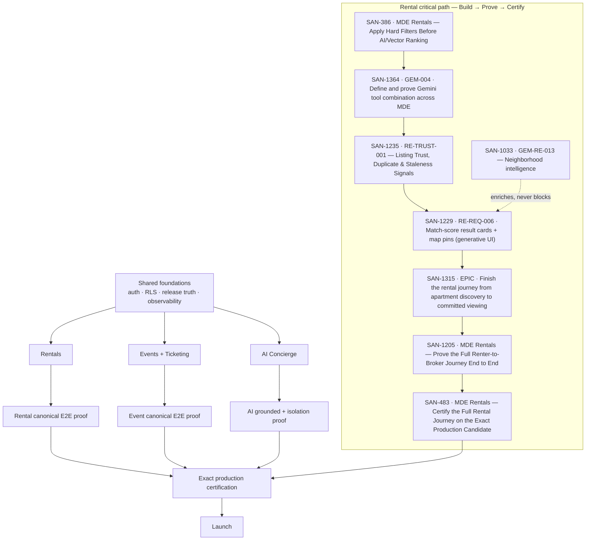

# MDE AI — MVP Definition

**What this document owns:** the launch definition, launch scope, launch gates, and the minimum
user journeys required for MDE AI to be considered ready to launch in Medellín.

**What it does not own:**

| Truth | Owner |
| --- | --- |
| Product requirements | `prd.md` |
| Strategic direction, NOW/NEXT/LATER sequencing | `roadmap.md` |
| Live task status, priority, ownership, progress | Linear |
| Shipped implementation | merged `main` |
| Route surface | `src/app` |
| Physical database schema | `supabase/migrations` |
| Detailed per-task specifications | the Linear issue for that task |

`mvp.md` answers one question: **is MDE ready to launch, and what still blocks it?** It is deliberately
shorter than both `prd.md` and `roadmap.md`, and it links to execution owners instead of copying them.

**The division of labour this document depends on:** `mvp.md` states **what must be true to launch**.
Linear states **whether it is true today**. GitHub, CI and Supabase provide the implementation
evidence. When this file and Linear disagree about *status*, Linear is right. When they disagree about
*launch scope*, this file is the tiebreaker and the Linear labels should be corrected.

---

## 1 · MVP definition

MDE AI is an AI-native local concierge and transaction platform for Medellín that carries a person
from **intent → trusted discovery → decision → action → return**. The MVP proves MDE is not a chatbot
wearing a website: a natural-language request is resolved against trusted data, presented as
synchronized cards and map pins, and finished through a real identity-bound transaction — a viewing
request a broker can act on, or a ticket, a wallet entitlement and a host payout after a payment
settles. Chat understands and coordinates; structured screens own data, controls, approvals, and
money. The launch succeeds when a real user can do that end to end in production without being
misled, and safely fails when a provider or model does.

---

## 2 · The three launch loops

**All three loops are required launch gates. They can be implemented and verified in parallel after
shared platform foundations are ready. The order below is product focus, not a cross-domain
dependency chain.**

| Focus | Loop | What it proves that the others do not |
| --- | --- | --- |
| 1 | **Rentals** | Deterministic eligibility over real inventory, map/card synchronization, trust signals, and an **atomic, identity-bound commitment** (lead + showing) with correct operator visibility. The highest-correctness write path. |
| 2 | **Events + Ticketing** | A **real money loop**: external payment authority, exactly-once webhook finalization, entitlement delivery, a wallet that reflects truth, and **host payout/revenue state that reconciles**. |
| 3 | **AI Concierge + Local Discovery** | Shared capabilities used across every surface — intent routing, grounded facts, structured output, session continuity, safe authenticated tool actions. Consumed by the other loops; it does not gate their execution. |

Rentals prove trustworthy supply and safe commitment. Events prove money, entitlement and host payout.
The concierge proves the intelligence layer is grounded and user-scoped. Any two of the three can pass
while the third hides a launch-blocking defect — which is why all three are launch gates rather than
parallel feature tracks.

Real-world shape of the goal: a renter searching **“2BR in Laureles under $80/night, quiet for remote
work”** gets only eligible listings, sees pins that match the cards, and books a viewing the *owning*
broker can see; an attendee buys a ticket for a **Provenza** show, the webhook finalizes once, the QR
appears in their wallet, and the host can see the proceeds they are owed; a visitor asking **“rooftop
with a view for tonight near Parque Lleras”** gets grounded, sourced options on a synchronized map.

---

## 3 · MVP scope

### In scope

| Area | MVP capability | Launch requirement |
| --- | --- | --- |
| AI Concierge | Intent routing, grounded answers, structured results, safe authenticated actions | Grounded facts, user-scoped tools, working degraded state |
| Rentals | Natural-language + structured search, eligibility, detail, viewing request | Hard-filter violations = 0; exactly one lead + showing per request |
| Events | Discovery, detail, host publish/manage | Publish path works for a real host |
| Ticketing + payout | Checkout, payment finalization, QR/ticket, wallet, host payout | Exactly-once finalization; ticket in the correct wallet; host payout/revenue state traceable |
| Maps / Places | Pins, card↔pin sync, place detail, field-masked Places calls | Pins match visible results; no model-invented coordinates |
| Restaurants / cafés / nightlife | One consistent card + map + chat discovery experience | Grounded results, attributable sources |
| Authentication | Supabase Auth, authenticated routes, ownership enforcement | Cross-user access = 0 |
| Saved context (only where already required) | Saved entities and thread continuity already needed by a launch journey | Works for launch journeys; no new memory platform |
| Host / Broker surfaces required by rentals/events | Listing + event management, inbound leads/viewings, booking visibility | Owning broker/host sees the record; unrelated operator denied |
| Supabase RLS / security | RLS as the final enforcement layer; negative tests | Negative authorization tests pass |
| Production release verification | Exact-candidate certification, required gates | Immutable candidate certified; blocking gates green |
| Mobile usability for critical journeys | Launch journeys usable on a phone | No horizontal overflow; journey completes on mobile |
| Error / degraded states | Explicit timeout, quota, provider-failure and partial-result behaviour | Degrades safely; never invents facts |
| Observability | Runnable logs, run/tool failure visibility, correlation IDs | A failed launch journey is diagnosable end to end |

### Launch languages

The launch language contract is stated explicitly, because otherwise "Spanish support" has no
objective test and cannot be gated either way.

| Language | Launch status | Objective test |
| --- | --- | --- |
| **English** | Required and gated | Every journey in §4 completes from an English-language request |
| **Spanish** | Supported, **not gated** | Spanish input reaches the same grounded tools and invents no facts — the no-invention rule is language-independent. Spanish output/UX quality is not a launch gate |

**SAN-1072 · GEM-RE-017 — Spanish intent prep** therefore carries `MVP · Launch Supporting`, not
`MVP · Launch Blocker`. Promote it to a blocker only if a launch decision makes Spanish-language
journey completion a gate — at which point the Spanish row above becomes the acceptance test.

### Out of scope

Explicitly **not** launch requirements. Post-MVP intent lives in `roadmap.md`, not here.

- full autonomous multi-agent system; generic Firecrawl agent
- rental deposit payments; AI-generated lease execution; landlord bidding; advanced rental offer marketplace
- proactive WhatsApp automation
- broad personalization; full semantic-memory platform expansion
- complex sponsorship marketplace; loyalty and rewards; broad partner marketplace expansion
- OpenBot unless required by a launch journey
- speculative new databases or services; duplicated search engines, state stores, or production test suites

The framing rule: **MVP proves the loop; post-MVP scales it.** A capability that adds surface without
making one of the three loops truthful, safe, or completable is post-MVP by default.

---

## 4 · Canonical MVP user journeys

These six are the minimum launch journeys. Everything in §3 exists to make one of them work.

1. **Rental discovery to viewing** — `intent → normalized criteria → deterministic eligibility → trusted result → map/detail → request viewing → atomic lead + showing → correct broker visibility`
2. **Rental external fallback** — `MDE insufficient → external discovery → verified facts → dedupe/trust → external card → View Original Listing`
3. **Event purchase to host payout** — `discover event → event detail → checkout → payment → webhook → ticket/QR → wallet → host payout/reconciliation`
4. **Grounded local discovery** — `user asks for restaurant/café/nightlife/place → grounded search → structured cards → map → refinement`
5. **AI concierge** — `user starts conversation → intent routed → tool called → grounded answer → structured result/action → context preserved`
6. **Broker/host visibility** — `consumer action → backend commit → correct operator sees record → unrelated operator denied`

Journey 6 is a negative-test journey, not a screen. It is the journey most likely to be silently
broken by a policy change, so it is a launch gate rather than a QA detail.

---

## 5 · Technical architecture and boundaries

The current production architecture from merged `main`. This section records **what exists**; it does
not authorize new architecture.

| Layer | Stack |
| --- | --- |
| Frontend | Next.js App Router · React · CopilotKit |
| AI orchestration | Mastra · Gemini |
| Data / auth | Supabase Postgres · Supabase Auth · RLS · pgvector where already justified |
| Maps | Google Maps · Places · Routes · Gemini Maps grounding where appropriate |
| External discovery | Gemini Google Search · Gemini URL Context · Firecrawl only as extraction fallback |
| Payments | Stripe |
| Testing | Vitest · pgTAP · Playwright · repository Floor / release gates |
| Deployment | current production deployment architecture from merged `main` |

Boundary rule that keeps this simple: **Gemini acquires evidence, Mastra/MDE tools perform business
actions, Supabase mutations happen only behind authenticated backend/RLS paths, and the Maps stack
owns rendering/routes/Places UI.** An Edge Function belongs only at a real webhook, cron,
provider-secret, public-ingress, or runtime boundary — never inserted between Mastra and an RPC merely
because the operation is backend.

**Shared contracts.** Eligibility, rendering, persistence, notification and tests must not drift into
separate versions of the same rule, so these are named once and referenced everywhere:

| Contract | Purpose |
| --- | --- |
| `NormalizedRentalCriteria` | One canonical renter intent (dates, budget, bedrooms, explicit location) |
| `RentalEligibility` | Deterministic `eligible \| ineligible \| unknown` **with machine-readable reasons** |
| `RentalResult` | One normalized result: identity, grounded facts, provenance, trust/freshness, score/reasons, coordinates, allowed actions |
| authenticated actor identity · idempotency key · canonical mutation result · correlation / request ID | One attributable actor; retries and webhook replays cannot duplicate a committed action; one success/failure shape for UI, alerts and tests; a failed journey is traceable across AI → tool → backend → DB |

**Unknown external facts stay `unknown`; they are never coerced to `0`, `false`, or an invented
value.** AI may not invent price, bedrooms, dates, availability, ownership, or coordinates.

---

## 6 · Production gates

MVP is not ready because screens exist. Every gate below is a release gate.

| Gate | Requirement |
| --- | --- |
| **Product** | Critical user journeys complete end-to-end |
| **Data** | No critical stale or invalid production data presented as trustworthy |
| **Security** | RLS / auth / ownership negative tests pass |
| **Transaction** | Payments, payouts and viewing mutations are idempotent, atomic and traceable where required |
| **AI** | Grounded facts, user isolation, no unauthorized tool actions |
| **Failure** | Timeout / provider / API failures degrade safely |
| **Diagnostics** | Every launch-journey operation emits a minimum record — **correlation ID + operation + result + safe error + latency/failure signal** — for Rentals, Events and Concierge. Enough to answer "why did this fail", not a monitoring platform |
| **Mobile** | Critical launch journeys usable on mobile |
| **Production** | Exact deployed SHA / immutable candidate is certified |
| **Cleanup** | Production test fixtures leave zero residue |

---

## 7 · Success criteria

Measurable pass/fail. `0` means zero, not "few".

**Rentals**
- hard-filter violations = **0**
- correct rental/source provenance shown on every result
- external result never exposes an internal **Schedule Viewing** action
- one viewing request creates **exactly one** lead + showing
- the unrelated broker cannot access it

**Events**
- one real or production-safe checkout flow completes end to end
- webhook replay does not duplicate fulfillment
- the purchased ticket appears in the **correct** user's wallet
- host proceeds/revenue state is traceable and payout completes according to the launch contract

**AI**
- current facts come from trusted/grounded data
- cross-user data leakage = **0**
- unsupported current-fact claims = **0** in launch certification cases

**Maps**
- card/pin synchronization correct; no model-invented coordinates

**Release**
- the exact production candidate passes required certification
- blocking CI / release checks green

---

## 8 · Launch checklist

Binary. If a box cannot be checked with current evidence, MVP is not ready.

**1 · Product**
- [ ] Journeys 1–6 each complete end to end in production
- [ ] No launch journey depends on a manual operator step outside the documented runbook
- [ ] English-language journeys complete; Spanish input reaches the same grounded tools without inventing facts

**2 · Rentals**
- [ ] Hard filters enforced before ranking; violations = 0
- [ ] Map pins match visible cards
- [ ] One viewing request → exactly one committed lead + showing
- [ ] Owning broker sees it; unrelated broker denied
- [ ] External result shows provenance and only **View Original Listing**

**3 · Events and payout**
- [ ] Host publish works for a real host
- [ ] Checkout completes and payment finalizes exactly once
- [ ] Webhook replay is idempotent
- [ ] Ticket/QR reaches the buyer and appears in the correct wallet
- [ ] Host payout/reconciliation proven for the production-safe transaction

**4 · AI**
- [ ] Answers derive from grounded/trusted data
- [ ] User-scoped tools cannot act as another user
- [ ] Degraded state leaves deterministic surfaces usable, and tool/agent failures are observable

**5 · Security and data**
- [ ] RLS/auth/ownership negative tests pass
- [ ] No service-role credential reaches client or model; cross-user access = 0
- [ ] No stale/invalid record presented as trustworthy; unknown facts surface as unknown

**6 · Mobile and reliability**
- [ ] Critical journeys complete on a phone with no horizontal overflow
- [ ] Provider/model timeout, quota and malformed-response paths degrade safely
- [ ] A failed launch journey is diagnosable from the minimum diagnostics record

**7 · Production and evidence**
- [ ] Exact immutable candidate certified (SHA/deployment/migration head pinned)
- [ ] Blocking release checks green
- [ ] Each gate above points at current evidence, not a memory of a past run
- [ ] Transient production fixtures removed and cleanup proven

---

## 9 · Launch dependency structure

Shared foundations come first: authenticated identity, RLS, release truth, and observability. After
those, the three loops proceed in parallel.

### Rental critical path — Build → Prove → Certify

Three distinct responsibilities. Skipping the middle one is the specific mistake this document exists
to prevent.

`SAN-1315 · EPIC · Finish the rental journey from apartment discovery to committed viewing`
→ `SAN-1205 · MDE Rentals — Prove the Full Renter-to-Broker Journey End to End`
→ `SAN-483 · MDE Rentals — Certify the Full Rental Journey on the Exact Production Candidate`

The search chain decides **what is shown**; the conversion chain decides **what is committed**; the
security chain decides **who may see it**. `SAN-483 · MDE Rentals — Certify the Full Rental Journey on
the Exact Production Candidate` certifies all three and is the last thing that can pass.

| Chain | Order |
| --- | --- |
| Search — what is shown | SAN-386 · MDE Rentals — Apply Hard Filters Before AI/Vector Ranking → SAN-1364 · GEM-004 · Define and prove Gemini tool combination across MDE → SAN-1235 · RE-TRUST-001 — Listing Trust, Duplicate & Staleness Signals → SAN-1229 · RE-REQ-006 · Match-score result cards + map pins (generative UI) |
| Conversion — what is committed | SAN-1203 · MDE Rentals — Show “Viewing Requested” Only After It Is Saved → SAN-1286 · Save the Lead and Viewing Together or Not at All → SAN-474 · Make Sure Every Viewing Request Creates Exactly One Lead and One Showing → SAN-476 · MDE Rentals — Show Each Viewing Request Only to the Correct Broker |
| Security — who may see it | SAN-482 · Shared rental test harness, fixtures, auth states, and RLS proof → SAN-547 · Prove per-user AI/Supabase isolation and retire the shared anonymous runtime default → SAN-548 · MDE Rentals — Prove Rental Chat Memory Survives a Fresh Runtime, plus SAN-1054 · MDE Rentals — Prove AI Cannot Leak Data or Perform Unauthorized Actions |

**Stable launch rule.** Rental certification requires real, owner-verified rental inventory and one
successful application-originated renter-to-broker journey — and it must run against real customer data
only: no synthetic or test-generated record may be present, and any genuine pre-invariant record must
be annotated rather than deleted. Do not seed or fabricate listings: an empty-state journey is
*degraded-state* certification, not launch certification. The current production state for that
requirement — which prerequisites currently hold — is tracked on
**SAN-1205 · MDE Rentals — Prove the Full Renter-to-Broker Journey End to End**, and the row-level
cleanup inventory belongs to
**SAN-483 · MDE Rentals — Certify the Full Rental Journey on the Exact Production Candidate**.

**Supporting enrichment — useful, never blocking.** `SAN-1033 · GEM-RE-013 — Neighborhood intelligence`
carries `MVP · Launch Supporting` and runs as a supporting branch off the critical path, not a step in
it. It adds grounded context — “coworking 8 minutes away”, “commute 14 minutes” — only after
eligibility, dedupe and preliminary ranking have qualified a result. **Rule: rental results must still
work when `SAN-1033 · GEM-RE-013 — Neighborhood intelligence` is unavailable.** Enrichment may be
absent, stale or degraded; it may never remove, hide or delay a card the critical path already
qualified.

### Edge Function prerequisite lane

A **separate security lane that feeds** the rental proof. It does not replace it.

`SAN-1295 · Task 48.2H.8A · MDE-EDGE-001 — Recover and Canonicalize All 39 Live Edge Functions`
→ `SAN-1296 · Stop Edge Functions from Losing Rental Reminders or Running Unsafe Actions`
→ `SAN-1297 · Task 48.2H.8C · MDE-EDGE-003 — Add Edge Function Tests, Deployment Provenance, and Drift Gates`
→ feeds `SAN-1205 · MDE Rentals — Prove the Full Renter-to-Broker Journey End to End`
→ `SAN-483 · MDE Rentals — Certify the Full Rental Journey on the Exact Production Candidate`

This lane must **not** replace the rental journey chain. The plan's own rule, learned the hard way:
**scheduler enqueue ≠ function success ≠ provider delivery.**

### Dependency diagram

Reading rule: the dotted edge is deliberate — `SAN-1033 · GEM-RE-013 — Neighborhood intelligence`
enriches displayed results and must never block the chain.

---

## 10 · MVP vs post-MVP

| Capability | MVP | Post-MVP | Reason |
| --- | --- | --- | --- |
| Rental discovery | ✅ | | Core of loop 1 |
| Viewing request (lead + showing) | ✅ | | The commitment that makes rentals real |
| External rental fallback | ✅ when inventory insufficient | | Launch supply is smaller than demand; must not fabricate or dead-end |
| Event checkout | ✅ | | Core of loop 2; revenue path |
| Ticket wallet / QR | ✅ | | Entitlement proof; without it payment proves nothing |
| Host payout | ✅ | | A money loop without host proceeds is not a money loop (`roadmap.md` §4.1) |
| Mobile event checkout — SAN-526 · PAY-005 — Mobile checkout UX (Stripe + Apple/Google Pay + QR) | ✅ | | Owns phone → event → checkout → payment → ticket/QR; no separate mobile payment flow is added |
| Edge Function source provenance — SAN-1295 · Task 48.2H.8A · MDE-EDGE-001 — Recover and Canonicalize All 39 Live Edge Functions | ✅ | | Live source cannot be fully accounted for from Git alone, so the deployed surface is not fully reviewable |
| Edge Function runtime defects — SAN-1296 · Stop Edge Functions from Losing Rental Reminders or Running Unsafe Actions | ✅ | | Rental reminders can be lost silently and some Edge actions are unsafe to expose |
| Edge Function tests and drift gates — SAN-1297 · Task 48.2H.8C · MDE-EDGE-003 — Add Edge Function Tests, Deployment Provenance, and Drift Gates | ⚪ | | Prevents recurrence of the provenance drift; certification can be performed manually without it |
| Chat memory durability — SAN-1303 · Task 53.M.25 · MDE-MASTRA-PG-001 — Make AI chat memory survive restarts safely on Supabase | ⚪ | | Only its durability-matrix portion gates `SAN-548 · MDE Rentals — Prove Rental Chat Memory Survives a Fresh Runtime`; SSL, pool and fail-fast hardening are not themselves a launch journey |
| Neighborhood intelligence — SAN-1033 · GEM-RE-013 — Neighborhood intelligence | ⚪ | | Enriches displayed results; a renter can find and commit without it |
| Saved rental search — SAN-1077 · RE-SAVEDSEARCH-001 — Saved searches | | ✅ | Adds scheduling and repeated search without proving the core rental transaction |
| Re-match alerts — SAN-1237 · RE-REQ-016 · Saved requests + re-match alerts (suggested) | | ✅ | Needs saved search, change detection, notification idempotency and quiet hours |
| Rental payments / deposits | | ✅ | Regulatory and reconciliation weight; not needed to prove commitment |
| Trips | | ✅ (`roadmap.md` §5.5, NEXT) | Routes exist but it is not a launch journey |
| Venue booking journey | | ✅ (`roadmap.md` §5.4, NEXT) | Valuable, but after approval/booking contracts harden |
| Native mobile application | | ✅ | Responsive web covers the mobile gate |

✅ in scope · ⚪ conditional · blank = post-MVP.

Alignment note: this table follows `roadmap.md` NOW / NEXT / LATER. `NOW` items are MVP; `NEXT` items
are post-MVP until a launch decision promotes them. Capabilities listed as out of scope in §3 are not
repeated here.

---

## 11 · Ownership and classification

This document deliberately contains **no** live percentages, SHAs, migration counts, or volatile
production counts. Those change hourly and belong to their owners.

| Need | Canonical owner |
| --- | --- |
| Live task order, dependencies, verified progress | [MDE AI Production Task Order, Dependencies and Progress](https://linear.app/amo100/document/mde-ai-production-task-order-dependencies-and-progress-verified-2026-b34a41251abd) |
| Rental journey coordination and current production state | [SAN-1315 · EPIC · Finish the rental journey from apartment discovery to committed viewing](https://linear.app/amo100/issue/SAN-1315/san-1315-epic-finish-the-rental-journey-from-apartment-discovery-to) · [SAN-1205 · MDE Rentals — Prove the Full Renter-to-Broker Journey End to End](https://linear.app/amo100/issue/SAN-1205/mde-rentals-prove-the-full-renter-to-broker-journey-end-to-end) |
| Rental external-discovery design | [MDE Rental Search + External Discovery Plan](https://linear.app/amo100/document/mde-rental-search-external-discovery-plan-gemini-search-url-context-d0340a3558e8) |
| MVP umbrella | Linear label `MVP_MDE` |
| Launch-blocking work | Linear label `MVP · Launch Blocker` |
| Launch-supporting work | Linear label `MVP · Launch Supporting` |
| Already complete | Linear label `MVP · Complete` |
| Product requirements | `prd.md` |
| Strategic sequencing | `roadmap.md` |

The stage labels are the authoritative sub-classification inside the `MVP_MDE` umbrella. An item
carrying only `MVP_MDE` with no stage has not been classified yet — do not assume it is blocking, and
do not assume it is optional.

### Classification rule

Ask one question of every task: **if this task fails, can a user still safely complete the Rentals,
Events and AI Concierge journeys?**

| Answer | Label |
| --- | --- |
| No | `MVP · Launch Blocker` |
| Yes, but the experience or reliability is worse | `MVP · Launch Supporting` |
| Already delivered and verified | `MVP · Complete` |
| Useful only after first launch | `MVP · Post-MVP` |
| Canceled, superseded or duplicate | `MVP · Removed/Obsolete` |

This keeps `MVP_MDE` to one purpose: **the smallest set of work necessary to launch the three core
journeys safely in production.**

### Maintaining this document

- Keep it **shorter than** `prd.md` and `roadmap.md`.
- Change it when the **launch definition, scope, gates, or minimum journeys** change — not when a task
  moves between columns. That belongs to Linear.
- Never paste child-task implementation notes, dated audits, completion inventories, or progress
  snapshots here.
- Distinguish MVP from post-MVP explicitly; when promoting something from post-MVP, state which launch
  journey now depends on it.
- Prefer a table over prose, and a link over a copy.
- Every task reference is written as `SAN-#### · <exact current Linear task name>`.
- Real Medellín examples over abstract placeholders.
