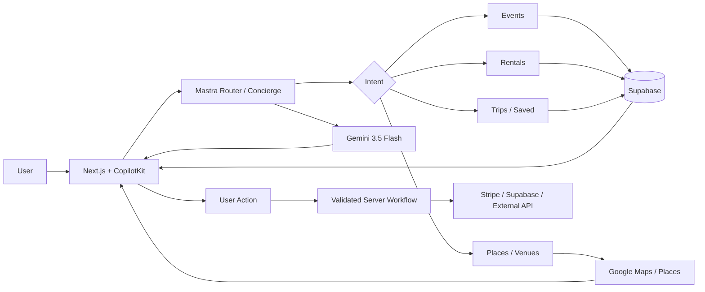
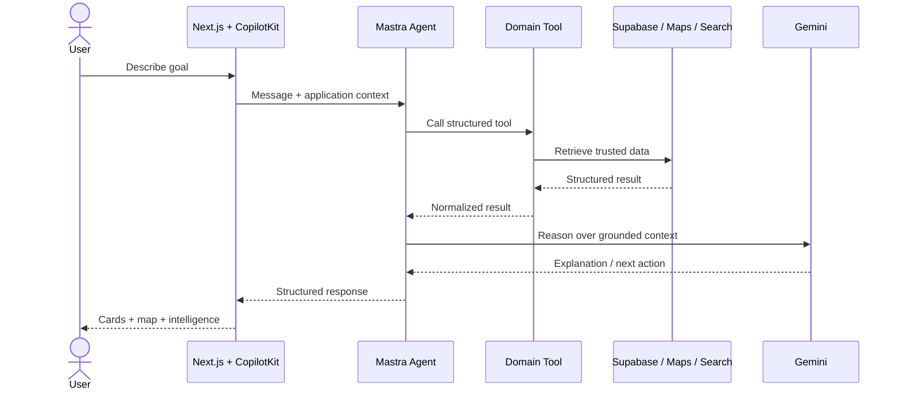
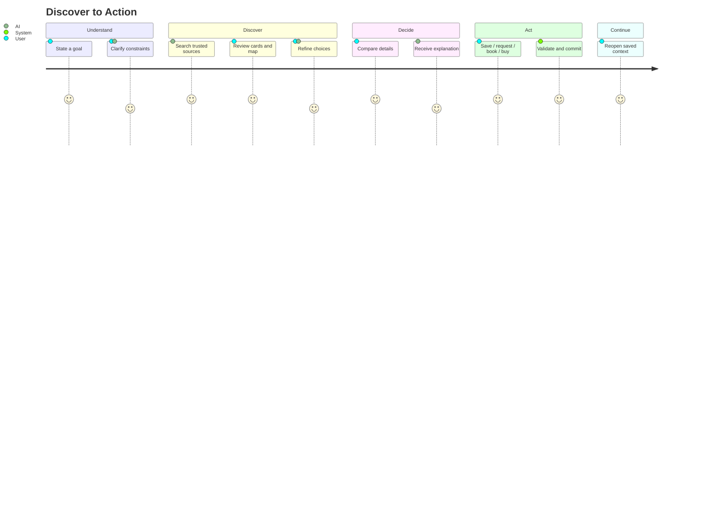
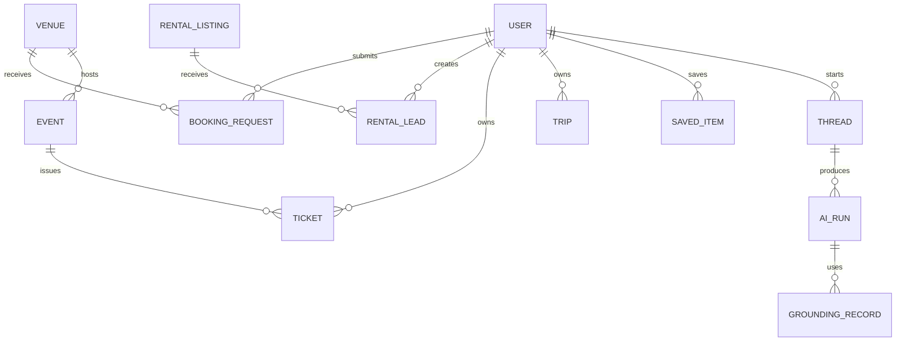

# MDE AI — Product Requirements Document

**Document purpose:** Canonical product requirements for MDE AI.

**Product:** MDE AI — AI-native discovery, concierge, booking, ticketing, rental, and local-commerce platform for Medellín.

**Source-of-truth rule:** Linear owns live task status and priority. Merged `main` owns shipped code. `src/app` owns implemented routes. Supabase migrations own the physical database schema. This PRD defines product intent and requirements; it does not duplicate live execution status.

---

## 1. Executive Summary

MDE AI helps people discover what to do, where to go, where to stay, and how to act on those decisions in Medellín through one AI-guided experience.

Instead of making users search across many disconnected websites, maps, listing pages, event sites, booking forms, and messaging channels, MDE AI combines:

- conversational AI;
- map-based discovery;
- structured cards and detail pages;
- events and ticketing;
- rentals and viewing leads;
- restaurants, cafés, nightlife, and venues;
- trips and saved items;
- host, broker, partner, sponsor, and admin workflows;
- grounded search and recommendations;
- payments and transaction workflows.

The product model is **AI + structured application**, not “chatbot only.” Chat understands intent and coordinates actions; structured screens provide reliable data, controls, approvals, maps, forms, and transactions.

The core experience follows a reusable three-panel model:

> **Left = Context**
>
> **Main = Work**
>
> **Right = Intelligence**

CopilotKit connects the user interface to Mastra agents and tools. Mastra owns AI orchestration. Gemini is the primary model. Supabase owns application data and authentication. Google Maps/Places owns spatial and place information. Stripe supports payment flows.

---

## 2. Problem Statement

### User problem

Local discovery is fragmented. A person planning a night out, looking for an apartment, buying an event ticket, or building a trip usually has to:

1. search Google or social platforms;
2. compare many tabs;
3. open Maps separately;
4. verify dates, prices, locations, and availability;
5. message businesses or hosts;
6. remember what they liked;
7. restart the process when requirements change.

Traditional search returns links. Traditional marketplaces return filters and lists. Generic AI can explain options but often lacks reliable local data or the ability to complete actions.

### Business/operator problem

Hosts, brokers, venues, event organizers, partners, and operators have a different fragmentation problem. They need to create inventory, manage leads/bookings, understand performance, and respond to customers across disconnected workflows.

### Product opportunity

MDE AI should turn a natural-language goal into a structured, verifiable workflow:

```text
Intent → Understand → Search → Ground → Compare → Decide → Act → Save → Learn
```

The system should reduce the distance between **“I need something”** and **“it is done.”**

---

## 3. Target Users

| User | Primary need | Example |
|---|---|---|
| Resident | Discover local experiences quickly | “Find a quiet café in Laureles with Wi-Fi.” |
| Visitor / traveler | Understand an unfamiliar city | “Plan my Saturday around Provenza without wasting time in traffic.” |
| Event attendee | Find and buy tickets | “What electronic events are happening Friday?” |
| Renter | Find suitable housing and contact the listing side | “Show furnished monthly rentals under my budget.” |
| Host / property operator | Publish and manage rental inventory | Add a listing, improve content, manage leads. |
| Broker | Review inventory and rental demand | Compare listings and follow up on viewing requests. |
| Event organizer | Create and manage events | Build an event, publish it, monitor bookings. |
| Venue operator | Receive qualified booking requests | Handle requests containing date, party size, and requirements. |
| Restaurant / café / nightlife business | Be discovered by the right customer | Surface when the user’s intent matches the venue. |
| Partner / sponsor | Participate in MDE commercial workflows | Join programs, receive opportunities, track activity. |
| Internal operator / admin | Monitor platform operations | Review event bookings and operational exceptions. |

### Product principle

The same underlying city data should support multiple users without creating separate disconnected products. Consumer discovery, operator workflows, AI tools, and business dashboards should share contracts and source-of-truth data.

---

## 4. Directory Structure / Routes

### 4.1 Technical structure

```text
mdeai/
├── src/
│   ├── app/                 # Next.js App Router pages and APIs
│   ├── components/          # Shared interface components
│   ├── hooks/               # Client/application hooks
│   ├── lib/                 # Domain logic and integrations
│   └── mastra/
│       ├── agents/          # AI agents
│       ├── tools/           # Agent tools
│       ├── workflows/       # Multi-step orchestration
│       └── lib/             # Model/runtime support
├── supabase/                # Database migrations/configuration
├── e2e/                     # Playwright tests
├── scripts/                 # Verification, smoke, audit scripts
├── docs/                    # Product and engineering documentation
└── public/                  # Static assets
```

### 4.2 Implemented page routes represented in the current application

| Area | Route | Purpose |
|---|---|---|
| Home | `/` | Main discovery/concierge entry |
| Chat | `/chat` | Dedicated conversational workspace |
| Events | `/events` | Event discovery |
| Event detail | `/events/[slug]` | Event information and actions |
| Rentals | `/rentals` | Rental discovery |
| Rental detail | `/rentals/[id]` | Listing detail and lead action |
| Restaurants | `/restaurants` | Restaurant discovery |
| Cafés | `/cafes` | Café discovery |
| Nightlife | `/nightlife` | Nightlife discovery |
| Venues | `/venues` | Venue discovery / booking entry |
| Trips | `/trips` | Trip workspace/list |
| Trip detail | `/trips/[id]` | Saved itinerary/trip detail |
| Saved | `/saved` | Saved entities |
| Tickets | `/me/tickets` | User ticket wallet |
| Ticket detail | `/me/tickets/[id]` | Individual ticket |
| Login | `/login` | Authentication |
| Signup | `/signup` | Account creation |
| Host | `/host` | Host entry |
| Host dashboard | `/host/dashboard` | Host operational overview |
| Host events | `/host/events` | Event management |
| New event | `/host/event/new` | Event creation workflow |
| Host analytics | `/host/analytics` | Host performance |
| Rental host/broker | `/host/rentals` | Rental operator workspace |
| Rental listings | `/host/rentals/listings` | Listing management |
| Rental dashboard | `/host/rentals/dashboard` | Rental performance/operations |
| Rental onboarding | `/host/rentals/onboarding` | Rental onboarding workflow |
| Partners | `/partners` | Partner program entry |
| Partner signup | `/partners/signup` | Partner onboarding |
| Partner rentals | `/partners/rentals` | Rental partner area |
| Sponsors | `/sponsors` | Sponsor entry |
| Business AI | `/business/ai` | Business-facing AI experience |
| Admin bookings | `/admin/event-bookings` | Administrative booking operations |

Route groups such as `(broker)` are implementation folders and are not URL segments.

### 4.3 Important API capabilities

Current route handlers include APIs for CopilotKit, events, rentals, restaurants, grounded search, Google place details/photos, venue booking requests, rental viewing leads, tickets, partner activation, threads, approvals, and admin event bookings.

The PRD treats these APIs as capabilities. Exact request/response contracts remain owned by source code and tests.

---

## 5. Core Features

### 5.1 AI Concierge

A persistent conversational interface that understands goals, asks only necessary questions, routes work to appropriate tools/agents, and returns structured results.

**Requirements**

- understand natural-language requests;
- maintain thread context;
- distinguish discovery from transactional intent;
- call structured tools instead of inventing facts;
- render cards, maps, forms, and approvals where useful;
- allow the user to refine results conversationally.

### 5.2 Map-Based Local Discovery

Map and list views must stay synchronized so a user can understand both relevance and location.

**Requirements**

- display geocoded results as pins;
- connect selected cards and selected pins;
- preserve active filters/context;
- use Google Maps/Places for spatial/place truth where applicable;
- avoid model-generated coordinates.

### 5.3 Events and Ticketing

Users discover events, inspect details, and complete ticket-related actions. Organizers can create and manage events.

**Requirements**

- event search and filtering;
- event detail pages;
- host event creation;
- booking/ticket checkout path;
- ticket wallet;
- administrative booking visibility;
- payment state controlled by trusted backend/payment events.

### 5.4 Rentals and Leads

Users discover rentals, compare listings, view details, and create qualified viewing/contact leads. Hosts/brokers manage listings and inbound demand.

**Requirements**

- natural-language and structured search;
- map/list synchronization;
- listing detail;
- budget/location/amenity filters;
- viewing/lead capture;
- host/broker listing management;
- onboarding and publish controls.

### 5.5 Restaurants, Cafés, Nightlife, and Venues

Users discover suitable places based on context, not only category.

**Requirements**

- domain browse pages;
- place details/photos where allowed;
- query grounding;
- map support;
- venue booking/request workflow where applicable;
- conversational refinement such as mood, distance, budget, or group needs.

### 5.6 Trips and Saved Items

Users should be able to preserve useful discoveries rather than restart each search.

**Requirements**

- save entities;
- group useful items into trip context;
- revisit details later;
- maintain references to canonical entities rather than copying stale data.

### 5.7 Host / Broker / Business Workspaces

Business users need structured workspaces, not only chat.

**Requirements**

- dashboard overview;
- inventory/event/listing management;
- operational status and leads/bookings;
- AI-assisted suggestions without bypassing approval;
- analytics appropriate to the operator’s domain.

### 5.8 Authentication and User State

**Requirements**

- Supabase-backed authentication;
- authenticated routes where required;
- organization/user ownership enforced in backend/data policy;
- saved items, tickets, threads, and business data linked to the correct identity.

### 5.9 Grounded Search and Attribution

AI recommendations should be supported by trusted product data or external grounding rather than unsupported generation.

**Requirements**

- structured search before answer generation when freshness matters;
- source/attribution support where available;
- separate factual retrieval from model explanation;
- graceful handling when evidence is incomplete.

### 5.10 Transaction and Approval Workflows

High-impact actions require deterministic backend handling.

**Requirements**

- AI can propose or prepare actions;
- user/operator approves sensitive actions when appropriate;
- backend validates before commit;
- payment state must not be trusted from the browser;
- retries should not duplicate committed actions.

---

## 6. Advanced Features / AI Features

These capabilities extend the core product. Some are already represented in the codebase; others are product requirements for the advanced phase.

| Capability | Product value | Stage rule |
|---|---|---|
| Intent routing | Send a request to the right domain without making users choose modules | Core |
| Domain agents | Specialized reasoning for rentals/events/operations | Core/MVP |
| Generative UI | Render cards, forms, approvals, maps instead of long text | MVP |
| Grounded recommendation | Explain why options match using retrieved facts | MVP |
| AI ranking/scoring | Prioritize options using explicit criteria | Advanced |
| Thread memory | Preserve conversational context | Core |
| Semantic memory / pgvector | Retrieve relevant historical/entity context | Advanced unless verified for a specific production flow |
| HITL approval | Human approval before consequential changes | MVP |
| Proactive intelligence | Surface risks, next actions, opportunities | Advanced |
| Evaluation agent | Measure AI output quality and policy/contract adherence | Production readiness |
| Cost tracking | Monitor model/tool usage and cost | Production readiness |
| Personalized recommendations | Adapt to stated preferences/history with privacy controls | Advanced |
| Cross-domain planning | Combine events, restaurants, transport/location context, and trips | Advanced |

---

## 7. Use Cases + Real-World Examples

### Feature 1 — AI Concierge

1. **Night out:** “I have friends visiting. Find dinner and somewhere lively afterward near Provenza.” The concierge searches relevant domains and returns a coherent plan.
2. **Rental:** “I need a furnished place for one month with fast Wi-Fi under my budget.” The concierge converts the request into rental filters and results.
3. **Event:** “What can I do this Saturday that is not reggaeton?” The concierge searches events, explains matches, and lets the user refine.

### Feature 2 — Maps / Discovery

1. A traveler sees five café options and immediately understands which are walkable from their hotel.
2. A renter compares listings geographically instead of opening addresses one by one.
3. A nightlife user selects a map pin and the matching detail/card becomes active.

### Feature 3 — Events / Tickets

1. A user finds a Friday event, opens its detail page, and starts checkout.
2. An organizer creates an event through a guided flow and reviews it before publishing.
3. A ticket buyer returns later and opens the purchased ticket from `/me/tickets`.

### Feature 4 — Rentals

1. A remote worker searches for a quiet furnished apartment with reliable internet.
2. A user opens a listing and requests a viewing without copying information into another app.
3. A broker sees inbound rental leads and identifies which listing generated each request.

### Feature 5 — Restaurants / Cafés / Nightlife / Venues

1. “Quiet coffee shop for a Zoom call” returns places based on intent rather than only “coffee.”
2. “Dinner for eight near El Poblado” narrows options using group and location context.
3. An organizer finds a venue and submits a booking request containing the event requirements.

### Feature 6 — Trips / Saved

1. A visitor saves three restaurants and two events into a Medellín weekend plan.
2. A resident saves apartments and comes back the next day without recreating the search.
3. A user converts several discoveries into a simple itinerary grouped by day.

### Feature 7 — Business Dashboards

1. An event host sees active events and booking activity in one workspace.
2. A broker reviews listings and new viewing leads without searching email threads.
3. An operator reviews booking exceptions from the admin event-bookings screen.

### Feature 8 — Grounded Search

1. The AI checks current event data before telling a user what is happening tonight.
2. Place details come from trusted Places/product data rather than an invented address.
3. A recommendation explains that an option matches because of retrieved location, category, and user constraints.

### Feature 9 — Approvals / Transactions

1. AI drafts event information; the organizer reviews it before commit/publish.
2. AI prepares a venue request; the user confirms the date and party size before sending.
3. Ticket checkout uses a backend-created payment flow and trusted payment confirmation.

### Feature 10 — AI Intelligence

1. A host receives a suggestion that an event draft is missing critical information.
2. A broker is shown that a user’s stated budget conflicts with a selected listing.
3. An operator sees an AI summary of the most important items requiring attention, while raw records remain visible for verification.

---

## 8. User Stories

### Consumer

- As a user, I want to describe what I need in normal language so I do not have to understand the platform’s information architecture.
- As a user, I want results shown on a map so I can judge location immediately.
- As a user, I want to refine results by chatting instead of rebuilding filters.
- As a user, I want to save useful options so I can continue later.
- As a user, I want the AI to distinguish known facts from suggestions.
- As a ticket buyer, I want my purchased tickets accessible from my account.

### Renter

- As a renter, I want the system to understand budget, dates, location, furnishing, and amenities.
- As a renter, I want to compare a short list rather than hundreds of weak matches.
- As a renter, I want to request a viewing directly from a listing.

### Host / broker

- As a host, I want a guided onboarding flow so listing creation is consistent.
- As a broker, I want to see inventory and demand in the same operational workspace.
- As a host, I want AI suggestions but final control over publishing and consequential changes.

### Event organizer

- As an organizer, I want to create an event through a guided workflow.
- As an organizer, I want the system to detect missing data before publication.
- As an organizer, I want visibility into bookings and event performance.

### Operator / admin

- As an operator, I want exceptions surfaced without losing access to raw records.
- As an operator, I want actions attributable to a user/system workflow.
- As an operator, I want failed AI/tool actions to degrade safely instead of corrupting data.

---

## 9. User Journey

### Primary consumer journey

1. User lands on MDE AI.
2. User browses directly or states a need in chat.
3. CopilotKit passes conversational state to the AI runtime.
4. Router/concierge logic identifies the relevant domain and required tools.
5. Mastra retrieves structured data or grounding evidence.
6. Gemini interprets and explains the results.
7. UI renders cards, map pins, details, or a guided action.
8. User compares/refines.
9. User saves, requests, books, buys, or continues planning.
10. The resulting state is persisted by the responsible backend/data system.

### Operator journey

1. Authenticate.
2. Open domain dashboard.
3. Review inventory, requests, bookings, or analytics.
4. AI summarizes relevant context and proposes next actions.
5. Operator inspects the underlying record.
6. Operator approves/edits/rejects consequential changes.
7. Backend validates and commits.
8. Dashboard refreshes from source-of-truth data.

---

## 10. Workflows

### 10.1 Discovery workflow

```text
User intent
→ classify domain
→ validate required constraints
→ query product/search/grounding source
→ normalize results
→ rank/filter
→ render cards + map
→ explain matches
→ refine or act
```

### 10.2 Transaction workflow

```text
User action
→ server validation
→ permission/ownership check
→ create trusted transaction/request
→ external system when needed
→ confirm through trusted backend event/state
→ persist final state
→ update UI
```

### 10.3 Human-in-the-loop workflow

```text
AI proposes
→ structured preview
→ user/operator reviews
→ edit / approve / reject
→ backend revalidates
→ commit
→ audit/result returned
```

### 10.4 Grounded AI workflow

```text
Question
→ determine freshness/data need
→ retrieve trusted evidence
→ preserve attribution/provenance
→ Gemini synthesizes
→ render answer + structured results
→ user can inspect source entity
```

---

## 11. Mermaid Diagrams

### 11.1 Platform flowchart



### 11.2 AI request sequence



### 11.3 User journey



---

## 12. Website Pages

| Page | Purpose | Core content / actions |
|---|---|---|
| `/` | Main entry and discovery | Concierge entry, discovery surfaces, map/content modules |
| `/chat` | Dedicated AI workspace | Conversation, generative results, contextual UI |
| `/events` | Event discovery | Event cards, filters/search, discovery actions |
| `/events/[slug]` | Event detail | Event facts, venue/location, ticket/action entry |
| `/rentals` | Rental search | Listings, filters, AI-assisted discovery, map |
| `/rentals/[id]` | Rental detail | Photos/details, location, lead/viewing action |
| `/restaurants` | Restaurant discovery | Search/browse cards and place context |
| `/cafes` | Café discovery | Search/browse cards and place context |
| `/nightlife` | Nightlife discovery | Search/browse and contextual recommendations |
| `/venues` | Venue discovery | Venue cards/details and booking-request entry |
| `/trips` | Trip workspace | User trips and planning entry |
| `/trips/[id]` | Trip detail | Saved itinerary/context |
| `/saved` | Saved content | Saved entities across supported domains |
| `/me/tickets` | Ticket wallet | User-owned tickets |
| `/me/tickets/[id]` | Ticket detail | Individual ticket data/action |
| `/partners` | Partner landing | Program explanation and entry points |
| `/sponsors` | Sponsor landing | Sponsor/business opportunity context |
| `/business/ai` | Business AI entry | Business-facing AI workflow |
| `/login` | Login | Authentication |
| `/signup` | Signup | Account creation |

### Page design rule

Every page should answer three questions quickly:

1. **Where am I?**
2. **What can I do here?**
3. **How can AI make this faster or better?**

---

## 13. Dashboard Pages

### 13.1 Host Dashboard — `/host/dashboard`

**Purpose:** Operational home for a host.

**Data shown**

- relevant events/listings/activity;
- booking/lead summary;
- recent operational changes;
- items requiring attention.

**Features**

- quick actions;
- status overview;
- links into management workflows;
- AI summary and suggested next actions.

**AI mapping**

- `hostOpsAgent` can support operational interpretation;
- concierge/router can provide cross-domain navigation;
- AI recommendations must link back to source records.

### 13.2 Host Events — `/host/events`

**Purpose:** Manage organizer event inventory.

**Data shown:** events, statuses, dates, relevant booking/operational information.

**Features:** create/open/manage events, inspect missing information, navigate to analytics or booking operations.

**AI mapping:** `hostEventAgent` assists event creation; event-domain logic handles discovery/structured event operations.

### 13.3 Host Analytics — `/host/analytics`

**Purpose:** Explain host performance and operational trends.

**Data shown:** only metrics backed by application data; avoid generated metrics.

**AI mapping:** intelligence layer can summarize changes, anomalies, and next actions but should never replace raw metrics.

### 13.4 Rental Dashboard — `/host/rentals/dashboard`

**Purpose:** Broker/host overview of rental operations.

**Data shown:** listings, publish state, leads/viewing activity, operational attention items.

**AI mapping:** `rentalAgent` understands rental intent and domain constraints; right-panel intelligence can summarize lead/listing fit.

### 13.5 Rental Listings — `/host/rentals/listings`

**Purpose:** Manage individual rental inventory.

**Features:** open listing, inspect data, publish/update through validated workflows.

**AI mapping:** AI may detect missing/weak listing information and prepare improvements; operator remains in control of consequential changes.

### 13.6 Admin Event Bookings — `/admin/event-bookings`

**Purpose:** Internal operational view for event booking records/exceptions.

**Data shown:** booking records and relevant status information from trusted backend data.

**AI mapping:** evaluation/summarization can prioritize exceptions, but administrative actions must be permission checked and deterministic.

### Dashboard design rule

A dashboard is a **decision workspace**, not a wall of metrics. Each dashboard should contain:

```text
Current state → Important change → Recommended next action → Source record → Safe action
```

---

## 14. Three-Panel Layout Logic — CopilotKit Core Model

The preferred model for high-value workspaces is:

> **Left = Context**
>
> **Main = Work**
>
> **Right = Intelligence**

### Left — Context

Purpose: maintain orientation and scope.

Possible content:

- navigation;
- active filters;
- current trip/event/listing/customer context;
- history/recent items;
- saved items;
- workflow progress;
- selected domain/entity.

### Main — Work

Purpose: perform the task.

Possible content:

- conversation;
- result cards;
- forms;
- wizard steps;
- list/detail views;
- map where map is the primary work surface;
- approval/review interfaces.

### Right — Intelligence

Purpose: provide useful AI assistance without taking control away from the user.

Possible content:

- AI summary;
- recommendations;
- ranking rationale;
- missing information;
- risks/conflicts;
- next actions;
- selected-item detail/map when intelligence is spatial;
- agent/tool activity that benefits the user.

### CopilotKit logic

CopilotKit should connect application state and AI interaction so AI can understand what the user is looking at without the UI becoming a transcript-only chatbot.

Use the pattern:

```text
Application state
      ↓
CopilotKit readable/action context
      ↓
Mastra agent/tool
      ↓
Structured result
      ↓
Generative UI / application state update
```

### Responsive behavior

Desktop can show all three zones. Tablet/mobile should progressively collapse context and intelligence into drawers/sheets/tabs while preserving the main work surface.

---

## 15. Wizards

### 15.1 Event Creation Wizard — `/host/event/new`

**Purpose:** Turn incomplete organizer input into a publishable event record.

**Suggested logical steps**

1. Basics — name, description, category.
2. Time — dates/times.
3. Venue/location — existing or supplied venue context.
4. Ticket/attendance configuration where applicable.
5. Media/details.
6. Review.
7. Approve/commit.

**AI:** `hostEventAgent` helps fill/validate the draft and identify missing data. It should not silently publish consequential changes.

### 15.2 Rental Onboarding Wizard — `/host/rentals/onboarding`

**Purpose:** Create consistent rental inventory and operator context.

**Suggested logical steps**

1. Property basics.
2. Location.
3. Price/terms.
4. Amenities/features.
5. Photos/content.
6. Contact/ownership information.
7. Review and publish readiness.

**AI:** assist with normalization, missing-field detection, concise copy, and quality checks.

### 15.3 Partner Signup — `/partners/signup`

**Purpose:** Qualify and create a partner relationship.

**Data:** organization/contact identity, partner type, relevant offering/capabilities, consent/terms.

**AI:** can classify or summarize submitted information; authoritative identity/permissions remain backend-controlled.

### Wizard rule

Wizards must expose state visibly. AI can reduce typing, but users must be able to see and correct structured data before submission.

---

## 16. Chatbots / AI Interactions

MDE AI should avoid creating a separate chatbot for every page. Use a small set of agents with clear responsibilities and reusable tools/workflows.

### Concierge / Router Experience

**Purpose:** Main entry for cross-domain requests.

**Agent logic:** `routerAgent` and `conciergeAgent` identify intent, retain context, and delegate/call the appropriate domain capability.

**Examples:** local discovery, combined plans, switching from café search to nearby event discovery.

### Rental Assistant

**Agent:** `rentalAgent`.

**Purpose:** Understand rental requirements and coordinate listing/search/lead workflows.

**Data shown:** structured listing results, filters, map context, detail, lead action.

### Event Assistant

**Agent:** `eventAgent`.

**Purpose:** Support event discovery and structured event questions/actions.

### Host Event Assistant

**Agent:** `hostEventAgent`.

**Purpose:** Assist event organizers with structured event creation and review.

### Host Operations Assistant

**Agent:** `hostOpsAgent`.

**Purpose:** Help operators understand operational state and next actions.

### Evaluation Agent

**Agent:** evaluation capability represented in `src/mastra/agents/evaluation.ts`.

**Purpose:** Evaluate AI/output quality and support production-quality controls.

### AI interaction rules

- Prefer tools over unsupported factual generation.
- Ask a question only when missing information materially blocks useful work.
- Return structured data when the UI needs structured behavior.
- Preserve user control for consequential actions.
- Explain uncertainty rather than fabricating an answer.
- Do not expose implementation complexity that does not help the user.

---

## 17. Data Model

This section defines the **logical product model**. Exact physical table names, columns, constraints, policies, indexes, and migrations are owned by `supabase/migrations/` and must be verified there before implementation.

### Core entities

| Entity | Important logical fields | Relationships |
|---|---|---|
| User/Profile | id, identity, preferences, metadata | Owns saved items, trips, tickets, threads where applicable |
| Thread | id, user/context, timestamps | Contains messages / AI interaction state |
| Event | id, organizer, title, description, time, venue, status | Has venue, tickets/bookings; owned/managed by organizer |
| Venue | id, name, location, place reference, capabilities | Hosts events; receives booking requests |
| Event booking/order | id, user, event, quantity/amount, status, payment reference | Links user + event + payment state |
| Ticket | id, order/event/user, ticket state | Belongs to purchaser/event |
| Rental listing | id, owner/org, location, price, terms, amenities, publish state | Generates leads/viewing requests |
| Rental lead | id, user/contact, listing, request details, status | Belongs to listing/operator workflow |
| Place | id/reference, category, location, external source metadata | Supports restaurants/cafés/nightlife/venue discovery |
| Saved item | id, user, entity type/id | References a canonical domain entity |
| Trip | id, user, title, dates/context | Contains trip items / saved references |
| Partner | id, organization, type, status | Linked to partner workflows/opportunities |
| Sponsor | id/org, program context, status | Linked to sponsor opportunities |
| Booking request | id, user/org, venue/entity, date, requirements, status | Connects demand with operator |
| AI run | id, thread/user context, agent/model, usage/status | Operational AI observability |
| Grounding record/citation | query/run reference, source/provenance, entity references | Supports explainable grounded results |
| Embedding/vector record | source entity, embedding contract/version, vector | Advanced semantic retrieval where deliberately implemented |

### Relationship model



### Data rules

- Supabase/Postgres is the application source of truth for MDE-owned business data.
- RLS/authorization must protect user/org-owned data.
- External provider identifiers should be references, not excuses to duplicate uncontrolled stale data.
- Stripe owns authoritative payment processing state; MDE stores the application-facing payment/order reference and validated state.
- Vector data is an index/retrieval layer, not a replacement for normalized domain data.

---

## 18. AI Functions — Gemini 3 + Tools

The current model configuration uses the Gemini 3 family, with **Gemini 3.5 Flash** as the primary/default model represented in the repository.

### AI functions

| Function | Input | Output | Tool/data dependency |
|---|---|---|---|
| Intent classification | User request + context | Domain/action intent | Router logic |
| Constraint extraction | Natural language | Structured filters/fields | Zod/domain contracts |
| Conversational planning | Goal + retrieved facts | Next-step plan | Mastra + Gemini |
| Result explanation | Structured candidates | Concise rationale | Search/domain result data |
| Grounded synthesis | Retrieved evidence | Answer with provenance | Search/Maps/product data |
| Draft completion | Partial event/listing form | Suggested structured values | Domain draft state |
| Missing-data detection | Draft/entity | Missing or conflicting fields | Schema/domain rules |
| Ranking assistance | Candidates + explicit criteria | Ordered/reasoned candidates | Structured scoring inputs |
| Summarization | Operational records | Short actionable summary | Authorized records |
| Evaluation | AI/tool result | Quality/contract signal | Evaluation logic |
| Semantic retrieval | Query embedding | Relevant records | pgvector when implemented for that domain |

### Tool categories

- event search/detail tools;
- rental search/detail/lead tools;
- Google Maps/Places tools;
- grounded web/search tools;
- venue booking tools;
- ticket/checkout tools;
- partner tools;
- thread/memory tools;
- approval/commit tools;
- scoring/evaluation tools.

### AI safety/product rules

1. Gemini reasons over facts; it does not become the database.
2. Coordinates, prices, availability, payment state, ownership, and permissions must come from trusted systems.
3. Tool schemas must validate AI-generated parameters before side effects.
4. Sensitive mutations require authorization and, where appropriate, explicit approval.
5. The UI should show structured results instead of hiding important state inside prose.

---

## 19. Success Criteria

### User outcomes

- Users reach relevant options with fewer searches and fewer page changes.
- Users can refine results naturally without losing context.
- Map/list/chat state remains consistent.
- Users can complete supported actions instead of receiving only advice.

### Product metrics

Track by domain and journey:

- search → detail conversion;
- detail → save/action conversion;
- rental result → qualified lead/viewing request;
- event detail → checkout/ticket completion;
- venue discovery → booking request;
- returning users / reopened saved context;
- successful AI/tool completion rate;
- grounded-answer coverage when grounding is required;
- task abandonment;
- median/p95 interaction latency;
- payment/action failure rate;
- operator time saved on supported workflows.

### Quality gates

A feature is not production-ready merely because a page renders. Production readiness requires:

- correct authorization/RLS;
- deterministic side-effect handling;
- unit/integration tests where appropriate;
- Playwright coverage for critical journeys;
- failure-state UX;
- observability/logging;
- production smoke verification;
- accessibility/responsive validation for user-facing critical flows.

---

## 20. Risks + Constraints

| Risk | Why it matters | Mitigation |
|---|---|---|
| Hallucinated local facts | Wrong address/date/price damages trust | Ground critical facts; tools/data before prose |
| Stale external data | Local businesses/events change often | Fresh retrieval, timestamps, graceful uncertainty |
| API cost | Maps/grounding/model calls can scale quickly | Caching, field masks, rate limits, cost telemetry |
| Too many agents | Hard to debug and costly | Small agent roster; reuse workflows/tools |
| AI side effects | Model error could mutate real records | Validate + authorize + HITL where consequential |
| RLS/tenant leakage | Severe security/privacy failure | Supabase policy tests and server-side authorization |
| Payment inconsistency | Duplicate/false payment state | Stripe server/webhook truth + idempotency |
| Duplicate domain models | Data diverges across modules | Shared canonical entities/contracts |
| Three-panel overload | Too much information on small screens | Responsive collapse and task-focused defaults |
| Documentation drift | Architecture docs become misleading | Code/route validation + Linear as live status |
| Vector misuse | Semantic similarity can override factual filters | Structured filters first; vectors as supplemental retrieval |
| Provider dependency | AI/maps/payment providers can change | Adapter boundaries, fallbacks where economically justified |

### Constraints

- Next.js App Router is the web application foundation.
- CopilotKit is the AI UI/runtime bridge currently pinned by the repository.
- Mastra is the agent/workflow orchestration layer.
- Gemini is the production AI model family represented by the current code.
- Supabase is the primary application database/auth layer.
- Google Maps/Places is the spatial/place platform.
- Stripe is used for payment-related application flows.
- Live priorities must remain in Linear, not this PRD.

---

## 21. Suggested Improvements

### Near-term

- Make the new `docs/` structure the clear documentation entry point.
- Standardize one result envelope for AI/domain tools so cards, maps, and chat consume consistent data.
- Standardize loading, empty, stale-data, tool-error, permission-error, and retry UX.
- Add route-to-documentation drift checks.
- Make AI provenance visible when a recommendation depends on external grounding.

### Product improvements

- Unified compare mode across rentals/events/places.
- Cross-domain trip planning that can combine activities and saved locations.
- Better preference controls so personalization is explicit and editable.
- Proactive “why this matters” intelligence on dashboards.
- Reusable approval component for all AI-proposed mutations.
- Stronger business lead qualification and follow-up workflows.

### Advanced AI improvements

- Semantic memory only after retrieval contracts/RLS are verified.
- Hybrid retrieval: deterministic filters + keyword/text + vector similarity.
- Model/tool evaluations on a stable golden-query set.
- Agent trace/cost/error inspection for operators.
- Context compression so long threads remain useful without uncontrolled token growth.
- Domain-specific scoring with transparent factors rather than unexplained rankings.

---

## 22. Implementation Notes

### 22.1 Frontend

**Foundation**

- Next.js App Router;
- React 19;
- TypeScript;
- Tailwind CSS 4;
- shared component system;
- CopilotKit for AI-aware UI and generative interaction;
- Google Maps React integration for map surfaces.

**Frontend rule**

The UI should not wait for a chatbot to describe everything. Important data should be represented as typed application state and reusable components.

Example:

```text
User: “Show furnished rentals under my budget near Laureles.”

Bad UI:
AI returns 12 paragraphs.

Preferred UI:
Chat summary + 5 listing cards + synchronized pins + filters + lead action.
```

### 22.2 Backend

Use Next.js route handlers and server-side domain modules for validated application operations. Mastra coordinates AI tools/workflows but should not bypass domain authorization or database rules.

```text
Browser
→ Next.js / CopilotKit
→ Mastra agent/workflow
→ validated domain tool
→ Supabase / Maps / Stripe / search provider
→ normalized result
→ UI
```

### 22.3 CopilotKit

Use CopilotKit as the bridge between conversational AI and application state.

Preferred uses:

- provide relevant screen/context state to agents;
- render generative UI from tool results;
- allow AI-triggered UI actions through controlled contracts;
- keep agent name/runtime wiring consistent;
- use approval UI for human-in-the-loop flows.

Avoid using CopilotKit as a second database or a replacement for domain state management.

### 22.4 Mastra

Mastra owns agent/tool/workflow orchestration.

Verified agent files currently include:

```text
concierge
evaluation
event-agent
host-event
host-ops
rental-agent
router
```

Use agents for durable role/reasoning boundaries. Use tools/workflows for deterministic domain capabilities. Do not create a new agent merely because a new page exists.

### 22.5 Supabase

Supabase responsibilities:

- authentication;
- PostgreSQL business data;
- RLS/authorization boundaries;
- transactional state owned by MDE;
- realtime capabilities where product value justifies them;
- pgvector where a verified semantic retrieval use case exists.

The physical schema is migration-owned. Product docs should not invent table names/columns that are not verified in migrations.

### 22.6 pgvector

pgvector is appropriate for semantic retrieval, not general filtering.

Correct pattern:

```text
Hard constraints first
(date, price, ownership, status, geo boundary)
        ↓
Candidate set
        ↓
Semantic/vector relevance when useful
        ↓
Explicit ranking factors
        ↓
Results
```

Do not replace SQL predicates, RLS, exact identifiers, or transactional state with embedding similarity.

### 22.7 Stripe

Stripe-backed flows must follow server-authoritative payment design.

```text
User chooses purchase
→ server creates trusted payment session/action
→ Stripe processes payment
→ trusted server/webhook confirmation
→ application order/ticket state updated idempotently
→ UI reads final application state
```

Never mark an order paid only because the browser returned from checkout.

### 22.8 Real-World Application Pattern

A request such as:

> “My parents are visiting this weekend. Find a quiet Colombian restaurant near their hotel, an afternoon activity, and an event that ends before 10 PM.”

should become:

1. parse constraints;
2. resolve relevant location context;
3. search restaurants + activities/events using trusted sources;
4. filter by time/location requirements;
5. show a small coherent plan;
6. render locations on the map;
7. let the user swap one item without rebuilding everything;
8. save the final plan to trip context.

This demonstrates the product moat: **conversation coordinates structured workflows across domains.**

### 22.9 Agent Types

Use this taxonomy rather than unlimited page-specific bots:

| Agent type | Responsibility | Current/example |
|---|---|---|
| Router | Determine domain/action | `routerAgent` |
| Concierge | Cross-domain user assistance | `conciergeAgent` |
| Domain agent | Domain-specific reasoning | rental, event |
| Workflow/operator agent | Guided business process | host event, host ops |
| Evaluation agent | Quality/evaluation controls | evaluation |
| Research/grounding capability | Retrieve evidence | Prefer tools/workflows unless persistent agent role is justified |
| Scoring capability | Apply explicit evaluation criteria | Prefer deterministic scorer/tool when possible |

### 22.10 Delivery Phases

#### Phase A — Core

Goal: reliable platform foundation.

Must include:

- auth and ownership boundaries;
- CopilotKit ↔ Mastra runtime;
- Gemini model/tool contracts;
- core search/discovery;
- map integration;
- typed domain contracts;
- error/loading states;
- verification baseline.

#### Phase B — MVP

Goal: complete high-value end-to-end journeys.

Must include:

- consumer concierge;
- events discovery/detail + supported ticket path;
- rentals discovery/detail + qualified lead path;
- restaurant/café/nightlife/venue discovery;
- saved/trip continuity;
- host event workflow;
- host/rental operational workspace;
- HITL for consequential AI-assisted actions;
- critical Playwright journeys.

#### Phase C — Advanced

Goal: differentiated intelligence.

Candidates:

- semantic/pgvector memory;
- personalized recommendation;
- hybrid retrieval;
- proactive operator intelligence;
- cross-domain itinerary optimization;
- deeper partner/sponsor automation;
- richer AI ranking/evaluation;
- advanced commerce capabilities.

#### Phase D — Production Ready

Goal: prove the product is reliable under real use.

Required:

- authorization/RLS verification;
- payment idempotency and failure handling;
- production smoke tests;
- observability and AI/tool traces;
- cost budgets/alerts;
- performance budgets;
- accessibility and responsive checks;
- backup/recovery/data-retention considerations;
- security review;
- runbooks and incident response;
- stable analytics definitions;
- documentation drift prevention.

### 22.11 Definition of Done

For a product requirement to be considered implemented:

1. behavior exists in merged code;
2. authorization and data ownership are correct;
3. relevant automated tests pass;
4. critical user journey is verified at the appropriate level;
5. failure states are handled;
6. source-of-truth data is persisted correctly;
7. documentation describes current behavior without duplicating live Linear status.

Planning, mockups, task descriptions, or an unmerged branch do not by themselves mean a product requirement is shipped.

---

## Product Architecture Principle

The platform should remain understandable as it grows:

> **Supabase owns durable MDE data.**
>
> **Mastra owns AI orchestration.**
>
> **CopilotKit connects AI to the user interface.**
>
> **Gemini reasons over trusted context.**
>
> **Google Maps/Places owns spatial/place facts where used.**
>
> **Stripe owns payment processing truth.**
>
> **Linear owns live execution status.**

The product succeeds when these systems work together without duplicating responsibility.

---

## Documentation References

- Repository overview: [`README.md`](README.md)
- Documentation entry point: [`docs/README.md`](docs/README.md)
- Transitional documentation audit: [`docs/index-docs.md`](docs/index-docs.md)
- Product docs: [`docs/01-product/`](docs/01-product/)
- Architecture: [`docs/02-architecture/`](docs/02-architecture/)
- Platform: [`docs/03-platform/`](docs/03-platform/)
- Domains: [`docs/04-domains/`](docs/04-domains/)
- Testing: [`docs/06-testing/`](docs/06-testing/)
- Operations: [`docs/07-operations/`](docs/07-operations/)
- Linear project: https://linear.app/amo100/project/mde-ai-bb25cababf6c/issues

This PRD intentionally contains no stale progress percentage, dated readiness score, hard-coded implementation SHA, or absolute local repository path.