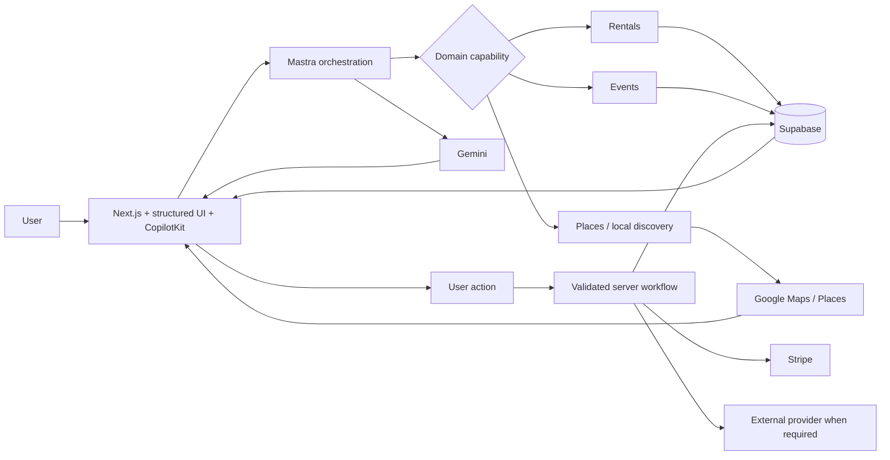
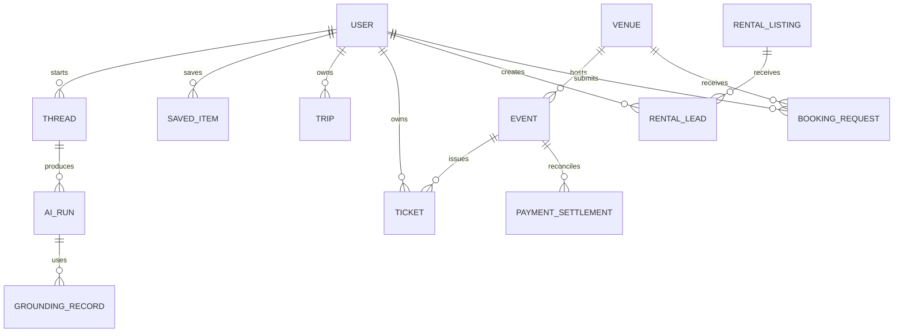

# MDE AI — Product Requirements Document

**Document purpose:** Canonical product requirements for MDE AI.

**Product:** MDE AI — AI-native discovery, concierge, booking, ticketing, rental, and local-commerce platform for Medellín.

**Source-of-truth rule:** This PRD owns product intent and requirements. `mvp.md` owns launch scope and launch gates. `roadmap.md` owns strategic sequencing. Linear owns live task status and priority. Merged `main` owns shipped code, `src/app` owns implemented routes, and Supabase migrations own the physical database schema. Do not duplicate volatile execution state here.

---

## 1. Executive Summary

MDE AI helps people discover what to do, where to go, where to stay, and how to act on those decisions in Medellín through one AI-guided experience.

Instead of making users search across many disconnected websites, maps, listing pages, event sites, booking forms, and messaging channels, MDE AI combines:

- conversational AI;
- map-based discovery;
- structured cards and detail pages;
- events and ticketing;
- rentals and viewing leads;
- restaurants, cafés, nightlife, and venues;
- trips and saved items;
- host, broker, partner, sponsor, and admin workflows;
- grounded search and recommendations;
- payments and transaction workflows.

The product model is **AI + structured application**, not “chatbot only.” Chat understands intent and coordinates actions; structured screens provide reliable data, controls, approvals, maps, forms, and transactions.

The core experience follows a reusable three-panel model:

> **Left = Context**
>
> **Main = Work**
>
> **Right = Intelligence**

CopilotKit connects the user interface to Mastra agents and tools. Mastra owns AI orchestration. Gemini is the primary model. Supabase owns application data and authentication. Google Maps/Places owns spatial and place information. Stripe supports payment flows.

---

## 2. Problem Statement

### User problem

Local discovery is fragmented. A person planning a night out, looking for an apartment, buying an event ticket, or building a trip usually has to:

1. search Google or social platforms;
2. compare many tabs;
3. open Maps separately;
4. verify dates, prices, locations, and availability;
5. message businesses or hosts;
6. remember what they liked;
7. restart the process when requirements change.

Traditional search returns links. Traditional marketplaces return filters and lists. Generic AI can explain options but often lacks reliable local data or the ability to complete actions.

### Business/operator problem

Hosts, brokers, venues, event organizers, partners, and operators have a different fragmentation problem. They need to create inventory, manage leads/bookings, understand performance, and respond to customers across disconnected workflows.

### Product opportunity

MDE AI should turn a natural-language goal into a structured, verifiable workflow:

```text
Intent → Understand → Search → Ground → Compare → Decide → Act → Save → Learn
```

The system should reduce the distance between **“I need something”** and **“it is done.”**

---

## 3. Target Users

| User | Primary need | Example |
|---|---|---|
| Resident | Discover local experiences quickly | “Find a quiet café in Laureles with Wi-Fi.” |
| Visitor / traveler | Understand an unfamiliar city | “Plan my Saturday around Provenza without wasting time in traffic.” |
| Event attendee | Find and buy tickets | “What electronic events are happening Friday?” |
| Renter | Find suitable housing and contact the listing side | “Show furnished monthly rentals under my budget.” |
| Host / property operator | Publish and manage rental inventory | Add a listing, improve content, manage leads. |
| Broker | Review inventory and rental demand | Compare listings and follow up on viewing requests. |
| Event organizer | Create and manage events | Build an event, publish it, monitor bookings. |
| Venue operator | Receive qualified booking requests | Handle requests containing date, party size, and requirements. |
| Restaurant / café / nightlife business | Be discovered by the right customer | Surface when the user’s intent matches the venue. |
| Partner / sponsor | Participate in MDE commercial workflows | Join programs, receive opportunities, track activity. |
| Internal operator / admin | Monitor platform operations | Review event bookings and operational exceptions. |

### Product principle

The same underlying city data should support multiple users without creating separate disconnected products. Consumer discovery, operator workflows, AI tools, and business dashboards should share contracts and source-of-truth data.

---

## 4. Product Surface Ownership

The PRD defines **what product capabilities must exist**, not a live inventory of routes, API handlers, files, or implementation folders.

| Product surface | Product responsibility |
|---|---|
| Concierge | Understand intent, retrieve grounded information, and coordinate structured actions |
| Rentals | Search, compare, inspect, and complete a trustworthy viewing-request journey |
| Events + ticketing | Discover, purchase, receive ticket/QR, and reconcile host proceeds |
| Local discovery | Restaurants, cafés, nightlife, venues, cards, maps, and place context |
| Host / broker operations | Manage supply and act on resulting leads, bookings, sales, and exceptions |
| User account | Authentication, owned tickets, saved context, and continuity where required |
| Admin / operations | Review authorized operational records and exceptions |

**Implementation ownership**

- Current routes and route groups: `src/app`.
- Exact API/tool contracts: source code, schemas, and tests.
- Physical database schema: `supabase/migrations/`.
- First-launch inclusion and launch gates: `mvp.md`.
- NOW / NEXT / LATER sequencing: `roadmap.md`.

A route existing in source does **not** make that capability a launch requirement. A requirement in this PRD does **not** prove that the route or workflow is shipped.

---

## 5. Core Features

### 5.1 AI Concierge

A persistent conversational interface that understands goals, asks only necessary questions, routes work to appropriate tools/agents, and returns structured results.

**Requirements**

- understand natural-language requests;
- maintain thread context;
- distinguish discovery from transactional intent;
- call structured tools instead of inventing facts;
- render cards, maps, forms, and approvals where useful;
- allow the user to refine results conversationally.

### 5.2 Map-Based Local Discovery

Map and list views must stay synchronized so a user can understand both relevance and location.

**Requirements**

- display geocoded results as pins;
- connect selected cards and selected pins;
- preserve active filters/context;
- use Google Maps/Places for spatial/place truth where applicable;
- avoid model-generated coordinates.

### 5.3 Events and Ticketing

MDE must support a trustworthy event-commerce loop from discovery through buyer entitlement and host revenue reconciliation.

**Requirements**

- event search, filtering, and truthful event detail;
- guided host event creation and management;
- backend-created ticket checkout using trusted payment state;
- webhook/payment finalization is idempotent: replaying the same provider event produces one business outcome;
- ticket/QR delivery belongs to the correct purchaser and the wallet reflects authoritative application state;
- host payout/revenue state is traceable to the settled ticket sale and can be reconciled;
- administrative booking/payment exceptions remain visible to authorized operators;
- browser redirects or client state alone never mark an order paid, fulfilled, or reconciled.

### 5.4 Rentals and Leads

MDE must move a renter from intent to a trustworthy result and, for requestable MDE inventory, to a committed viewing request that the correct broker can act on.

**Requirements**

- normalize natural-language and structured intent into one canonical rental criteria contract;
- apply known hard constraints such as dates, budget, bedrooms, status, and explicit location before AI/vector ranking;
- preserve source/provenance and apply conservative trust, duplicate, and freshness rules;
- unknown external facts remain `unknown`; they are never coerced into invented values;
- prefer canonical MDE inventory and use external discovery only when needed to fill a result shortfall;
- external listings remain external: show source/provenance and **View Original Listing**, never silently expose an internal **Schedule Viewing** mutation;
- keep map pins and visible cards synchronized and use only grounded coordinates;
- one logical viewing request creates exactly one lead and exactly one showing, even on retry;
- the viewing remains attached to the correct rental and only the owning broker/operator can access broker-side records;
- support listing detail, host/broker listing management, onboarding, and validated publish controls.

### 5.5 Restaurants, Cafés, Nightlife, and Venues

Users discover suitable places based on context, not only category.

**Requirements**

- domain browse pages;
- place details/photos where allowed;
- query grounding;
- map support;
- venue booking/request workflow where applicable;
- conversational refinement such as mood, distance, budget, or group needs.

### 5.6 Trips and Saved Items

Users should be able to preserve useful discoveries rather than restart each search.

**Requirements**

- save entities;
- group useful items into trip context;
- revisit details later;
- maintain references to canonical entities rather than copying stale data.

### 5.7 Host / Broker / Business Workspaces

Business users need structured workspaces, not only chat.

**Requirements**

- dashboard overview;
- inventory/event/listing management;
- operational status and leads/bookings;
- AI-assisted suggestions without bypassing approval;
- analytics appropriate to the operator’s domain.

### 5.8 Authentication and User State

**Requirements**

- Supabase-backed authentication;
- authenticated routes where required;
- organization/user ownership enforced in backend/data policy;
- saved items, tickets, threads, and business data linked to the correct identity.

### 5.9 Grounded Search and Attribution

AI recommendations must be supported by trusted MDE data or explicit external grounding rather than unsupported generation.

**Requirements**

- retrieve structured or grounded evidence before synthesis when freshness matters;
- preserve source/provenance through normalized results and user-visible attribution where useful;
- separate factual retrieval from model explanation/ranking;
- never invent current availability, price, event date/time, listing attributes, coordinates, ownership, payment state, payout state, or transaction success;
- when required evidence is missing, surface `unknown`, omit the unsupported claim, or degrade explicitly rather than fabricating a value;
- provider/tool failure must not silently convert into a factual claim or false success.

### 5.10 Transaction and Approval Workflows

Consequential actions require deterministic, identity-bound backend handling.

**Requirements**

- AI may propose or prepare actions, but user/operator approval remains visible where the action is consequential;
- backend validation checks authenticated identity, business authorization, ownership, and input contracts before commit;
- retries and provider/webhook replays use idempotency/deduplication so one logical request produces one business outcome;
- payment and payout truth comes from Stripe/trusted backend events, never browser state;
- committed state is persisted atomically where partial writes would create an invalid business outcome;
- consequential operations carry a correlation/request identity sufficient to diagnose failure and prove replay behavior;
- the UI reports success only after the authoritative backend state confirms it.

---

## 6. AI Product Capabilities

This section defines product posture, not launch sequencing. `mvp.md` decides first-launch inclusion; `roadmap.md` decides NOW / NEXT / LATER.

| Capability | Product value | Product posture |
|---|---|---|
| Intent routing | Send a request to the right domain without forcing users to choose modules | Core requirement |
| Domain reasoning | Apply rental/event/operator-specific rules and context | Use durable agent/workflow boundaries; do not create page-specific bots |
| Generative UI | Render cards, forms, approvals, and maps instead of hiding state in prose | Core interaction pattern where structured state/actions matter |
| Grounded recommendation | Explain why options match using retrieved facts | Core trust requirement |
| AI ranking/scoring | Prioritize options using explicit criteria | Supplemental only after deterministic eligibility/filtering |
| Thread continuity | Preserve conversational context | Required only where a product journey needs continuity |
| Semantic memory / pgvector | Retrieve relevant historical/entity context | Advanced; use only with verified retrieval + authorization contracts |
| HITL approval | Keep humans in control of consequential changes | Required where the action is consequential |
| Proactive intelligence | Surface risks, next actions, opportunities | Future/advanced capability |
| Evaluation | Measure AI/tool quality and contract adherence | Production-quality capability |
| Cost tracking | Monitor model/tool usage and cost | Production-quality capability |
| Personalized recommendations | Adapt to explicit preferences/history with privacy controls | Future/advanced capability |
| Cross-domain planning | Combine events, places, transport/location context, and trips | Future/advanced capability |

---

## 7. Canonical User Journeys

These journeys explain how the requirements work together. They are durable product behavior, not a claim that every journey is part of the first launch; `mvp.md` owns that decision.

### 7.1 Grounded Local Discovery

```text
user states a goal
→ ask only for materially missing constraints
→ retrieve trusted product/place/search evidence
→ normalize results
→ render structured cards + synchronized map
→ explain why options match
→ user refines or acts
```

**Example:** “Quiet café in Laureles for a Zoom call” returns grounded places with usable location context instead of generic coffee-shop prose.

### 7.2 MDE Rental Discovery to Viewing

```text
renter intent
→ normalized criteria
→ deterministic hard eligibility
→ trust / dedupe / freshness
→ ranked cards + grounded map pins
→ renter opens requestable MDE listing
→ Schedule Viewing
→ exactly one lead + one showing
→ owning broker can act on it
```

**Example:** Sofia asks for a 2BR under 4.5M COP. A 6M listing cannot outrank or bypass the budget rule just because an AI model likes it.

### 7.3 Rental External Fallback

```text
eligible MDE inventory is insufficient
→ grounded external discovery for the shortfall
→ verify known facts
→ deterministic eligibility + conservative dedupe
→ preserve provider/source provenance
→ render external result
→ View Original Listing
```

Unknown external facts stay `unknown`. An external result never silently becomes requestable MDE inventory.

### 7.4 Event Purchase to Host Revenue

```text
attendee discovers event
→ event detail
→ backend-created checkout
→ Stripe payment
→ trusted webhook finalizes once
→ ticket / QR delivered
→ correct buyer wallet updated
→ host revenue and payout/reconciliation state traceable
```

A browser return from checkout is never sufficient proof of payment, entitlement, or payout.

### 7.5 Host / Broker Operations

```text
operator authenticates
→ opens domain workspace
→ reviews source records and exceptions
→ AI summarizes or proposes a next action
→ operator inspects underlying state
→ backend revalidates authorization
→ safe action commits
→ workspace refreshes from authoritative data
```

A broker sees viewing demand only for rentals they are authorized to manage. A host can trace event sales to settlement/payout state.

### 7.6 Saved / Trip Continuity

```text
discover useful entity
→ save canonical reference
→ optionally group into trip/context
→ return later
→ resolve current canonical entity state
```

Saved context should reference canonical entities instead of copying stale event, place, or rental facts. Whether this is required for first launch belongs to `mvp.md`.

### 7.7 Consequential AI-Assisted Action

```text
AI proposes
→ structured preview
→ user/operator reviews
→ edit / approve / reject
→ backend revalidates identity + authorization + inputs
→ idempotent/atomic commit where required
→ authoritative result returned
```

AI can reduce work, but it never becomes the final authority for permissions, payment state, ownership, or irreversible business state.

---

## 8. Experience and Interaction Principles

### Structured Application, Not Chatbot-Only

Important product state belongs in typed application state and reusable UI. Chat coordinates intent and actions; it should not hide listings, tickets, payment state, approvals, or operator records inside prose.

**Preferred example:** a rental request returns a short chat summary plus eligible listing cards, synchronized pins, filters, provenance, and the correct action.

### Three-Panel Model

High-value desktop workspaces may use:

| Zone | Purpose | Typical content |
|---|---|---|
| **Context** | Maintain orientation and scope | Navigation, filters, selected entity, saved/recent context |
| **Work** | Perform the task | Cards, forms, maps, lists/details, approvals, conversation |
| **Intelligence** | Add useful AI help | Summary, rationale, conflicts, missing data, suggested next actions |

This is a reusable pattern, not a requirement to render three columns on every page.

### Mobile / Responsive

Mobile keeps the main task visible and progressively collapses secondary context/intelligence into drawers, sheets, or tabs. Critical actions, errors, maps, checkout, and confirmations must remain understandable without horizontal overflow.

### Maps

Cards and pins represent the same grounded entities. Selecting one should synchronize the other. Coordinates and travel/place facts come from trusted spatial systems, never model invention.

### Dashboards

A dashboard is a **decision workspace**, not a wall of metrics:

```text
Current state → Important change → Recommended next action → Source record → Safe action
```

AI summaries must link back to source records and never replace authoritative metrics.

### Wizards and Forms

Guided workflows must expose structured state visibly. AI may reduce typing, normalize fields, or identify missing information, but users/operators can inspect and correct the data before consequential submission or publish.

### AI Capability Boundaries

Use a small number of durable reasoning boundaries rather than a chatbot per page:

- routing/concierge for intent and cross-domain coordination;
- domain reasoning for rentals/events/local discovery;
- workflow/operator reasoning for guided business processes;
- evaluation for quality/contract checks;
- tools/workflows for deterministic retrieval, scoring, validation, and mutations.

Exact routes, agent names, registry entries, filenames, and model IDs are implementation-owned by current source/tests.

### Product Surface Questions

Every user-facing surface should answer quickly:

1. **Where am I?**
2. **What can I do here?**
3. **How can AI make this faster or better without hiding the underlying state?**

### Platform Flow


```mermaid
flowchart LR
    U[User] --> UI[Next.js + structured UI + CopilotKit]
    UI --> M[Mastra orchestration]
    M --> D{Domain capability}
    D --> R[Rentals]
    D --> E[Events]
    D --> P[Places / local discovery]
    M --> G[Gemini]
    R --> DB[(Supabase)]
    E --> DB
    P --> MAPS[Google Maps / Places]
    UI --> A[User action]
    A --> S[Validated server workflow]
    S --> DB
    S --> STRIPE[Stripe]
    S --> X[External provider when required]
    DB --> UI
    MAPS --> UI
    G --> UI
```

---

## 9. Logical Data Model

This section defines the **logical product model**. Exact physical table names, columns, constraints, policies, indexes, and migrations are owned by `supabase/migrations/` and must be verified there before implementation.

### Core entities

| Entity | Important logical fields | Relationships |
|---|---|---|
| User/Profile | id, identity, preferences, metadata | Owns saved items, trips, tickets, threads where applicable |
| Thread | id, user/context, timestamps | Contains messages / AI interaction state |
| Event | id, organizer, title, description, time, venue, status | Has venue, tickets/bookings; owned/managed by organizer |
| Venue | id, name, location, place reference, capabilities | Hosts events; receives booking requests |
| Event booking/order | id, user, event, quantity/amount, status, payment reference | Links user + event + payment state |
| Ticket | id, order/event/user, ticket state | Belongs to purchaser/event |
| Payment / settlement | order/event reference, provider reference, amount, fee, host proceeds, state | Reconciles trusted payment state to buyer entitlement and host payout |
| Rental listing | id, owner/org, location, price, terms, amenities, publish state, source/provenance | Generates leads/viewing requests; external supply remains distinguishable from MDE-owned inventory |
| Rental lead | id, user/contact, listing, request details, status | Belongs to listing/operator workflow |
| Place | id/reference, category, location, external source metadata | Supports restaurants/cafés/nightlife/venue discovery |
| Saved item | id, user, entity type/id | References a canonical domain entity |
| Trip | id, user, title, dates/context | Contains trip items / saved references |
| Partner | id, organization, type, status | Linked to partner workflows/opportunities |
| Sponsor | id/org, program context, status | Linked to sponsor opportunities |
| Booking request | id, user/org, venue/entity, date, requirements, status | Connects demand with operator |
| AI run | id, thread/user context, agent/model, usage/status | Operational AI observability |
| Grounding record/citation | query/run reference, source/provenance, entity references | Supports explainable grounded results |
| Embedding/vector record | source entity, embedding contract/version, vector | Advanced semantic retrieval where deliberately implemented |

### Relationship model


```mermaid
erDiagram
    USER ||--o{ THREAD : starts
    USER ||--o{ SAVED_ITEM : saves
    USER ||--o{ TRIP : owns
    USER ||--o{ TICKET : owns
    EVENT ||--o{ TICKET : issues
    EVENT ||--o{ PAYMENT_SETTLEMENT : reconciles
    VENUE ||--o{ EVENT : hosts
    USER ||--o{ RENTAL_LEAD : creates
    RENTAL_LISTING ||--o{ RENTAL_LEAD : receives
    USER ||--o{ BOOKING_REQUEST : submits
    VENUE ||--o{ BOOKING_REQUEST : receives
    THREAD ||--o{ AI_RUN : produces
    AI_RUN ||--o{ GROUNDING_RECORD : uses
```

### Data rules

- Supabase/Postgres is the application source of truth for MDE-owned business data.
- RLS/authorization must protect user/org-owned data.
- External provider identifiers should be references, not excuses to duplicate uncontrolled stale data.
- Stripe owns authoritative payment processing state; MDE stores the application-facing payment/order reference and validated state.
- Host revenue/payout state must be traceable from a settled ticket/order through provider-backed reconciliation.
- External rental/provider identity and provenance must remain explicit; acquisition does not silently convert external inventory into MDE-owned inventory.
- Vector data is an index/retrieval layer, not a replacement for normalized domain data.

---

## 10. AI Product and Tool Contracts

Gemini is the primary AI model family for MDE. Exact model IDs, provider options, fallback behavior, and version-specific configuration are implementation-owned and must be verified from current source/config before changes.

### AI functions

| Function | Input | Output | Tool/data dependency |
|---|---|---|---|
| Intent classification | User request + context | Domain/action intent | Router logic |
| Constraint extraction | Natural language | Structured filters/fields | Zod/domain contracts |
| Conversational planning | Goal + retrieved facts | Next-step plan | Mastra + Gemini |
| Result explanation | Structured candidates | Concise rationale | Search/domain result data |
| Grounded synthesis | Retrieved evidence | Answer with provenance | Search/Maps/product data |
| Draft completion | Partial event/listing form | Suggested structured values | Domain draft state |
| Missing-data detection | Draft/entity | Missing or conflicting fields | Schema/domain rules |
| Ranking assistance | Candidates + explicit criteria | Ordered/reasoned candidates | Structured scoring inputs |
| Summarization | Operational records | Short actionable summary | Authorized records |
| Evaluation | AI/tool result | Quality/contract signal | Evaluation logic |
| Semantic retrieval | Query embedding | Relevant records | pgvector when implemented for that domain |

### Tool categories

- event search/detail tools;
- rental search/detail/lead tools;
- Google Maps/Places tools;
- grounded web/search tools;
- venue booking tools;
- ticket/checkout/payout-reconciliation tools;
- partner tools;
- thread/memory tools;
- approval/commit tools;
- scoring/evaluation tools.

### AI safety/product rules

1. Gemini reasons over trusted context; it does not become the database or transaction authority.
2. Current availability, prices, event dates/times, listing attributes, coordinates, ownership, payment/payout state, and permissions come from trusted systems.
3. Missing evidence produces `unknown`, omission, or an explicit degraded state — never an invented current fact.
4. Tool schemas validate model-generated parameters before side effects.
5. Sensitive mutations require authentication, business authorization, and explicit approval where appropriate.
6. AI ranking/explanation never overrides deterministic eligibility, RLS, ownership, payment truth, or transaction invariants.
7. The UI shows structured results and authoritative state instead of hiding important state inside prose.

---

## 11. Success Criteria

### User outcomes

- Users reach relevant options with fewer searches and fewer page changes.
- Users can refine results naturally without losing context.
- Map/list/chat state remains consistent.
- Users can complete supported actions instead of receiving only advice.

### Product metrics

Track by domain and journey:

- search → detail conversion;
- detail → save/action conversion;
- rental result → qualified lead/viewing request;
- event detail → checkout → ticket entitlement → host payout/reconciliation;
- venue discovery → booking request;
- returning users / reopened saved context;
- successful AI/tool completion rate;
- grounded-answer coverage when grounding is required;
- task abandonment;
- median/p95 interaction latency;
- payment/action failure rate;
- duplicate side-effect/replay rate for payments, viewings, and webhooks;
- unsupported-current-fact rate in grounded current-data journeys;
- operator time saved on supported workflows.

### Quality gates

A feature is not production-ready merely because a page renders. Production readiness requires:

- correct authorization/RLS;
- deterministic side-effect handling;
- unit/integration tests where appropriate;
- Playwright coverage for critical journeys;
- failure-state UX;
- observability/logging;
- production smoke verification;
- accessibility/responsive validation for user-facing critical flows.

---

## 12. Risks + Constraints

| Risk | Why it matters | Mitigation |
|---|---|---|
| Hallucinated local facts | Wrong address/date/price damages trust | Ground critical facts; tools/data before prose |
| Stale external data | Local businesses/events/listings change often | Fresh retrieval, timestamps, provenance, graceful uncertainty |
| External rental identity/provenance drift | Duplicate or ambiguous listings can mislead renters or create unsafe actions | Preserve source identity, dedupe conservatively, keep external inventory external |
| API cost | Maps/grounding/model calls can scale quickly | Caching, field masks, rate limits, cost telemetry |
| Too many agents | Hard to debug and costly | Small agent roster; reuse workflows/tools |
| AI side effects | Model error could mutate real records | Validate + authorize + HITL where consequential |
| RLS/tenant leakage | Severe security/privacy failure | Supabase policy tests and server-side authorization |
| Payment inconsistency | Duplicate/false payment state | Stripe server/webhook truth + idempotency |
| Duplicate domain models | Data diverges across modules | Shared canonical entities/contracts |
| Three-panel overload | Too much information on small screens | Responsive collapse and task-focused defaults |
| Documentation drift | Architecture docs become misleading | Code/route validation + Linear as live status |
| Vector misuse | Semantic similarity can override factual filters | Structured filters first; vectors as supplemental retrieval |
| Provider dependency | AI/maps/payment providers can change | Adapter boundaries, fallbacks where economically justified |

### Constraints

- Next.js App Router is the web application foundation.
- CopilotKit is the AI UI/runtime bridge currently pinned by the repository.
- Mastra is the agent/workflow orchestration layer.
- Gemini is the production AI model family represented by the current code.
- Supabase is the primary application database/auth layer.
- Google Maps/Places is the spatial/place platform.
- Stripe is used for payment-related application flows.
- Live priorities must remain in Linear, not this PRD.
- Exact package versions, model IDs, agent registries, and route inventories are implementation-owned and must be verified from current source before changes.

---

## 13. Future Product Direction

Future capabilities and sequencing live in `roadmap.md`, not in a second backlog inside this PRD.

Update this PRD when a future capability becomes an accepted product requirement. Examples that may remain future-facing until promoted include advanced personalization, semantic memory, cross-domain itinerary optimization, proactive intelligence, and broader partner/sponsor automation.

Launch inclusion is decided in `mvp.md`; live execution belongs to Linear.

---

## 14. Engineering Constraints

### 14.1 Frontend

**Foundation**

- Next.js App Router;
- React;
- TypeScript;
- Tailwind CSS;
- shared component system;
- CopilotKit for AI-aware UI and generative interaction;
- Google Maps React integration for map surfaces.

**Frontend rule**

The UI should not wait for a chatbot to describe everything. Important data should be represented as typed application state and reusable components.

Example:

```text
User: “Show furnished rentals under my budget near Laureles.”

Bad UI:
AI returns 12 paragraphs.

Preferred UI:
Chat summary + 5 listing cards + synchronized pins + filters + lead action.
```

### 14.2 Backend

Use Next.js route handlers and server-side domain modules for validated application operations. Mastra coordinates AI tools/workflows but should not bypass domain authorization or database rules.

```text
Browser
→ Next.js / CopilotKit
→ Mastra agent/workflow
→ validated domain tool
→ Supabase / Maps / Stripe / search provider
→ normalized result
→ UI
```

### 14.3 CopilotKit

Use CopilotKit as the bridge between conversational AI and application state.

Preferred uses:

- provide relevant screen/context state to agents;
- render generative UI from tool results;
- allow AI-triggered UI actions through controlled contracts;
- keep agent name/runtime wiring consistent;
- use approval UI for human-in-the-loop flows.

Avoid using CopilotKit as a second database or a replacement for domain state management.

### 14.4 Mastra

Mastra owns agent/tool/workflow orchestration.

Use agents for durable role/reasoning boundaries. Use tools and workflows for deterministic domain capabilities. Do not create a new agent merely because a new page exists.

The exact current agent registry and filenames are implementation-owned by `src/mastra/` and current tests; do not duplicate that inventory in this PRD.

### 14.5 Supabase

Supabase responsibilities:

- authentication;
- PostgreSQL business data;
- RLS/authorization boundaries;
- transactional state owned by MDE;
- realtime capabilities where product value justifies them;
- pgvector where a verified semantic retrieval use case exists.

The physical schema is migration-owned. Product docs should not invent table names/columns that are not verified in migrations.

### 14.6 pgvector

pgvector is appropriate for semantic retrieval, not general filtering.

Correct pattern:

```text
Hard constraints first
(date, price, ownership, status, geo boundary)
        ↓
Candidate set
        ↓
Semantic/vector relevance when useful
        ↓
Explicit ranking factors
        ↓
Results
```

Do not replace SQL predicates, RLS, exact identifiers, or transactional state with embedding similarity.

### 14.7 Stripe

Stripe-backed flows must follow server-authoritative payment and payout design.

```text
User chooses purchase
→ server creates trusted payment session/action
→ Stripe processes payment
→ trusted server/webhook confirmation
→ application order/ticket state updated idempotently
→ host revenue/settlement state reconciled
→ payout state reconciled from trusted provider/backend events
→ UI reads authoritative application state
```

Never mark an order paid, fulfilled, or paid out only because the browser returned from checkout.

### 14.8 Cross-Domain Application Pattern

A request such as:

> “My parents are visiting this weekend. Find a quiet Colombian restaurant near their hotel, an afternoon activity, and an event that ends before 10 PM.”

should become:

1. parse constraints;
2. resolve relevant location context;
3. search restaurants + activities/events using trusted sources;
4. filter by time/location requirements;
5. show a small coherent plan;
6. render locations on the map;
7. let the user swap one item without rebuilding everything;
8. save the final plan to trip context.

This demonstrates the product moat: **conversation coordinates structured workflows across domains.**

### 14.9 Agent / Capability Boundaries

Use the smallest durable set of reasoning boundaries:

| Boundary | Responsibility | Rule |
|---|---|---|
| Router | Determine domain/action intent | Route; do not own domain transactions |
| Concierge | Coordinate cross-domain user assistance | Orchestrate trusted capabilities, not duplicate them |
| Domain reasoning | Apply domain-specific reasoning | Reuse shared domain contracts/tools |
| Workflow/operator reasoning | Assist a guided business process | Keep authoritative state in application/backend systems |
| Evaluation | Assess AI/tool quality | Observe and score; do not mutate business truth |
| Research/grounding | Retrieve evidence | Prefer tools/workflows unless a persistent agent role is justified |
| Scoring | Apply explicit evaluation criteria | Prefer deterministic scorer/tool when possible |

Exact agent names/files are implementation details and belong to current source/tests.

### 14.10 Delivery and Launch Ownership

This PRD does not define delivery phases or a second MVP scope.

- **Product requirements:** `prd.md`
- **Launch scope and gates:** `mvp.md`
- **Strategic sequencing:** `roadmap.md`
- **Live task execution:** Linear
- **Shipped implementation:** merged `main`

A capability may be a valid long-term product requirement without being required for the first launch. Do not infer launch priority from section order in this PRD.

### 14.11 Definition of Done

For a product requirement to be considered implemented:

1. behavior exists in merged code;
2. authorization and data ownership are correct;
3. relevant automated tests pass;
4. critical user journey is verified at the appropriate level;
5. failure states are handled;
6. source-of-truth data is persisted correctly;
7. documentation describes current behavior without duplicating live Linear status.

Planning, mockups, task descriptions, or an unmerged branch do not by themselves mean a product requirement is shipped.

---

## 15. Product Architecture Principle

The platform should remain understandable as it grows:

> **Supabase owns durable MDE data.**
>
> **Mastra owns AI orchestration.**
>
> **CopilotKit connects AI to the user interface.**
>
> **Gemini reasons over trusted context.**
>
> **Google Maps/Places owns spatial/place facts where used.**
>
> **Stripe owns payment processing truth.**
>
> **Linear owns live execution status.**

The product succeeds when these systems work together without duplicating responsibility.

---

## 16. Documentation References

- Repository overview: [`README.md`](README.md)
- Launch scope and gates: [`mvp.md`](mvp.md)
- Strategic sequencing: [`roadmap.md`](roadmap.md)
- Documentation entry point: [`docs/README.md`](docs/README.md)
- Transitional documentation audit: [`docs/index-docs.md`](docs/index-docs.md)
- Product docs: [`docs/01-product/`](docs/01-product/)
- Architecture: [`docs/02-architecture/`](docs/02-architecture/)
- Platform: [`docs/03-platform/`](docs/03-platform/)
- Domains: [`docs/04-domains/`](docs/04-domains/)
- Testing: [`docs/06-testing/`](docs/06-testing/)
- Operations: [`docs/07-operations/`](docs/07-operations/)
- Linear project: https://linear.app/amo100/project/mde-ai-bb25cababf6c/issues

This PRD intentionally contains no stale progress percentage, dated readiness score, hard-coded implementation SHA, or absolute local repository path.