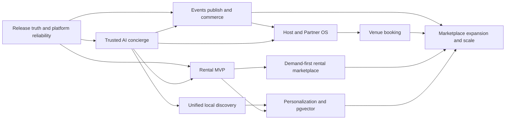
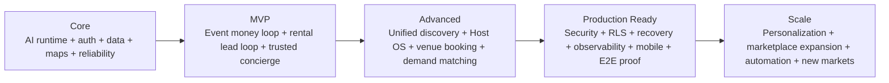

# MDE AI — Product Roadmap

This roadmap defines **product strategy and sequencing** for MDE AI. It does not replace Linear, the PRD, GitHub, or architecture documentation.

**Source-of-truth rules**

- **Linear** owns live task status, priority, ownership, and execution sequencing.
- **Merged `main`** owns shipped implementation truth.
- **`src/app`** owns implemented route truth.
- **Supabase migrations** own the physical database schema.
- **`prd.md`** owns product requirements.
- **`roadmap.md`** owns strategic direction, outcome horizons, and major dependencies.

Roadmap horizons are **confidence levels, not artificial deadlines**:

> **Now → Next → Later → Candidates**

---

## 1. Executive Roadmap Summary

MDE AI is becoming an **AI-native local concierge and transaction platform for Medellín**.

The product should help a user move from:

> **intent → trusted discovery → decision → action → return**

without switching between separate search sites, maps, event platforms, rental listing sites, booking forms, and messaging tools.

The current strategic focus is not adding more disconnected features. It is making the strongest existing product loops reliable and complete:

1. **Events:** host publishes → attendee discovers → attendee pays → ticket is delivered → host is paid.
2. **Rentals:** renter describes need → relevant listings appear → map and cards stay synchronized → renter creates a lead/viewing.
3. **AI concierge:** user intent, map state, account context, memory, tools, and grounded evidence work together reliably.
4. **Platform reliability:** security, RLS, authentication context, testing, observability, mobile behavior, and production proof prevent silent failures.

The roadmap optimizes for **completed user outcomes**, not feature count.

---

## 2. Product North Star

### Vision

MDE AI should become the trusted AI layer for discovering and acting on opportunities in Medellín: places, events, rentals, venues, trips, and local services.

### Target market

Initial market:

- Medellín residents;
- visitors and digital nomads;
- event attendees;
- renters;
- event hosts;
- landlords and brokers;
- venues and local businesses;
- partners and sponsors.

### Primary users

| User | Primary need |
|---|---|
| Visitor / local explorer | Find relevant places, events, and experiences quickly |
| Renter | Find a suitable apartment and take the next action confidently |
| Event attendee | Discover, buy, receive, and manage a ticket |
| Event host | Create, publish, manage, and monetize an event |
| Broker / landlord | Receive and manage qualified rental demand |
| Venue / partner | Join the platform and receive commercial opportunities |
| Operations | Maintain trust, approvals, data quality, and transaction correctness |

### Core value proposition

**Ask once, understand the options, see them spatially, compare them, and act without leaving MDE AI.**

### North-star outcome

**Percentage of qualified user sessions that reach a meaningful completed action.**

Examples of completed actions:

- ticket purchased;
- rental viewing requested;
- event published;
- venue booking request submitted;
- place saved;
- trip item added;
- partner onboarding completed.

### Supporting metrics

- successful discovery sessions;
- grounded result rate;
- search-to-action conversion;
- ticket checkout completion;
- rental lead/viewing conversion;
- host publish completion;
- workflow completion without manual recovery;
- returning-user rate;
- AI/tool failure rate;
- cost and latency per completed journey.

---

## 3. Strategic Product Pillars

### 3.1 AI Concierge

Understand intent, maintain context, call structured tools, render useful UI, and coordinate multi-step journeys.

### 3.2 Local Discovery

Events, restaurants, cafés, nightlife, venues, rentals, and local experiences should feel like one coherent discovery system rather than separate mini-products.

### 3.3 Maps + Spatial Intelligence

Location is a core decision input. Cards, map pins, selected items, neighborhood context, and grounded place data must remain synchronized.

### 3.4 Events + Ticketing

Complete the money loop from event publishing through checkout, ticket delivery, attendee wallet, and host payout.

### 3.5 Rentals

Make the existing search, map, lead, and showing journey trustworthy before expanding into a full request/offer marketplace.

### 3.6 Host + Partner Platform

Give hosts, brokers, venues, partners, and sponsors coherent onboarding, dashboards, AI assistance, and workflows.

### 3.7 Trips + Saved Context

Allow users to preserve discoveries and turn one-off search into an ongoing planning relationship.

### 3.8 Intelligence

Add personalization, semantic retrieval, ranking, memory, and proactive assistance only after core data and journeys are reliable.

### 3.9 Platform Reliability

Authentication, RLS, payment correctness, observability, degraded states, mobile behavior, testing, security, and release gates are product requirements, not engineering polish.

---

## 4. NOW

NOW contains the smallest set of initiatives that most directly improve launch trust and completed user outcomes.

| Initiative | Problem | Users | Desired Outcome | Success Metric | Dependencies | Evidence | Linear |
|---|---|---|---|---|---|---|---|
| Complete the event money loop | Checkout exists, but delivery, payout, webhook safety, and full E2E proof are not yet one proven journey | Attendees, hosts | Publish → buy → receive ticket → host paid | One verified end-to-end production-like money path with idempotent payment handling | Stripe, Supabase, event ownership, RLS, wallet | Existing event/ticket routes and launch issues | SAN-178, SAN-116, SAN-1242, SAN-1262, SAN-1263, SAN-1264, SAN-1266 |
| Make the AI concierge trustworthy in production | AI context, grounding, memory, auth identity, and UI state can drift or fail independently | All users | Grounded, user-aware AI that survives real sessions and degrades safely | Grounded-answer success, tool success, persistent thread proof, zero cross-user access | CopilotKit, Mastra, Supabase, Gemini, Maps | Current runtime already has auth, RequestContext, rate limits, run logging, agents and workflows | SAN-396, SAN-412, SAN-547, SAN-548, SAN-368, SAN-1245 |
| Finish the rental MVP loop | Search exists, but schema/index/RLS proof, pin sync, lead/showing flow and production certification remain fragmented | Renters, brokers | Search → compare on map → request viewing → broker can act | Search quality, successful lead creation, showing creation, production smoke | Supabase, Maps, rental workflow, CopilotKit | Rental agent/workflow and rental pages exist | SAN-467, SAN-472, SAN-474, SAN-476, SAN-483, SAN-1043–1050, SAN-1057–1060 |
| Stabilize release truth and engineering controls | Linear contains stale claims and the open PR stack still includes security/bootstrap/documentation work | Product and engineering | One trustworthy execution board and safer merge/release baseline | Critical release gates green; obsolete/duplicate work classified; docs/code/Linear stop contradicting each other | Linear cleanup, docs, CI, skill stack, Next.js security | SAN-1269 plus current docs/skills/security PRs | SAN-1269, SAN-1271, SAN-1272, SAN-1276, SAN-458 |

### 4.1 Complete the event money loop

**Problem**

A transaction is not complete when checkout opens. The product succeeds only when payment finalizes exactly once, the attendee receives a usable ticket, the wallet shows it, and the host can ultimately receive proceeds.

**Outcome**

A repeatable event commerce journey:

> host publishes → attendee selects ticket → Stripe payment → webhook finalizes → QR/ticket delivered → attendee wallet → payout/reconciliation

**Why now**

This is the clearest direct revenue loop already represented in the product and Linear launch work.

**Scope**

- ticket checkout correctness;
- ticket webhook isolation and idempotency;
- ticket finalization;
- attendee wallet/delivery;
- event commerce RLS;
- host payout path;
- one end-to-end Playwright proof.

**Not in scope**

- complex marketplace commissions across every vertical;
- sponsor automation;
- loyalty programs;
- advanced revenue forecasting.

**Success measures**

- payment finalizes exactly once;
- purchased ticket appears in the attendee wallet;
- ticket can be delivered outside the checkout session;
- host payout/revenue state is traceable;
- E2E money-path test passes;
- no unauthorized access to event commerce rows.

**Linear**

SAN-178, SAN-116, SAN-1242, SAN-1262, SAN-1263, SAN-1264, SAN-1266 and the production proof ledger SAN-115.

### 4.2 Make the AI concierge trustworthy in production

**Problem**

MDE already has a real CopilotKit/Mastra runtime, multiple agents, workflows, run logging, auth, rate limiting, and user-scoped request context. The remaining risk is fragmented proof: grounding, session continuity, map/UI context, user identity, and degraded states must behave reliably together.

**Outcome**

The AI can understand the request, use verified data, know which user is acting, share relevant application state, and fail gracefully without blanking the product.

**Why now**

Every domain depends on the concierge layer. Improving it multiplies value across events, rentals, discovery, venues, trips, and partners.

**Scope**

- grounding verification;
- user-scoped tool execution;
- durable thread/session memory;
- map and slot state mirrored to the agent;
- mobile-safe chat/map behavior;
- explicit AI-degraded states;
- observable tool/agent failures.

**Not in scope**

- autonomous multi-agent swarms;
- proactive outreach without approval;
- replacing deterministic workflows with unconstrained agent loops.

**Success measures**

- grounded responses cite or derive from approved data sources;
- thread context survives server cold starts where intended;
- user-specific tools cannot act as another user;
- map/card state remains consistent;
- AI outage still leaves deterministic product surfaces usable;
- tool and workflow failures are observable.

**Linear**

SAN-396, SAN-412, SAN-547, SAN-548, SAN-368, SAN-1245 plus mobile work such as SAN-521, SAN-522 and SAN-524.

### 4.3 Finish the rental MVP loop

**Problem**

The product already has a meaningful rental foundation, but the journey is not strategically complete until search quality, data access, map/card synchronization, lead capture, showing creation, and production verification work as one flow.

**Outcome**

A renter can describe a need, receive trustworthy results, understand where they are, and request a viewing without leaving the product.

**Why now**

Rentals are one of the strongest high-value verticals in the existing codebase and Linear project.

**Scope**

- rental schema and inventory quality;
- search indexes and availability filters;
- search quality and failure recovery;
- RLS and edge lead contract;
- card/pin synchronization;
- lead and showing creation;
- mobile usability;
- production smoke/evidence.

**Not in scope**

- full deposit payment;
- AI-generated lease execution;
- landlord marketplace bidding;
- proactive WhatsApp alerts;
- long-term semantic personalization.

**Success measures**

- relevant listings returned for representative queries;
- no blank/invalid core listing data;
- map pins match visible results;
- lead creation succeeds exactly once;
- showing is linked to the correct lead/listing;
- RLS prevents cross-user/admin leakage;
- mobile flow is usable without horizontal overflow;
- production smoke passes.

**Linear**

SAN-467, SAN-472, SAN-474, SAN-476, SAN-483, SAN-486, SAN-1043, SAN-1044, SAN-1045, SAN-1046, SAN-1047, SAN-1049, SAN-1050, SAN-1054, SAN-1057, SAN-1058, SAN-1059, SAN-1060, SAN-1061 and SAN-1075.

### 4.4 Stabilize release truth and engineering controls

**Problem**

Linear contains stale implementation assumptions, including issues that can lag current routes and code. The repository also has a live documentation cleanup and a stacked skills/security PR sequence. A roadmap cannot be reliable if the execution board and implementation truth disagree.

**Outcome**

Linear becomes the trustworthy execution system, current docs stop duplicating status, and merged `main` is protected by repeatable quality/security gates.

**Why now**

This reduces wasted work: the team should not build a route because an old issue says it is missing when the route already exists.

**Scope**

- classify launch vs post-MVP vs duplicate vs obsolete Linear issues;
- resolve stale paths/repo names/route claims;
- complete canonical docs migration;
- make required release checks enforceable;
- land the skills/security stack safely rather than merging the oversized source PR wholesale.

**Success measures**

- active Linear tasks reference current repository paths and current architecture;
- duplicate/obsolete work is explicitly classified;
- roadmap items link to canonical execution issues rather than duplicating them;
- critical security/release gates are green on merged `main`;
- docs no longer publish stale implementation percentages or SHAs as product truth.

**Linear**

SAN-1269, SAN-1271, SAN-1272, SAN-1276, SAN-458.

---

## 5. NEXT

NEXT contains validated initiatives whose value is clear but which should follow the NOW reliability and transaction work.

| Initiative | Problem | Users | Desired Outcome | Move to NOW when |
|---|---|---|---|---|
| Unify local discovery | Restaurants, cafés and nightlife can feel like separate surfaces | Explorers | One consistent card + map + AI discovery experience | Core concierge/map state is stable and production-tested |
| Complete host/partner operating experience | Host and partner screens exist but onboarding/navigation/AI assistance are still fragmented | Hosts, venues, partners | One coherent Host/Partner OS | Event money loop and auth/context foundations are proven |
| Expand rentals into demand-first matching | Current MVP is listing/search/lead centric | Renters, brokers, landlords | Request → match → compare offers → accept | Rental MVP data/RLS/search/lead loop is green |
| Venue booking journey | Discovery has more value when users can act | Event hosts, venues | Find venue → evaluate → request booking safely | User-scoped auth + approval/booking contracts proven |
| Trips and saved context | Discovery sessions are transient | Explorers, travelers | Save discoveries into persistent plans | Core discovery consistency and identity persistence are reliable |

### 5.1 Unify local discovery

The next discovery goal is **consistency**, not more categories.

Restaurants, cafés, nightlife, events, venues, and nearby experiences should share:

- common card behavior;
- map synchronization;
- consistent detail affordances;
- grounded evidence;
- save/share actions;
- AI contextual recommendations;
- comparable mobile behavior.

Relevant execution work includes SAN-1122 and the existing Maps/grounding surfaces.

### 5.2 Complete the Host + Partner OS

Existing host and partner capabilities should be made coherent before adding more supply-side modules.

Desired journey:

> partner/host joins → guided onboarding → AI-assisted setup → persistent workspace → publish/manage → analytics/action

Relevant current work includes SAN-692, SAN-729, SAN-1193, SAN-1207 and SAN-1209.

### 5.3 Expand rentals into demand-first matching

After the current rental MVP is trustworthy, move from “search listings” toward “describe what I need and bring me qualified options.”

Target flow:

> request intake → structured criteria → match engine → ranked/explained matches → offers → compare → human accept

Representative Linear work includes SAN-1224, SAN-1226, SAN-1228, SAN-1229 and SAN-1230.

This should remain NEXT until the current rental schema/search/lead foundations are proven.

### 5.4 Venue booking journey

Use existing event-venue workflow foundations to let hosts move from venue discovery to a safe booking request with clear approvals and user-scoped data access.

### 5.5 Trips and saved context

Trips should become the persistence layer for discovery: saved places, events, restaurants, and itinerary context that the concierge can later reuse.

---

## 6. LATER

| Opportunity | User / Business Value | Why Later | Prerequisites |
|---|---|---|---|
| Rental deposits and booking payments | Converts rental demand into direct transactions | Higher financial/regulatory complexity than lead/viewing MVP | Proven booking state machine, idempotency, RLS, payment compensation |
| AI-drafted rental agreements + handover | Reduces operational friction | Requires trusted booking/payment state and human approval | Confirmed rental booking lifecycle |
| Rental saved requests + re-match alerts | Improves retention and speed-to-match | Needs sufficient supply and reliable matching | Rental liquidity + request model + notification strategy |
| Personalization + pgvector | Better ranking and repeat-session relevance | Poor data foundations make semantic memory noisy | Stable identities, feedback signals, measurable retrieval quality |
| Proactive recommendations | Increases engagement | Must avoid spam and ungrounded actions | Preference memory, consent, notification policy |
| Sponsor / broader marketplace automation | New revenue channels | Core user and host loops should prove value first | Reliable events/partners/payments |
| Ecommerce expansion | Transaction expansion beyond current local journeys | Broad scope can dilute core Medellín wedge | Proven user demand and shared commerce contracts |
| Multi-city expansion | Larger market | Medellín product/market loops should be repeatable first | Repeatable supply onboarding, discovery quality, unit economics |

---

## 7. ROADMAP CANDIDATES

Candidates are hypotheses, not commitments.

### 7.1 Fully autonomous operations

- **Hypothesis:** agents could automatically manage partner outreach, inventory maintenance, or event operations.
- **Target users:** operations, hosts, partners.
- **Expected value:** lower manual workload.
- **Evidence available:** Mastra agents/workflows and approval patterns already exist.
- **Evidence required:** clear repetitive workflow volume, acceptable failure rate, recoverable actions, auditability.
- **Decision:** remain Candidate until deterministic/HITL versions prove value.

### 7.2 Dedicated agents for every vertical

- **Hypothesis:** more domain-specific agents could improve specialization.
- **Expected value:** potentially stronger domain reasoning.
- **Risk:** duplicated tools, routing ambiguity, context cost, maintenance overhead.
- **Evidence required:** measurable quality gain over existing agent + workflow/tool approach.
- **Decision:** do not add an agent merely because a feature exists.

### 7.3 Native mobile application

- **Hypothesis:** a native app could improve retention, notifications, maps, and wallet access.
- **Evidence required:** strong repeat use and mobile-web limitations that cannot be solved economically in the current app.
- **Decision:** keep responsive web as primary until the product proves recurring demand.

### 7.4 Advanced semantic city graph

- **Hypothesis:** embeddings and graph-like relationships could enable better cross-domain recommendations.
- **Evidence required:** retrieval benchmarks that beat simpler SQL/filter/ranking approaches at acceptable cost.
- **Decision:** prove narrow semantic retrieval first.

---

## 8. User Journey Roadmap

```text
Discover
   ↓
Understand
   ↓
Compare
   ↓
Decide
   ↓
Book / Buy / Contact / Save
   ↓
Manage
   ↓
Return / Personalize
```

| Journey stage | Current strategic friction | Roadmap response |
|---|---|---|
| Discover | Multiple verticals can behave differently | Concierge trust + discovery unification |
| Understand | Grounding and explanation quality must be reliable | Grounding verification + structured tool results |
| Compare | Cards, maps and state can diverge | Shared three-panel state + pin/card synchronization |
| Decide | User needs confidence, availability and context | Better ranking, details, neighborhood/venue intelligence |
| Act | Payment/lead/booking flows have the highest correctness requirements | Event money loop + rental lead/showing + later venue/rental booking |
| Manage | Host, attendee and partner experiences remain fragmented | Host/Partner OS + ticket wallet + trips |
| Return | Persistent preferences and saved intent are still immature | Trips, memory and later personalization/pgvector |

---

## 9. Three-Panel Experience Roadmap

MDE's core workspace model is:

> **Left = Context**  
> **Main = Work**  
> **Right = Intelligence**

### Left — Context

Owns stable navigation and user/workflow context:

- navigation;
- saved items;
- conversations;
- trips;
- filters;
- account/role context;
- current workflow;
- host/broker workspace navigation.

### Main — Work

Owns the primary task:

- conversation;
- search results;
- cards;
- forms;
- dashboards;
- wizard steps;
- comparisons;
- approval surfaces;
- checkout/booking actions.

### Right — Intelligence

Owns decision support:

- map;
- selected-place/listing/event detail;
- grounded evidence;
- contextual recommendations;
- comparisons;
- next-best actions;
- AI reasoning summaries;
- approval context.

### Evolution

**Now:** stabilize shared state, map synchronization, mobile behavior, grounding and degraded states.

**Next:** make the same interaction contract consistent across discovery, rentals, events and host workflows.

**Later:** add personalized and proactive intelligence without changing the fundamental three-panel mental model.

### CopilotKit role

CopilotKit should connect application state and AI interaction rather than turning every screen into free-form chat. Use it for:

- readable application state;
- tool/generative UI rendering;
- human approval steps;
- agent interaction;
- shared context between conversational and structured interfaces.

Deterministic UI and transactional logic remain authoritative where correctness matters.

---

## 10. AI Roadmap

### Core AI — NOW

- intent understanding;
- structured tool calls;
- grounded responses;
- user-scoped context;
- generative UI;
- map/UI state awareness;
- persistent conversation where intended;
- safe degraded states;
- run/tool observability.

### Domain Intelligence — NOW / NEXT

- rentals;
- events;
- local discovery;
- venues;
- host operations.

Domain intelligence should usually be implemented as **tools + workflows + shared agent context**, not a new agent for every feature.

### Advanced Intelligence — LATER

- durable preference models;
- semantic retrieval;
- pgvector where benchmarked;
- personalized ranking;
- cross-domain recommendations;
- proactive suggestions;
- neighborhood intelligence;
- recommendation feedback loops.

### Agentic Operations — LATER / CANDIDATE

- multi-step host operations;
- broker assistance;
- partner operations;
- automated follow-up;
- notifications;
- reconciliation assistance.

State-changing actions should retain deterministic workflow boundaries, idempotency, audit logs, and human approval where appropriate.

---

## 11. Agent / Workflow Roadmap

The repository already contains a meaningful agent and workflow layer. Do not replace it with speculative agent sprawl.

| Capability | Agent | Workflow / Tools | User Surface | Horizon |
|---|---|---|---|---|
| Cross-domain concierge | `conciergeAgent` / `routerAgent` | Search and domain tools | `/`, `/chat`, discovery surfaces | NOW |
| Rental assistance | `rentalAgent` | `rental-search-workflow` + rental tools | `/rentals`, `/rentals/[id]`, chat | NOW |
| Event discovery | `eventAgent` | `event-discovery-workflow` | `/events`, chat | NOW |
| Event creation | `hostEventAgent` | Host event tools / approvals | `/host/event/new` | NOW |
| Host operations | `hostOpsAgent` | Host read/ops tools, analytics context | `/host/*` | NEXT |
| Quality evaluation | `evaluationAgent` | Evaluation/scoring flows | Internal quality systems | NOW / NEXT |
| Event venue booking | Existing workflow boundary | `event-venue-booking-workflow` | Host/venue journey | NEXT |
| Sales insight | Existing workflow boundary | `sales-insight-workflow` | Partner/host intelligence | NEXT / LATER |
| Preference/recommendation agent | **PROPOSED only if justified** | Memory/retrieval/ranking tools | Cross-domain | LATER |

### Agent design rule

Prefer:

> **a small number of capable agents + explicit tools + deterministic workflows**

Create another agent only when it has a clear responsibility boundary, distinct context/instructions, measurable quality benefit, and lower complexity than extending an existing workflow.

---

## 12. Platform Roadmap

### CopilotKit

**Now**

- reliable application-state exposure;
- generative UI and tool rendering;
- HITL for sensitive actions;
- mobile-safe chat interaction;
- clear degraded/error UX.

**Next**

- consistent CopilotKit interaction contract across discovery, host, partner and venue surfaces.

### Mastra

**Now**

- user-scoped RequestContext;
- observable agents/tools;
- durable memory where required;
- deterministic workflows for state changes;
- graceful failure/retry behavior.

**Later**

- background tasks and progressive streaming where latency data proves need;
- advanced memory/processors only after core quality metrics exist.

### Gemini

**Now**

- intent interpretation;
- structured generation;
- grounded explanations;
- no invented geo/availability/transaction facts;
- failure fallback behavior.

**Later**

- multimodal enrichment;
- semantic ranking;
- richer personalization after benchmark proof.

### Supabase

**Now**

- Auth and user identity;
- RLS verification;
- reliable transaction data;
- idempotent writes;
- rental/event schema correctness;
- persistence for AI/runtime state where required.

**Next**

- realtime where it improves active operational workflows;
- standardized state machines for booking/lead lifecycle.

### pgvector

Use only where semantic retrieval provides measurable improvement over simpler filters/SQL/ranking.

**Later**, after:

1. embedding contract is explicit;
2. source data quality is high;
3. RLS boundaries are proven;
4. retrieval evaluation exists;
5. cost/latency are measured.

### Google Maps

**Now**

- map/card synchronization;
- grounded place context;
- stable markers/map IDs;
- field-mask/cost discipline;
- mobile map interaction.

**Next**

- consistent spatial behavior across all discovery verticals.

### Stripe

**Now**

- ticket payment correctness;
- webhook isolation;
- idempotency;
- ticket delivery;
- payout/reconciliation proof.

**Later**

- rental deposits and broader marketplace commerce after booking state machines are mature.

---

## 13. Dependency Map



Key principle: **reliable identity, data boundaries, workflow correctness, and observability precede deeper automation.**

---

## 14. Product Evolution Diagram



Production readiness is not a final cleanup step. Reliability requirements apply throughout; this diagram shows when they become explicit release gates across the full product.

---

## 15. Phase Definitions

### Phase 1 — Core

**Goal:** technically sound AI-native foundation shared across domains.

Includes:

- Next.js application and route handlers;
- CopilotKit runtime;
- Mastra agents/tools/workflows;
- Gemini model/grounding boundary;
- Supabase Auth/Postgres/RLS;
- Maps and shared state;
- observability;
- test/release gates.

### Phase 2 — MVP

**Goal:** users complete the highest-value end-to-end journeys.

Required outcome classes:

- attendee can purchase and receive a ticket;
- host can publish/manage an event safely;
- renter can discover and act on a suitable listing;
- concierge can provide grounded, state-aware assistance;
- critical flows work on mobile and production-like environments.

### Phase 3 — Advanced

**Goal:** improve usefulness, conversion and operational depth.

Examples:

- unified discovery;
- Host/Partner OS;
- venue booking;
- demand-first rental matching;
- stronger workflow intelligence;
- richer saved/trip context.

### Phase 4 — Production Ready

**Goal:** prove correctness under real operating conditions.

Includes:

- critical E2E journeys;
- RLS/security verification;
- idempotency and reconciliation;
- degraded/recovery states;
- monitoring/observability;
- accessibility;
- mobile quality;
- latency and cost controls;
- release protection.

### Phase 5 — Scale

**Goal:** expand supply, markets and intelligence without redesigning the core architecture.

Examples:

- personalization;
- semantic retrieval;
- notification/re-match systems;
- broader transactions;
- partner automation;
- additional cities.

---

## 16. Success Metrics

Metrics should be measured per journey and tracked against explicit baselines before declaring improvement.

### User Value

- qualified session → completed action rate;
- task completion rate;
- save/trip action rate;
- repeat usage;
- successful host publish rate;
- successful renter viewing-request rate.

### Discovery Quality

- relevant result rate;
- zero-result rate;
- wrong-location/neighborhood rate;
- card/pin consistency rate;
- grounded-answer rate;
- recommendation acceptance rate.

### Transactions

- checkout start → payment completion;
- payment → ticket delivery success;
- duplicate payment/finalization incidents;
- host payout correctness;
- rental search → lead conversion;
- lead → viewing conversion;
- venue request → booking conversion when launched.

### AI Quality

- tool success rate;
- grounded-response rate;
- clarification rate;
- agent/workflow failure rate;
- workflow completion rate;
- time to first useful UI/result;
- end-to-end latency;
- AI/API cost per completed journey.

### Platform

- production error rate;
- critical-flow E2E pass rate;
- API latency;
- release gate pass rate;
- RLS/security incidents;
- webhook/idempotency failures;
- degraded-state recovery success.

Avoid vanity metrics such as total prompts, total generated text, number of agents, or raw feature count.

---

## 17. Roadmap Decision Rules

An initiative enters **NOW** only when:

1. the problem is clear;
2. target users are known;
3. strategic value is clear;
4. current evidence supports the need;
5. the desired outcome can be measured;
6. major dependencies are understood;
7. it is more important than competing work;
8. the team has realistic capacity;
9. current code has been checked so the roadmap does not recreate already-shipped work.

Move work back to **NEXT** or **Candidates** when these conditions are not met.

### Priority rules

When priorities conflict, prefer:

1. security / data isolation / financial correctness;
2. broken end-to-end launch journey;
3. reliability and recovery;
4. user outcome/conversion;
5. consistency and usability;
6. optimization;
7. speculative expansion.

---

## 18. What Does NOT Belong in `roadmap.md`

Do not add:

- individual engineering subtasks;
- large implementation checklists;
- daily or weekly progress logs;
- stale completion percentages;
- commit SHAs as strategic state;
- feature-branch names;
- old local filesystem paths;
- duplicated Linear status;
- historical audit output;
- every backlog idea;
- speculative implementation details;
- arbitrary calendar commitments.

Use the correct system instead:

| Need | Source of truth |
|---|---|
| Product requirements | `prd.md` |
| Strategic sequence | `roadmap.md` |
| Live work/status | Linear |
| Code/PR state | GitHub |
| Routes | `src/app` |
| Database | Supabase migrations |
| Architecture boundaries | `docs/02-architecture/` |
| Platform implementation guidance | `docs/03-platform/` |
| Historical evidence | `docs/_archive/` / testing evidence |

---

## 19. Risks and Strategic Trade-offs

| Risk | Product Impact | Probability | Mitigation | Decision Trigger |
|---|---|---:|---|---|
| External search/maps/model cost grows faster than user value | Unsustainable unit economics | Medium | DB/cache-first paths, field masks, cost tracking, tool-output shaping | Cost per completed journey exceeds target |
| AI invents location, availability or transactional facts | Trust and financial damage | Medium | Tool-backed facts, grounding verification, deterministic transaction state | Any confirmed hallucinated critical fact |
| Payment succeeds but database/ticket finalization fails | Money loss/support incidents | Medium | Idempotent webhooks, reconciliation, compensation, E2E tests | Any split-brain payment incident |
| RLS/auth context is inconsistent between tools | Cross-user data exposure | Medium | User-scoped RequestContext, RLS tests, service-role carve-out discipline | Any unauthorized read/write path |
| Marketplace supply is thin | Poor recommendations/conversion | High in new verticals | Seed/partner supply before automation and track liquidity | High zero-result / low-offer rate |
| Too many agents duplicate responsibility | Cost, routing errors, maintenance | Medium | Prefer tools/workflows; require measurable reason for a new agent | Agent overlap or routing quality declines |
| Linear/docs drift from code | Team builds obsolete work | High | SAN-1269 cleanup, canonical docs, drift checks | Active issue contradicts merged route/code truth |
| Premature feature expansion | Core journeys remain unreliable | High | Now/Next/Later discipline and outcome gates | Advanced scope competes with failing core loop |
| Mobile UX lags desktop | Lost real-world usage | Medium/High | Mobile acceptance criteria for chat/maps/checkout/rentals | Critical flow unusable at target viewport |
| API/model latency harms UX | Abandonment | Medium | progressive UI, caching, background execution only where useful | Time-to-first-useful-result exceeds target |

---

## 20. Final Roadmap Summary

| Horizon | Primary Goal | Key Outcomes |
|---|---|---|
| **NOW** | Make existing core journeys trustworthy and complete | Event money loop; trusted AI concierge; rental MVP loop; truthful release/execution system |
| **NEXT** | Turn strong verticals into one coherent product | Unified discovery; Host/Partner OS; venue booking; demand-first rental matching; trips/saved context |
| **LATER** | Increase automation, retention and transaction depth | Rental payments/leases, re-match alerts, personalization, pgvector, broader marketplace/ecommerce |
| **CANDIDATES** | Validate strategic bets before commitment | Autonomous ops, more agents, native mobile, semantic city graph |

### What we are deliberately NOT doing now

- creating an agent for every vertical or screen;
- building a large autonomous-agent control plane;
- launching rental payment/lease automation before the rental lead/viewing loop is proven;
- making pgvector the default answer to search/recommendation problems without benchmarks;
- expanding aggressively to new cities before Medellín loops are repeatable;
- duplicating Linear tasks inside this roadmap;
- treating open PRs or stale issue descriptions as shipped product truth.

### What would change this roadmap

The roadmap should change when evidence changes, including:

- launch-critical security or payment failure;
- measured user behavior showing a different highest-value journey;
- severe external API cost/latency changes;
- insufficient marketplace supply;
- new regulatory/compliance constraints;
- a major architectural limitation proven by production usage;
- Linear cleanup proving that a supposedly missing capability is already shipped;
- validated customer demand strong enough to reorder NOW vs NEXT.

---

## Roadmap Operating Rule

Review the roadmap periodically, but update it only when strategy or evidence changes.

For day-to-day execution, use the MDE AI Linear project:

https://linear.app/amo100/project/mde-ai-bb25cababf6c/issues

For implementation truth, use the repository:

https://github.com/amoai-tech/mdeai

The roadmap is successful when it helps the team make fewer, better sequencing decisions—not when it contains the most items.